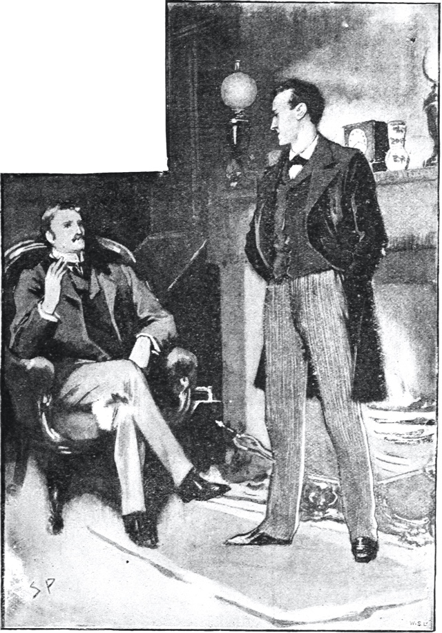
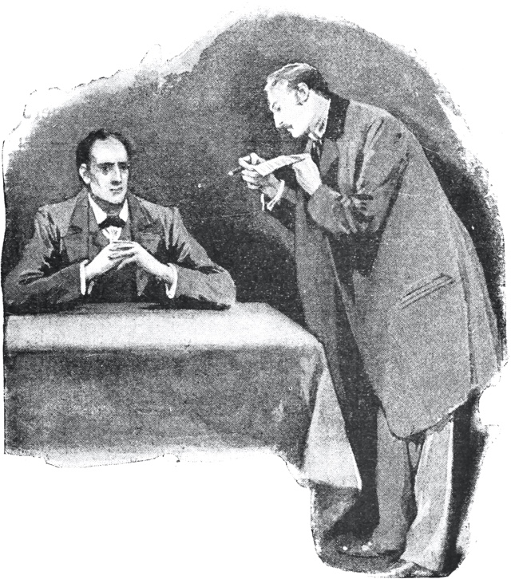
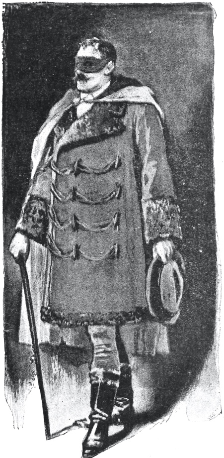
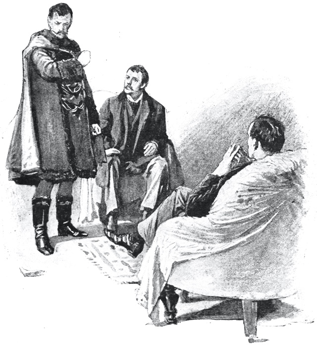

# 𐑩 𐑕𐑒𐑨𐑯𐑛𐑩𐑤 𐑦𐑯 ·𐑚𐑴𐑣𐑰𐑥𐑾

𐑚𐑲 ·𐑸𐑔𐑼 𐑒𐑴𐑯𐑩𐑯 𐑛𐑶𐑤

## 1

𐑑 ·𐑖𐑻𐑤𐑪𐑒 𐑣𐑴𐑥𐑟 𐑖𐑰 𐑦𐑟 𐑷𐑤𐑢𐑱𐑟 𐑞 𐑢𐑫𐑥𐑩𐑯. 𐑲 𐑣𐑨𐑝 𐑕𐑧𐑤𐑛𐑩𐑥 𐑣𐑻𐑛 𐑣𐑦𐑥 𐑥𐑧𐑯𐑖𐑩𐑯 𐑣𐑻 𐑳𐑯𐑛𐑼 𐑧𐑯𐑦 𐑳𐑞𐑼 𐑯𐑱𐑥. 𐑦𐑯 𐑣𐑦𐑟 𐑲𐑟 𐑖𐑰 𐑦𐑒𐑤𐑦𐑐𐑕𐑩𐑟 𐑯 𐑐𐑮𐑦𐑛𐑪𐑥𐑦𐑯𐑱𐑑𐑕 𐑞 𐑣𐑴𐑤 𐑝 𐑣𐑻 𐑕𐑧𐑒𐑕. 𐑦𐑑 𐑢𐑪𐑟 𐑯𐑪𐑑 𐑞𐑨𐑑 𐑣𐑰 𐑓𐑧𐑤𐑑 𐑧𐑯𐑦 𐑦𐑥𐑴𐑖𐑩𐑯 𐑩𐑒𐑦𐑯 𐑑 𐑤𐑳𐑝 𐑓 ·𐑲𐑮𐑰𐑯 𐑨𐑛𐑤𐑼. 𐑷𐑤 𐑦𐑥𐑴𐑖𐑩𐑯𐑟, 𐑯 𐑞𐑨𐑑 𐑢𐑳𐑯 𐑐𐑼𐑑𐑦𐑒𐑘𐑩𐑤𐑼𐑤𐑦, 𐑢𐑻 𐑩𐑚𐑣𐑪𐑮𐑩𐑯𐑑 𐑑 𐑣𐑦𐑟 𐑒𐑴𐑤𐑛, 𐑐𐑮𐑦𐑕𐑲𐑕 𐑚𐑳𐑑 𐑨𐑛𐑥𐑼𐑩𐑚𐑤𐑦 𐑚𐑨𐑤𐑩𐑯𐑕𐑑 𐑥𐑲𐑯𐑛. 𐑣𐑰 𐑢𐑪𐑟, 𐑲 𐑑𐑱𐑒 𐑦𐑑, 𐑞 𐑥𐑴𐑕𐑑 𐑐𐑻𐑓𐑦𐑒𐑑 𐑮𐑰𐑟𐑩𐑯𐑦𐑙 𐑯 𐑩𐑚𐑟𐑻𐑝𐑦𐑙 𐑥𐑩𐑖𐑰𐑯 𐑞𐑨𐑑 𐑞 𐑢𐑻𐑤𐑛 𐑣𐑨𐑟 𐑕𐑰𐑯, 𐑚𐑳𐑑 𐑨𐑟 𐑩 𐑤𐑳𐑝𐑼 𐑣𐑰 𐑢𐑫𐑛 𐑣𐑨𐑝 𐑐𐑤𐑱𐑕𐑑 𐑣𐑦𐑥𐑕𐑧𐑤𐑓 𐑦𐑯 𐑩 𐑓𐑷𐑤𐑕 𐑐𐑩𐑟𐑦𐑖𐑩𐑯. 𐑣𐑰 𐑯𐑧𐑝𐑼 𐑕𐑐𐑴𐑒 𐑝 𐑞 𐑕𐑪𐑓𐑑𐑼 𐑐𐑨𐑖𐑩𐑯𐑟, 𐑕𐑱𐑝 𐑢𐑦𐑞 𐑩 𐑡𐑲𐑚 𐑯 𐑩 𐑕𐑯𐑽. 𐑞𐑱 𐑢𐑻 𐑨𐑛𐑥𐑼𐑩𐑚𐑩𐑤 𐑔𐑦𐑙𐑟 𐑓 𐑞 𐑩𐑚𐑟𐑻𐑝𐑼—𐑧𐑒𐑕𐑩𐑤𐑩𐑯𐑑 𐑓 𐑛𐑮𐑷𐑦𐑙 𐑞 𐑝𐑱𐑤 𐑓𐑮𐑪𐑥 𐑥𐑧𐑯𐑟 𐑥𐑴𐑑𐑦𐑝𐑟 𐑯 𐑨𐑒𐑖𐑩𐑯𐑟. 𐑚𐑳𐑑 𐑓 𐑞 𐑑𐑮𐑱𐑯𐑛 𐑮𐑰𐑟𐑩𐑯𐑼 𐑑 𐑩𐑛𐑥𐑦𐑑 𐑕𐑳𐑗 𐑦𐑯𐑑𐑮𐑵𐑠𐑩𐑯𐑟 𐑦𐑯𐑑𐑵 𐑣𐑦𐑟 𐑴𐑯 𐑛𐑧𐑤𐑦𐑒𐑩𐑑 𐑯 𐑓𐑲𐑯𐑤𐑦 𐑩𐑡𐑳𐑕𐑑𐑩𐑛 𐑑𐑧𐑥𐑐𐑼𐑩𐑥𐑩𐑯𐑑 𐑢𐑪𐑟 𐑑 𐑦𐑯𐑑𐑮𐑩𐑛𐑿𐑕 𐑩 𐑛𐑦𐑕𐑑𐑮𐑨𐑒𐑑𐑦𐑙 𐑓𐑨𐑒𐑑𐑼 𐑢𐑦𐑗 𐑥𐑲𐑑 𐑔𐑮𐑴 𐑩 𐑛𐑬𐑑 𐑩𐑐𐑪𐑯 𐑷𐑤 𐑣𐑦𐑟 𐑥𐑧𐑯𐑑𐑩𐑤 𐑮𐑦𐑟𐑳𐑤𐑑𐑕. 𐑜𐑮𐑦𐑑 𐑦𐑯 𐑩 𐑕𐑧𐑯𐑕𐑦𐑑𐑦𐑝 𐑦𐑯𐑕𐑑𐑮𐑩𐑥𐑩𐑯𐑑, 𐑹 𐑩 𐑒𐑮𐑨𐑒 𐑦𐑯 𐑢𐑳𐑯 𐑝 𐑣𐑦𐑟 𐑴𐑯 𐑣𐑲-𐑐𐑬𐑼 𐑤𐑧𐑯𐑟𐑩𐑟, 𐑢𐑫𐑛 𐑯𐑪𐑑 𐑚𐑰 𐑥𐑹 𐑛𐑦𐑕𐑑𐑻𐑚𐑦𐑙 𐑞𐑨𐑯 𐑩 𐑕𐑑𐑮𐑪𐑙 𐑦𐑥𐑴𐑖𐑩𐑯 𐑦𐑯 𐑩 𐑯𐑱𐑗𐑼 𐑕𐑳𐑗 𐑨𐑟 𐑣𐑦𐑟. 𐑯 𐑘𐑧𐑑 𐑞𐑺 𐑢𐑪𐑟 𐑚𐑳𐑑 𐑢𐑳𐑯 𐑢𐑫𐑥𐑩𐑯 𐑑 𐑣𐑦𐑥, 𐑯 𐑞𐑨𐑑 𐑢𐑫𐑥𐑩𐑯 𐑢𐑪𐑟 𐑞 𐑤𐑱𐑑 ·𐑲𐑮𐑰𐑯 𐑨𐑛𐑤𐑼, 𐑝 𐑛𐑿𐑚𐑾𐑕 𐑯 𐑒𐑢𐑧𐑕𐑗𐑩𐑯𐑩𐑚𐑩𐑤 𐑥𐑧𐑥𐑼𐑦.

𐑲 𐑣𐑨𐑛 𐑕𐑰𐑯 𐑤𐑦𐑑𐑩𐑤 𐑝 ·𐑣𐑴𐑥𐑟 𐑤𐑱𐑑𐑤𐑦. 𐑥𐑲 𐑥𐑨𐑮𐑦𐑡 𐑣𐑨𐑛 𐑛𐑮𐑦𐑓𐑑𐑩𐑛 𐑳𐑕 𐑩𐑢𐑱 𐑓𐑮𐑪𐑥 𐑰𐑗 𐑳𐑞𐑼. 𐑥𐑲 𐑴𐑯 𐑒𐑩𐑥𐑐𐑤𐑰𐑑 𐑣𐑨𐑐𐑦𐑯𐑩𐑕, 𐑯 𐑞 𐑣𐑴𐑥-𐑕𐑧𐑯𐑑𐑼𐑛 𐑦𐑯𐑑𐑮𐑩𐑕𐑑𐑕 𐑢𐑦𐑗 𐑮𐑲𐑟 𐑳𐑐 𐑼𐑬𐑯𐑛 𐑞 𐑥𐑨𐑯 𐑣𐑵 𐑓𐑻𐑕𐑑 𐑓𐑲𐑯𐑛𐑟 𐑣𐑦𐑥𐑕𐑧𐑤𐑓 𐑥𐑭𐑕𐑑𐑼 𐑝 𐑣𐑦𐑟 𐑴𐑯 𐑦𐑕𐑑𐑨𐑚𐑤𐑦𐑖𐑥𐑩𐑯𐑑, 𐑢𐑻 𐑕𐑩𐑓𐑦𐑖𐑩𐑯𐑑 𐑑 𐑩𐑚𐑕𐑹𐑚 𐑷𐑤 𐑥𐑲 𐑩𐑑𐑧𐑯𐑖𐑩𐑯, 𐑢𐑲𐑤 ·𐑣𐑴𐑥𐑟, 𐑣𐑵 𐑤𐑴𐑞𐑛 𐑧𐑝𐑮𐑦 𐑓𐑹𐑥 𐑝 𐑕𐑩𐑕𐑲𐑩𐑑𐑦 𐑢𐑦𐑞 𐑣𐑦𐑟 𐑣𐑴𐑤 𐑚𐑴𐑣𐑰𐑥𐑾𐑯 𐑕𐑴𐑤, 𐑮𐑦𐑥𐑱𐑯𐑛 𐑦𐑯 𐑬𐑼 𐑤𐑪𐑡𐑦𐑙𐑟 𐑦𐑯 ·𐑚𐑱𐑒𐑼 𐑕𐑑𐑮𐑰𐑑, 𐑚𐑧𐑮𐑦𐑛 𐑩𐑥𐑳𐑙 𐑣𐑦𐑟 𐑴𐑤𐑛 𐑚𐑫𐑒𐑕, 𐑯 𐑷𐑤𐑑𐑼𐑯𐑱𐑑𐑦𐑙 𐑓𐑮𐑪𐑥 𐑢𐑰𐑒 𐑑 𐑢𐑰𐑒 𐑚𐑦𐑑𐑢𐑰𐑯 𐑒𐑴𐑒𐑱𐑯 𐑯 𐑨𐑥𐑚𐑦𐑖𐑩𐑯, 𐑞 𐑛𐑮𐑬𐑟𐑦𐑯𐑩𐑕 𐑝 𐑞 𐑛𐑮𐑳𐑜, 𐑯 𐑞 𐑓𐑽𐑕 𐑧𐑯𐑼𐑡𐑦 𐑝 𐑣𐑦𐑟 𐑴𐑯 𐑒𐑰𐑯 𐑯𐑱𐑗𐑼. 𐑣𐑰 𐑢𐑪𐑟 𐑕𐑑𐑦𐑤, 𐑨𐑟 𐑧𐑝𐑼, 𐑛𐑰𐑐𐑤𐑦 𐑩𐑑𐑮𐑨𐑒𐑑𐑩𐑛 𐑚𐑲 𐑞 𐑕𐑑𐑳𐑛𐑦 𐑝 𐑒𐑮𐑲𐑥, 𐑯 𐑪𐑒𐑘𐑩𐑐𐑲𐑛 𐑣𐑦𐑟 𐑦𐑥𐑧𐑯𐑕 𐑓𐑨𐑒𐑩𐑤𐑑𐑦𐑟 𐑯 𐑦𐑒𐑕𐑑𐑮𐑹𐑛𐑩𐑯𐑼𐑦 𐑐𐑬𐑼𐑟 𐑝 𐑪𐑚𐑟𐑼𐑝𐑱𐑖𐑩𐑯 𐑦𐑯 𐑓𐑪𐑤𐑴𐑦𐑙 𐑬𐑑 𐑞𐑴𐑟 𐑒𐑤𐑵𐑟, 𐑯 𐑒𐑤𐑽𐑦𐑙 𐑳𐑐 𐑞𐑴𐑟 𐑥𐑦𐑕𐑑𐑼𐑦𐑟 𐑢𐑦𐑗 𐑣𐑨𐑛 𐑚𐑰𐑯 𐑩𐑚𐑨𐑯𐑛𐑩𐑯𐑛 𐑨𐑟 𐑣𐑴𐑐𐑤𐑩𐑕 𐑚𐑲 𐑞 𐑩𐑓𐑦𐑖𐑩𐑤 𐑐𐑩𐑤𐑰𐑕. 𐑓𐑮𐑪𐑥 𐑑𐑲𐑥 𐑑 𐑑𐑲𐑥 𐑲 𐑣𐑻𐑛 𐑕𐑳𐑥 𐑝𐑱𐑜 𐑩𐑒𐑬𐑯𐑑 𐑝 𐑣𐑦𐑟 𐑛𐑵𐑦𐑙𐑟: 𐑝 𐑣𐑦𐑟 𐑕𐑳𐑥𐑩𐑯𐑟 𐑑 ·𐑴𐑛𐑧𐑕𐑩 𐑦𐑯 𐑞 𐑒𐑱𐑕 𐑝 𐑞 ·𐑑𐑮𐑧𐑐𐑪𐑓 𐑥𐑻𐑛𐑼, 𐑝 𐑣𐑦𐑟 𐑒𐑤𐑽𐑦𐑙 𐑳𐑐 𐑝 𐑞 𐑕𐑦𐑙𐑜𐑘𐑩𐑤𐑼 𐑑𐑮𐑨𐑡𐑩𐑛𐑦 𐑝 𐑞 ·𐑨𐑑𐑒𐑦𐑯𐑕𐑩𐑯 𐑚𐑮𐑳𐑞𐑼𐑟 𐑨𐑑 ·𐑑𐑮𐑦𐑙𐑒𐑴𐑥𐑩𐑤𐑰, 𐑯 𐑓𐑲𐑯𐑩𐑤𐑦 𐑝 𐑞 𐑥𐑦𐑖𐑩𐑯 𐑢𐑦𐑗 𐑣𐑰 𐑣𐑨𐑛 𐑩𐑒𐑳𐑥𐑐𐑤𐑦𐑖𐑑 𐑕𐑴 𐑛𐑧𐑤𐑦𐑒𐑩𐑑𐑤𐑦 𐑯 𐑕𐑩𐑒𐑕𐑧𐑕𐑓𐑩𐑤𐑦 𐑓 𐑞 𐑮𐑱𐑯𐑦𐑙 𐑓𐑨𐑥𐑦𐑤𐑦 𐑝 ·𐑣𐑪𐑤𐑩𐑯𐑛. 𐑚𐑦𐑘𐑪𐑯𐑛 𐑞𐑰𐑟 𐑕𐑲𐑯𐑟 𐑝 𐑣𐑦𐑟 𐑨𐑒𐑑𐑦𐑝𐑦𐑑𐑦, 𐑣𐑬𐑧𐑝𐑼, 𐑢𐑦𐑗 𐑲 𐑥𐑽𐑤𐑦 𐑖𐑺𐑛 𐑢𐑦𐑞 𐑷𐑤 𐑞 𐑮𐑰𐑛𐑼𐑟 𐑝 𐑞 𐑛𐑱𐑤𐑦 𐑐𐑮𐑧𐑕, 𐑲 𐑯𐑿 𐑤𐑦𐑑𐑩𐑤 𐑝 𐑥𐑲 𐑓𐑹𐑥𐑼 𐑓𐑮𐑧𐑯𐑛 𐑯 𐑒𐑩𐑥𐑐𐑨𐑯𐑾𐑯. 

𐑢𐑳𐑯 𐑯𐑲𐑑—𐑦𐑑 𐑢𐑪𐑟 𐑪𐑯 𐑞 𐑑𐑢𐑧𐑯𐑑𐑾𐑔 𐑝 ·𐑥𐑸𐑗, 1888—𐑲 𐑢𐑪𐑟 𐑮𐑦𐑑𐑻𐑯𐑦𐑙 𐑓𐑮𐑪𐑥 𐑩 𐑡𐑻𐑯𐑦 𐑑 𐑩 𐑐𐑱𐑖𐑩𐑯𐑑 (𐑓 𐑲 𐑣𐑨𐑛 𐑯𐑬 𐑮𐑦𐑑𐑻𐑯𐑛 𐑑 𐑕𐑦𐑝𐑩𐑤 𐑐𐑮𐑨𐑒𐑑𐑦𐑕), 𐑢𐑧𐑯 𐑥𐑲 𐑢𐑱 𐑤𐑧𐑛 𐑥𐑰 𐑔𐑮𐑵 ·𐑚𐑱𐑒𐑼 𐑕𐑑𐑮𐑰𐑑. 𐑨𐑟 𐑲 𐑐𐑭𐑕𐑑 𐑞 𐑢𐑧𐑤-𐑮𐑦𐑥𐑧𐑥𐑚𐑼𐑛 𐑛𐑹, 𐑢𐑦𐑗 𐑥𐑳𐑕𐑑 𐑷𐑤𐑢𐑱𐑟 𐑚𐑰 𐑩𐑕𐑴𐑖𐑦𐑱𐑑𐑩𐑛 𐑦𐑯 𐑥𐑲 𐑥𐑲𐑯𐑛 𐑢𐑦𐑞 𐑥𐑲 𐑢𐑵𐑦𐑙, 𐑯 𐑢𐑦𐑞 𐑞 𐑛𐑸𐑒 𐑦𐑯𐑕𐑦𐑛𐑩𐑯𐑑𐑕 𐑝 𐑞 ·𐑕𐑑𐑳𐑛𐑦 𐑦𐑯 𐑕𐑒𐑸𐑤𐑩𐑑, 𐑲 𐑢𐑪𐑟 𐑕𐑰𐑟𐑛 𐑢𐑦𐑞 𐑩 𐑒𐑰𐑯 𐑛𐑦𐑟𐑲𐑼 𐑑 𐑕𐑰 ·𐑣𐑴𐑥𐑟 𐑩𐑜𐑱𐑯, 𐑯 𐑑 𐑯𐑴 𐑣𐑬 𐑣𐑰 𐑢𐑪𐑟 𐑦𐑥𐑐𐑤𐑶𐑦𐑙 𐑣𐑦𐑟 𐑦𐑒𐑕𐑑𐑮𐑹𐑛𐑩𐑯𐑼𐑦 𐑐𐑬𐑼𐑟. 𐑣𐑦𐑟 𐑮𐑵𐑥𐑟 𐑢𐑻 𐑚𐑮𐑦𐑤𐑾𐑯𐑑𐑤𐑦 𐑤𐑦𐑑, 𐑯, 𐑰𐑝𐑩𐑯 𐑨𐑟 𐑲 𐑤𐑫𐑒𐑑 𐑳𐑐, 𐑲 𐑕𐑷 𐑣𐑦𐑟 𐑑𐑷𐑤, 𐑕𐑐𐑺 𐑓𐑦𐑜𐑼 𐑐𐑭𐑕 𐑑𐑢𐑲𐑕 𐑦𐑯 𐑩 𐑛𐑸𐑒 𐑕𐑦𐑤𐑵𐑧𐑑 𐑩𐑜𐑱𐑯𐑕𐑑 𐑞 𐑚𐑤𐑲𐑯𐑛. 𐑣𐑰 𐑢𐑪𐑟 𐑐𐑱𐑕𐑦𐑙 𐑞 𐑮𐑵𐑥 𐑕𐑢𐑦𐑓𐑑𐑤𐑦, 𐑰𐑜𐑼𐑤𐑦, 𐑢𐑦𐑞 𐑣𐑦𐑟 𐑣𐑧𐑛 𐑕𐑳𐑙𐑒 𐑩𐑐𐑪𐑯 𐑣𐑦𐑟 𐑗𐑧𐑕𐑑 𐑯 𐑣𐑦𐑟 𐑣𐑨𐑯𐑛𐑟 𐑒𐑤𐑭𐑕𐑐𐑑 𐑚𐑦𐑣𐑲𐑯𐑛 𐑣𐑦𐑥. 𐑑 𐑥𐑰, 𐑣𐑵 𐑯𐑿 𐑣𐑦𐑟 𐑧𐑝𐑮𐑦 𐑥𐑵𐑛 𐑯 𐑣𐑨𐑚𐑦𐑑, 𐑣𐑦𐑟 𐑨𐑑𐑦𐑑𐑿𐑛 𐑯 𐑥𐑨𐑯𐑼 𐑑𐑴𐑤𐑛 𐑞𐑺 𐑴𐑯 𐑕𐑑𐑹𐑦. 𐑣𐑰 𐑢𐑪𐑟 𐑨𐑑 𐑢𐑻𐑒 𐑩𐑜𐑱𐑯. 𐑣𐑰 𐑣𐑨𐑛 𐑮𐑦𐑟𐑩𐑯 𐑬𐑑 𐑝 𐑣𐑦𐑟 𐑛𐑮𐑳𐑜-𐑒𐑮𐑦𐑱𐑑𐑩𐑛 𐑛𐑮𐑰𐑥𐑟 𐑯 𐑢𐑪𐑟 𐑣𐑪𐑑 𐑩𐑐𐑪𐑯 𐑞 𐑕𐑧𐑯𐑑 𐑝 𐑕𐑳𐑥 𐑯𐑿 𐑐𐑮𐑪𐑚𐑤𐑩𐑥. 𐑲 𐑮𐑨𐑙 𐑞 𐑚𐑧𐑤 𐑯 𐑢𐑪𐑟 𐑖𐑴𐑯 𐑳𐑐 𐑑 𐑞 𐑗𐑱𐑥𐑚𐑼 𐑢𐑦𐑗 𐑣𐑨𐑛 𐑓𐑹𐑥𐑼𐑤𐑦 𐑚𐑰𐑯 𐑦𐑯 𐑐𐑸𐑑 𐑥𐑲 𐑴𐑯.

𐑣𐑦𐑟 𐑥𐑨𐑯𐑼 𐑢𐑪𐑟 𐑯𐑪𐑑 𐑦𐑓𐑿𐑕𐑦𐑝. 𐑦𐑑 𐑕𐑧𐑤𐑛𐑩𐑥 𐑢𐑪𐑟; 𐑚𐑳𐑑 𐑣𐑰 𐑢𐑪𐑟 𐑜𐑤𐑨𐑛, 𐑲 𐑔𐑦𐑙𐑒, 𐑑 𐑕𐑰 𐑥𐑰. 𐑢𐑦𐑞 𐑣𐑸𐑛𐑤𐑦 𐑩 𐑢𐑻𐑛 𐑕𐑐𐑴𐑒𐑩𐑯, 𐑚𐑳𐑑 𐑢𐑦𐑞 𐑩 𐑒𐑲𐑯𐑛𐑤𐑦 𐑲, 𐑣𐑰 𐑢𐑱𐑝𐑛 𐑥𐑰 𐑑 𐑩𐑯 𐑸𐑥𐑗𐑺, 𐑔𐑮𐑵 𐑩𐑒𐑮𐑪𐑕 𐑣𐑦𐑟 𐑒𐑱𐑕 𐑝 𐑕𐑦𐑜𐑸𐑟, 𐑯 𐑦𐑯𐑛𐑦𐑒𐑱𐑑𐑩𐑛 𐑩 𐑕𐑐𐑦𐑮𐑦𐑑 𐑒𐑱𐑕 𐑯 𐑩 𐑜𐑨𐑕𐑩𐑡𐑰𐑯 𐑦𐑯 𐑞 𐑒𐑹𐑯𐑼. 𐑞𐑧𐑯 𐑣𐑰 𐑕𐑑𐑫𐑛 𐑚𐑦𐑓𐑹 𐑞 𐑓𐑲𐑼 𐑯 𐑤𐑫𐑒𐑑 𐑥𐑰 𐑴𐑝𐑼 𐑦𐑯 𐑣𐑦𐑟 𐑕𐑦𐑙𐑜𐑘𐑩𐑤𐑼 𐑦𐑯𐑑𐑮𐑩𐑕𐑐𐑧𐑒𐑑𐑦𐑝 𐑓𐑨𐑖𐑩𐑯.

"𐑢𐑧𐑛𐑤𐑪𐑒 𐑕𐑵𐑑𐑕 𐑿," 𐑣𐑰 𐑮𐑦𐑥𐑸𐑒𐑑. "𐑲 𐑔𐑦𐑙𐑒, ·𐑢𐑪𐑑𐑕𐑩𐑯, 𐑞𐑨𐑑 𐑿 𐑣𐑨𐑝 𐑐𐑫𐑑 𐑪𐑯 𐑕𐑧𐑝𐑩𐑯 𐑯 𐑩 𐑣𐑭𐑓 𐑐𐑬𐑯𐑛𐑟 𐑕𐑦𐑯𐑕 𐑲 𐑕𐑷 𐑿."

"𐑕𐑧𐑝𐑩𐑯!" 𐑲 𐑭𐑯𐑕𐑼𐑛.

"𐑦𐑯𐑛𐑰𐑛, 𐑲 𐑖𐑫𐑛 𐑣𐑨𐑝 𐑔𐑷𐑑 𐑩 𐑤𐑦𐑑𐑩𐑤 𐑥𐑹. 𐑡𐑳𐑕𐑑 𐑩 𐑑𐑮𐑲𐑓𐑩𐑤 𐑥𐑹, 𐑲 𐑓𐑨𐑯𐑕𐑦, ·𐑢𐑪𐑑𐑕𐑩𐑯. 𐑯 𐑦𐑯 𐑐𐑮𐑨𐑒𐑑𐑦𐑕 𐑩𐑜𐑱𐑯, 𐑲 𐑩𐑚𐑟𐑻𐑝. 𐑿 𐑛𐑦𐑛 𐑯𐑪𐑑 𐑑𐑧𐑤 𐑥𐑰 𐑞𐑨𐑑 𐑿 𐑦𐑯𐑑𐑧𐑯𐑛𐑩𐑛 𐑑 𐑜𐑴 𐑦𐑯𐑑𐑵 𐑣𐑸𐑯𐑩𐑕."

"𐑞𐑧𐑯, 𐑣𐑬 𐑛𐑵 𐑿 𐑯𐑴?"

"𐑲 𐑕𐑰 𐑦𐑑, 𐑲 𐑛𐑦𐑛𐑿𐑕 𐑦𐑑. 𐑣𐑬 𐑛𐑵 𐑲 𐑯𐑴 𐑞𐑨𐑑 𐑿 𐑣𐑨𐑝 𐑚𐑰𐑯 𐑜𐑧𐑑𐑦𐑙 𐑘𐑹𐑕𐑧𐑤𐑓 𐑝𐑧𐑮𐑦 𐑢𐑧𐑑 𐑤𐑱𐑑𐑤𐑦, 𐑯 𐑞𐑨𐑑 𐑿 𐑣𐑨𐑝 𐑩 𐑥𐑴𐑕𐑑 𐑒𐑤𐑳𐑥𐑟𐑦 𐑯 𐑒𐑺𐑤𐑩𐑕 𐑕𐑻𐑝𐑩𐑯𐑑 𐑜𐑻𐑤?"

"𐑥𐑲 𐑛𐑽 ·𐑣𐑴𐑥𐑟," 𐑕𐑧𐑛 𐑲, "𐑞𐑦𐑕 𐑦𐑟 𐑑𐑵 𐑥𐑳𐑗. 𐑿 𐑢𐑫𐑛 𐑕𐑻𐑑𐑩𐑯𐑤𐑦 𐑣𐑨𐑝 𐑚𐑰𐑯 𐑚𐑻𐑯𐑛, 𐑣𐑨𐑛 𐑿 𐑤𐑦𐑝𐑛 𐑩 𐑓𐑿 𐑕𐑧𐑯𐑗𐑼𐑦𐑟 𐑩𐑜𐑴. 𐑦𐑑 𐑦𐑟 𐑑𐑮𐑵 𐑞𐑨𐑑 𐑲 𐑣𐑨𐑛 𐑩 𐑒𐑳𐑯𐑑𐑮𐑦 𐑢𐑷𐑒 𐑪𐑯 ·𐑔𐑻𐑟𐑛𐑱 𐑯 𐑒𐑱𐑥 𐑣𐑴𐑥 𐑦𐑯 𐑩 𐑛𐑮𐑧𐑛𐑓𐑩𐑤 𐑥𐑧𐑕, 𐑚𐑳𐑑 𐑨𐑟 𐑲 𐑣𐑨𐑝 𐑗𐑱𐑯𐑡𐑛 𐑥𐑲 𐑒𐑤𐑴𐑞𐑟 𐑲 𐑒𐑭𐑯𐑑 𐑦𐑥𐑨𐑡𐑦𐑯 𐑣𐑬 𐑿 𐑛𐑦𐑛𐑿𐑕 𐑦𐑑. 𐑨𐑟 𐑑 ·𐑥𐑺𐑦 𐑡𐑱𐑯, 𐑖𐑰 𐑦𐑟 𐑦𐑯𐑒𐑪𐑮𐑦𐑡𐑩𐑚𐑩𐑤, 𐑯 𐑥𐑲 𐑢𐑲𐑓 𐑣𐑨𐑟 𐑜𐑦𐑝𐑩𐑯 𐑣𐑻 𐑯𐑴𐑑𐑦𐑕, 𐑚𐑳𐑑 𐑞𐑺, 𐑩𐑜𐑱𐑯, 𐑲 𐑓𐑱𐑤 𐑑 𐑕𐑰 𐑣𐑬 𐑿 𐑢𐑻𐑒 𐑦𐑑 𐑬𐑑."

𐑣𐑰 𐑗𐑳𐑒𐑩𐑤𐑛 𐑑 𐑣𐑦𐑥𐑕𐑧𐑤𐑓 𐑯 𐑮𐑳𐑚𐑛 𐑣𐑦𐑟 𐑤𐑪𐑙, 𐑯𐑻𐑝𐑩𐑕 𐑣𐑨𐑯𐑛𐑟 𐑑𐑩𐑜𐑧𐑞𐑼.

"𐑦𐑑 𐑦𐑟 𐑕𐑦𐑥𐑐𐑤𐑦𐑕𐑦𐑑𐑦 𐑦𐑑𐑕𐑧𐑤𐑓," 𐑕𐑧𐑛 𐑣𐑰; "𐑥𐑲 𐑲𐑟 𐑑𐑧𐑤 𐑥𐑰 𐑞𐑨𐑑 𐑪𐑯 𐑞 𐑦𐑯𐑕𐑲𐑛 𐑝 𐑘𐑹 𐑤𐑧𐑓𐑑 𐑖𐑵, 𐑡𐑳𐑕𐑑 𐑢𐑺 𐑞 𐑓𐑲𐑼𐑤𐑲𐑑 𐑕𐑑𐑮𐑲𐑒𐑕 𐑦𐑑, 𐑞 𐑤𐑧𐑞𐑼 𐑦𐑟 𐑕𐑒𐑹𐑛 𐑚𐑲 𐑕𐑦𐑒𐑕 𐑷𐑤𐑥𐑴𐑕𐑑 𐑐𐑨𐑮𐑩𐑤𐑧𐑤 𐑒𐑳𐑑𐑕. 𐑪𐑚𐑝𐑾𐑕𐑤𐑦 𐑞𐑱 𐑣𐑨𐑝 𐑚𐑰𐑯 𐑒𐑷𐑟𐑛 𐑚𐑲 𐑕𐑳𐑥𐑢𐑳𐑯 𐑣𐑵 𐑣𐑨𐑟 𐑝𐑧𐑮𐑦 𐑒𐑺𐑤𐑩𐑕𐑤𐑦 𐑕𐑒𐑮𐑱𐑐𐑑 𐑮𐑬𐑯𐑛 𐑞 𐑧𐑡𐑩𐑟 𐑝 𐑞 𐑕𐑴𐑤 𐑦𐑯 𐑹𐑛𐑼 𐑑 𐑮𐑦𐑥𐑵𐑝 𐑒𐑮𐑳𐑕𐑑𐑩𐑛 𐑥𐑳𐑛 𐑓𐑮𐑪𐑥 𐑦𐑑. 𐑣𐑧𐑯𐑕, 𐑿 𐑕𐑰, 𐑥𐑲 𐑛𐑳𐑚𐑩𐑤 𐑛𐑦𐑛𐑳𐑒𐑖𐑩𐑯 𐑞𐑨𐑑 𐑿 𐑣𐑨𐑛 𐑚𐑰𐑯 𐑬𐑑 𐑦𐑯 𐑝𐑲𐑤 𐑢𐑧𐑞𐑼, 𐑯 𐑞𐑨𐑑 𐑿 𐑣𐑨𐑛 𐑩 𐑐𐑼𐑑𐑦𐑒𐑘𐑩𐑤𐑼𐑤𐑦 𐑥𐑩𐑤𐑦𐑜𐑯𐑩𐑯𐑑 𐑚𐑵𐑑-𐑕𐑤𐑦𐑑𐑦𐑙 𐑕𐑐𐑧𐑕𐑦𐑥𐑦𐑯 𐑝 𐑞 ·𐑤𐑳𐑯𐑛𐑩𐑯 𐑕𐑤𐑱𐑝𐑦. 𐑨𐑟 𐑑 𐑘𐑹 𐑐𐑮𐑨𐑒𐑑𐑦𐑕, 𐑦𐑓 𐑩 𐑡𐑧𐑯𐑑𐑩𐑤𐑥𐑩𐑯 𐑢𐑷𐑒𐑕 𐑦𐑯𐑑𐑵 𐑥𐑲 𐑮𐑵𐑥𐑟 𐑕𐑥𐑧𐑤𐑦𐑙 𐑝 𐑲𐑴𐑛𐑴𐑓𐑹𐑥, 𐑢𐑦𐑞 𐑩 𐑚𐑤𐑨𐑒 𐑥𐑸𐑒 𐑝 𐑯𐑲𐑑𐑮𐑱𐑑 𐑝 𐑕𐑦𐑤𐑝𐑼 𐑩𐑐𐑪𐑯 𐑣𐑦𐑟 𐑮𐑲𐑑 𐑓𐑹𐑓𐑦𐑙𐑜𐑼, 𐑯 𐑩 𐑚𐑳𐑤𐑡 𐑪𐑯 𐑞 𐑮𐑲𐑑 𐑕𐑲𐑛 𐑝 𐑣𐑦𐑟 𐑑𐑪𐑐-𐑣𐑨𐑑 𐑑 𐑖𐑴 𐑢𐑺 𐑣𐑰 𐑣𐑨𐑟 𐑕𐑦𐑒𐑮𐑰𐑑𐑩𐑛 𐑣𐑦𐑟 𐑕𐑑𐑧𐑔𐑩𐑕𐑒𐑴𐑐, 𐑲 𐑥𐑳𐑕𐑑 𐑚𐑰 𐑛𐑳𐑤, 𐑦𐑯𐑛𐑰𐑛, 𐑦𐑓 𐑲 𐑛𐑵 𐑯𐑪𐑑 𐑐𐑮𐑩𐑯𐑬𐑯𐑕 𐑣𐑦𐑥 𐑑 𐑚𐑰 𐑩𐑯 𐑨𐑒𐑑𐑦𐑝 𐑥𐑧𐑥𐑚𐑼 𐑝 𐑞 𐑥𐑧𐑛𐑦𐑒𐑩𐑤 𐑐𐑮𐑩𐑓𐑧𐑖𐑩𐑯."

𐑲 𐑒𐑫𐑛 𐑯𐑪𐑑 𐑣𐑧𐑤𐑐 𐑤𐑭𐑓𐑦𐑙 𐑨𐑑 𐑞 𐑰𐑟 𐑢𐑦𐑞 𐑢𐑦𐑗 𐑣𐑰 𐑦𐑒𐑕𐑐𐑤𐑱𐑯𐑛 𐑣𐑦𐑟 𐑐𐑮𐑴𐑕𐑧𐑕 𐑝 𐑛𐑦𐑛𐑳𐑒𐑖𐑩𐑯. "𐑢𐑧𐑯 𐑲 𐑣𐑽 𐑿 𐑜𐑦𐑝 𐑘𐑹 𐑮𐑰𐑟𐑩𐑯𐑟," 𐑲 𐑮𐑦𐑥𐑸𐑒𐑑,"𐑞 𐑔𐑦𐑙 𐑷𐑤𐑢𐑱𐑟 𐑩𐑐𐑽𐑟 𐑑 𐑥𐑰 𐑑 𐑚𐑰 𐑕𐑴 𐑮𐑦𐑛𐑦𐑒𐑘𐑩𐑤𐑩𐑕𐑤𐑦 𐑕𐑦𐑥𐑐𐑩𐑤 𐑞𐑨𐑑 𐑲 𐑒𐑫𐑛 𐑰𐑟𐑦𐑤𐑦 𐑛𐑵 𐑦𐑑 𐑥𐑲𐑕𐑧𐑤𐑓, 𐑞𐑴 𐑨𐑑 𐑰𐑗 𐑕𐑩𐑒𐑕𐑧𐑕𐑦𐑝 𐑦𐑯𐑕𐑑𐑩𐑯𐑕 𐑝 𐑘𐑹 𐑮𐑰𐑟𐑩𐑯𐑦𐑙 𐑲 𐑨𐑥 𐑚𐑨𐑓𐑩𐑤𐑛 𐑩𐑯𐑑𐑦𐑤 𐑿 𐑦𐑒𐑕𐑐𐑤𐑱𐑯 𐑘𐑹 𐑐𐑮𐑴𐑕𐑧𐑕. 𐑯 𐑘𐑧𐑑 𐑲 𐑚𐑦𐑤𐑰𐑝 𐑞𐑨𐑑 𐑥𐑲 𐑲𐑟 𐑸 𐑨𐑟 𐑜𐑫𐑛 𐑨𐑟 𐑘𐑹𐑟."

"𐑒𐑢𐑲𐑑 𐑕𐑴," 𐑣𐑰 𐑭𐑯𐑕𐑼𐑛, 𐑤𐑲𐑑𐑦𐑙 𐑩 𐑕𐑦𐑜𐑼𐑧𐑑, 𐑯 𐑔𐑮𐑴𐑦𐑙 𐑣𐑦𐑥𐑕𐑧𐑤𐑓 𐑛𐑬𐑯 𐑦𐑯𐑑𐑵 𐑩𐑯 𐑸𐑥𐑗𐑺. "𐑿 𐑕𐑰, 𐑚𐑳𐑑 𐑿 𐑛𐑵 𐑯𐑪𐑑 𐑩𐑚𐑟𐑻𐑝. 𐑞 𐑛𐑦𐑕𐑑𐑦𐑙𐑒𐑖𐑩𐑯 𐑦𐑟 𐑒𐑤𐑽. 𐑓 𐑦𐑜𐑟𐑭𐑥𐑐𐑩𐑤, 𐑿 𐑣𐑨𐑝 𐑓𐑮𐑰𐑒𐑢𐑩𐑯𐑑𐑤𐑦 𐑕𐑰𐑯 𐑞 𐑕𐑑𐑧𐑐𐑕 𐑢𐑦𐑗 𐑤𐑰𐑛 𐑳𐑐 𐑓𐑮𐑪𐑥 𐑞 𐑣𐑷𐑤 𐑑 𐑞𐑦𐑕 𐑮𐑵𐑥."

"𐑓𐑮𐑰𐑒𐑢𐑩𐑯𐑑𐑤𐑦."

"𐑣𐑬 𐑪𐑓𐑩𐑯?"

"𐑢𐑧𐑤, 𐑕𐑳𐑥 𐑣𐑳𐑯𐑛𐑮𐑩𐑛𐑟 𐑝 𐑑𐑲𐑥𐑟."

"𐑞𐑧𐑯 𐑣𐑬 𐑥𐑧𐑯𐑦 𐑸 𐑞𐑺?"

"𐑣𐑬 𐑥𐑧𐑯𐑦? 𐑲 𐑛𐑴𐑯𐑑 𐑯𐑴."

"𐑒𐑢𐑲𐑑 𐑕𐑴! 𐑿 𐑣𐑨𐑝 𐑯𐑪𐑑 𐑩𐑚𐑟𐑻𐑝𐑛. 𐑯 𐑘𐑧𐑑 𐑿 𐑣𐑨𐑝 𐑕𐑰𐑯. 𐑞𐑨𐑑 𐑦𐑟 𐑡𐑳𐑕𐑑 𐑥𐑲 𐑐𐑶𐑯𐑑. 𐑯𐑬, 𐑲 𐑯𐑴 𐑞𐑨𐑑 𐑞𐑺 𐑸 𐑕𐑧𐑝𐑩𐑯𐑑𐑰𐑯 𐑕𐑑𐑧𐑐𐑕, 𐑚𐑦𐑒𐑪𐑟 𐑲 𐑣𐑨𐑝 𐑚𐑴𐑔 𐑕𐑰𐑯 𐑯 𐑩𐑚𐑟𐑻𐑝𐑛. 𐑚𐑲 𐑞 𐑢𐑱, 𐑕𐑦𐑯𐑕 𐑿 𐑸 𐑦𐑯𐑑𐑮𐑩𐑕𐑑𐑩𐑛 𐑦𐑯 𐑞𐑰𐑟 𐑤𐑦𐑑𐑩𐑤 𐑐𐑮𐑪𐑚𐑤𐑩𐑥𐑟, 𐑯 𐑕𐑦𐑯𐑕 𐑿 𐑸 𐑜𐑫𐑛 𐑦𐑯𐑳𐑓 𐑑 𐑒𐑮𐑪𐑯𐑦𐑒𐑩𐑤 𐑢𐑳𐑯 𐑹 𐑑𐑵 𐑝 𐑥𐑲 𐑑𐑮𐑲𐑓𐑤𐑦𐑙 𐑦𐑒𐑕𐑐𐑽𐑾𐑯𐑕𐑩𐑟, 𐑿 𐑥𐑱 𐑚𐑰 𐑦𐑯𐑑𐑮𐑩𐑕𐑑𐑩𐑛 𐑦𐑯 𐑞𐑦𐑕." 𐑣𐑰 𐑔𐑮𐑵 𐑴𐑝𐑼 𐑩 𐑖𐑰𐑑 𐑝 𐑔𐑦𐑒, 𐑐𐑦𐑙𐑒-𐑑𐑦𐑯𐑑𐑩𐑛 𐑯𐑴𐑑𐑐𐑱𐑐𐑼 𐑢𐑦𐑗 𐑣𐑨𐑛 𐑚𐑰𐑯 𐑤𐑲𐑦𐑙 𐑴𐑐𐑩𐑯 𐑩𐑐𐑪𐑯 𐑞 𐑑𐑱𐑚𐑩𐑤. "𐑦𐑑 𐑒𐑱𐑥 𐑚𐑲 𐑞 𐑤𐑭𐑕𐑑 𐑐𐑴𐑕𐑑," 𐑕𐑧𐑛 𐑣𐑰. "𐑮𐑰𐑛 𐑦𐑑 𐑩𐑤𐑬𐑛."

𐑞 𐑯𐑴𐑑 𐑢𐑪𐑟 𐑳𐑯𐑛𐑱𐑑𐑩𐑛, 𐑯 𐑢𐑦𐑞𐑬𐑑 𐑲𐑞𐑼 𐑕𐑦𐑜𐑯𐑩𐑗𐑼 𐑹 𐑩𐑛𐑮𐑧𐑕.

"𐑞𐑺 𐑢𐑦𐑤 𐑒𐑷𐑤 𐑩𐑐𐑪𐑯 𐑿 𐑑𐑩𐑯𐑲𐑑, 𐑨𐑑 𐑩 𐑒𐑢𐑹𐑑𐑼 𐑑 𐑱𐑑 𐑩𐑒𐑤𐑪𐑒," 𐑦𐑑 𐑕𐑧𐑛,"𐑩 𐑡𐑧𐑯𐑑𐑩𐑤𐑥𐑩𐑯 𐑣𐑵 𐑛𐑦𐑟𐑲𐑼𐑟 𐑑 𐑒𐑩𐑯𐑕𐑳𐑤𐑑 𐑿 𐑩𐑐𐑪𐑯 𐑩 𐑥𐑨𐑑𐑼 𐑝 𐑞 𐑝𐑧𐑮𐑦 𐑛𐑰𐑐𐑩𐑕𐑑 𐑥𐑴𐑥𐑩𐑯𐑑. 𐑘𐑹 𐑮𐑰𐑕𐑩𐑯𐑑 𐑕𐑻𐑝𐑦𐑕𐑩𐑟 𐑑 𐑢𐑳𐑯 𐑝 𐑞 𐑮𐑶𐑩𐑤 𐑣𐑬𐑟𐑩𐑟 𐑝 ·𐑘𐑫𐑼𐑩𐑐 𐑣𐑨𐑝 𐑖𐑴𐑯 𐑞𐑨𐑑 𐑿 𐑸 𐑢𐑳𐑯 𐑣𐑵 𐑥𐑱 𐑕𐑱𐑓𐑤𐑦 𐑚𐑰 𐑑𐑮𐑳𐑕𐑑𐑩𐑛 𐑢𐑦𐑞 𐑥𐑨𐑑𐑼𐑟 𐑢𐑦𐑗 𐑸 𐑝 𐑩𐑯 𐑦𐑥𐑐𐑹𐑑𐑩𐑯𐑕 𐑢𐑦𐑗 𐑒𐑨𐑯 𐑣𐑸𐑛𐑤𐑦 𐑚𐑰 𐑦𐑜𐑟𐑨𐑡𐑼𐑱𐑑𐑩𐑛. 𐑞𐑦𐑕 𐑩𐑒𐑬𐑯𐑑 𐑝 𐑿 𐑢𐑰 𐑣𐑨𐑝 𐑓𐑮𐑪𐑥 𐑷𐑤 𐑒𐑢𐑹𐑑𐑼𐑟 𐑮𐑦𐑕𐑰𐑝𐑛. 𐑚𐑰 𐑦𐑯 𐑘𐑹 𐑗𐑱𐑥𐑚𐑼 𐑞𐑧𐑯 𐑨𐑑 𐑞𐑨𐑑 𐑬𐑼, 𐑯 𐑛𐑵 𐑯𐑪𐑑 𐑑𐑱𐑒 𐑦𐑑 𐑩𐑥𐑦𐑕 𐑦𐑓 𐑘𐑹 𐑝𐑦𐑟𐑦𐑑𐑼 𐑢𐑺 𐑩 𐑥𐑭𐑕𐑒."

"𐑞𐑦𐑕 𐑦𐑟 𐑦𐑯𐑛𐑰𐑛 𐑩 𐑥𐑦𐑕𐑑𐑼𐑦," 𐑲 𐑮𐑦𐑥𐑸𐑒𐑑. "𐑢𐑪𐑑 𐑛𐑵 𐑿 𐑦𐑥𐑨𐑡𐑦𐑯 𐑞𐑨𐑑 𐑦𐑑 𐑥𐑰𐑯𐑟?"

"𐑲 𐑣𐑨𐑝 𐑯𐑴 𐑛𐑱𐑑𐑩 𐑘𐑧𐑑. 𐑦𐑑 𐑦𐑟 𐑩 𐑒𐑨𐑐𐑦𐑑𐑩𐑤 𐑥𐑦𐑕𐑑𐑱𐑒 𐑑 𐑔𐑽𐑲𐑟 𐑚𐑦𐑓𐑹 𐑢𐑳𐑯 𐑣𐑨𐑟 𐑛𐑱𐑑𐑩. 𐑦𐑯𐑕𐑧𐑯𐑕𐑩𐑚𐑤𐑦 𐑢𐑳𐑯 𐑚𐑦𐑜𐑦𐑯𐑟 𐑑 𐑑𐑢𐑦𐑕𐑑 𐑓𐑨𐑒𐑑𐑕 𐑑 𐑕𐑵𐑑 𐑔𐑽𐑦𐑟, 𐑦𐑯𐑕𐑑𐑧𐑛 𐑝 𐑔𐑽𐑦𐑟 𐑑 𐑕𐑵𐑑 𐑓𐑨𐑒𐑑𐑕. 𐑚𐑳𐑑 𐑞 𐑯𐑴𐑑 𐑦𐑑𐑕𐑧𐑤𐑓. 𐑢𐑪𐑑 𐑛𐑵 𐑿 𐑛𐑦𐑛𐑿𐑕 𐑓𐑮𐑪𐑥 𐑦𐑑?"

𐑲 𐑒𐑺𐑓𐑩𐑤𐑦 𐑦𐑜𐑟𐑨𐑥𐑦𐑯𐑛 𐑞 𐑮𐑲𐑑𐑦𐑙, 𐑯 𐑞 𐑐𐑱𐑐𐑼 𐑩𐑐𐑪𐑯 𐑢𐑦𐑗 𐑦𐑑 𐑢𐑪𐑟 𐑮𐑦𐑑𐑩𐑯.

"𐑞 𐑥𐑨𐑯 𐑣𐑵 𐑮𐑴𐑑 𐑦𐑑 𐑢𐑪𐑟 𐑐𐑮𐑦𐑟𐑿𐑥𐑩𐑚𐑤𐑦 𐑢𐑧𐑤 𐑑 𐑛𐑵," 𐑲 𐑮𐑦𐑥𐑸𐑒𐑑, 𐑦𐑯𐑛𐑧𐑝𐑼𐑦𐑙 𐑑 𐑦𐑥𐑦𐑑𐑱𐑑 𐑥𐑲 𐑒𐑩𐑥𐑐𐑨𐑯𐑾𐑯𐑟 𐑐𐑮𐑴𐑕𐑧𐑕𐑩𐑟. "𐑕𐑳𐑗 𐑐𐑱𐑐𐑼 𐑒𐑫𐑛 𐑯𐑪𐑑 𐑚𐑰 𐑚𐑷𐑑 𐑳𐑯𐑛𐑼 𐑣𐑭𐑓 𐑩 𐑒𐑮𐑬𐑯 𐑩 𐑐𐑨𐑒𐑩𐑑. 𐑦𐑑 𐑦𐑟 𐑐𐑦𐑒𐑿𐑤𐑽𐑤𐑦 𐑕𐑑𐑮𐑪𐑙 𐑯 𐑕𐑑𐑦𐑓."

"𐑐𐑦𐑒𐑿𐑤𐑽—𐑞𐑨𐑑 𐑦𐑟 𐑞 𐑝𐑧𐑮𐑦 𐑢𐑻𐑛," 𐑕𐑧𐑛 ·𐑣𐑴𐑥𐑟. "𐑦𐑑 𐑦𐑟 𐑯𐑪𐑑 𐑩𐑯 𐑦𐑙𐑜𐑤𐑦𐑖 𐑐𐑱𐑐𐑼 𐑨𐑑 𐑷𐑤. 𐑣𐑴𐑤𐑛 𐑦𐑑 𐑳𐑐 𐑑 𐑞 𐑤𐑲𐑑."

𐑲 𐑛𐑦𐑛 𐑕𐑴, 𐑯 𐑕𐑷 𐑩 𐑤𐑸𐑡 "E" 𐑢𐑦𐑞 𐑩 𐑕𐑥𐑷𐑤 "g," 𐑩 "P," 𐑯 𐑩 𐑤𐑸𐑡 "G" 𐑢𐑦𐑞 𐑩 𐑕𐑥𐑷𐑤 "t" 𐑢𐑴𐑝𐑩𐑯 𐑦𐑯𐑑𐑵 𐑞 𐑑𐑧𐑒𐑕𐑗𐑼 𐑝 𐑞 𐑐𐑱𐑐𐑼.

"𐑢𐑪𐑑 𐑛𐑵 𐑿 𐑥𐑱𐑒 𐑝 𐑞𐑨𐑑?” 𐑭𐑕𐑒𐑑 ·𐑣𐑴𐑥𐑟.

"𐑞 𐑯𐑱𐑥 𐑝 𐑞 𐑥𐑱𐑒𐑼, 𐑯𐑴 𐑛𐑬𐑑; 𐑹 𐑣𐑦𐑟 𐑥𐑪𐑯𐑩𐑜𐑮𐑨𐑥, 𐑮𐑭𐑞𐑼."

"𐑯𐑪𐑑 𐑨𐑑 𐑷𐑤. 𐑞 'G' 𐑢𐑦𐑞 𐑞 𐑕𐑥𐑷𐑤 't' 𐑕𐑑𐑨𐑯𐑛𐑟 𐑓 'Gesellschaft,' 𐑢𐑦𐑗 𐑦𐑟 𐑞 𐑡𐑻𐑥𐑩𐑯 𐑓 '𐑒𐑳𐑥𐑐𐑩𐑯𐑦.' 𐑦𐑑 𐑦𐑟 𐑩 𐑒𐑳𐑕𐑑𐑩𐑥𐑼𐑦 𐑒𐑩𐑯𐑑𐑮𐑨𐑒𐑖𐑩𐑯 𐑤𐑲𐑒 𐑬𐑼 '𐑒𐑳𐑥.' 'P,' 𐑝 𐑒𐑹𐑕, 𐑕𐑑𐑨𐑯𐑛𐑟 𐑓 'Papier.' 𐑯𐑬 𐑓 𐑞 'Eg.' 𐑤𐑧𐑑 𐑳𐑕 𐑜𐑤𐑭𐑯𐑕 𐑨𐑑 𐑬𐑼 ·𐑒𐑪𐑯𐑑𐑦𐑯𐑧𐑯𐑑𐑩𐑤 𐑜𐑨𐑟𐑩𐑑𐑽." 𐑣𐑰 𐑑𐑫𐑒 𐑛𐑬𐑯 𐑩 𐑣𐑧𐑝𐑦 𐑚𐑮𐑬𐑯 𐑝𐑪𐑤𐑿𐑥 𐑓𐑮𐑪𐑥 𐑣𐑦𐑟 𐑖𐑧𐑤𐑝𐑟. "Eglow, Eglonitz—𐑣𐑽 𐑢𐑰 𐑸, Egria. 𐑦𐑑 𐑦𐑟 𐑦𐑯 𐑩 𐑡𐑻𐑥𐑩𐑯-𐑕𐑐𐑰𐑒𐑦𐑙 𐑒𐑳𐑯𐑑𐑮𐑦—𐑦𐑯 ·𐑚𐑴𐑣𐑰𐑥𐑾, 𐑯𐑪𐑑 𐑓𐑸 𐑓𐑮𐑪𐑥 Carlsbad. '𐑮𐑦𐑥𐑸𐑒𐑩𐑚𐑩𐑤 𐑨𐑟 𐑚𐑰𐑦𐑙 𐑞 𐑕𐑰𐑯 𐑝 𐑞 𐑛𐑧𐑔 𐑝 ·𐑝𐑭𐑤𐑩𐑯𐑖𐑑𐑲𐑯, 𐑯 𐑓 𐑦𐑑𐑕 𐑯𐑿𐑥𐑼𐑩𐑕 𐑜𐑤𐑭𐑕-𐑓𐑨𐑒𐑑𐑼𐑦𐑟 𐑯 𐑐𐑱𐑐𐑼-𐑥𐑦𐑤𐑟.’ 𐑣𐑭, 𐑣𐑭, 𐑥𐑲 𐑚𐑶, 𐑢𐑪𐑑 𐑛𐑵 𐑿 𐑥𐑱𐑒 𐑝 𐑞𐑨𐑑?" 𐑣𐑦𐑟 𐑲𐑟 𐑕𐑐𐑸𐑒𐑩𐑤𐑛, 𐑯 𐑣𐑰 𐑕𐑧𐑯𐑑 𐑳𐑐 𐑩 𐑜𐑮𐑱𐑑 𐑚𐑤𐑵 𐑑𐑮𐑲𐑳𐑥𐑓𐑩𐑯𐑑 𐑒𐑤𐑬𐑛 𐑓𐑮𐑪𐑥 𐑣𐑦𐑟 𐑕𐑦𐑜𐑼𐑧𐑑.

"𐑞 𐑐𐑱𐑐𐑼 𐑢𐑪𐑟 𐑥𐑱𐑛 𐑦𐑯 ·𐑚𐑴𐑣𐑰𐑥𐑾," 𐑲 𐑕𐑧𐑛.

"𐑐𐑮𐑦𐑕𐑲𐑕𐑤𐑦. 𐑯 𐑞 𐑥𐑨𐑯 𐑣𐑵 𐑮𐑴𐑑 𐑞 𐑯𐑴𐑑 𐑦𐑟 𐑩 𐑡𐑻𐑥𐑩𐑯. 𐑛𐑵 𐑿 𐑯𐑴𐑑 𐑞 𐑐𐑦𐑒𐑿𐑤𐑽 𐑒𐑩𐑯𐑕𐑑𐑮𐑳𐑒𐑖𐑩𐑯 𐑝 𐑞 𐑕𐑧𐑯𐑑𐑩𐑯𐑕—'𐑞𐑦𐑕 𐑩𐑒𐑬𐑯𐑑 𐑝 𐑿 𐑢𐑰 𐑣𐑨𐑝 𐑓𐑮𐑪𐑥 𐑷𐑤 𐑒𐑢𐑹𐑑𐑼𐑟 𐑮𐑦𐑕𐑰𐑝𐑛.' 𐑩 𐑓𐑮𐑧𐑯𐑗𐑥𐑩𐑯 𐑹 𐑮𐑳𐑖𐑩𐑯 𐑒𐑫𐑛 𐑯𐑪𐑑 𐑣𐑨𐑝 𐑮𐑦𐑑𐑩𐑯 𐑞𐑨𐑑. 𐑦𐑑 𐑦𐑟 𐑞 𐑡𐑻𐑥𐑩𐑯 𐑣𐑵 𐑦𐑟 𐑕𐑴 𐑳𐑯𐑒𐑻𐑑𐑾𐑕 𐑑 𐑣𐑦𐑟 𐑝𐑻𐑚𐑟. 𐑦𐑑 𐑴𐑯𐑤𐑦 𐑮𐑦𐑥𐑱𐑯𐑟, 𐑞𐑺𐑓𐑹, 𐑑 𐑛𐑦𐑕𐑒𐑳𐑝𐑼 𐑢𐑪𐑑 𐑦𐑟 𐑢𐑪𐑯𐑑𐑩𐑛 𐑚𐑲 𐑞𐑦𐑕 𐑡𐑻𐑥𐑩𐑯 𐑣𐑵 𐑮𐑲𐑑𐑕 𐑩𐑐𐑪𐑯 𐑚𐑴𐑣𐑰𐑥𐑾𐑯 𐑐𐑱𐑐𐑼 𐑯 𐑐𐑮𐑦𐑓𐑻𐑟 𐑢𐑺𐑦𐑙 𐑩 𐑥𐑭𐑕𐑒 𐑑 𐑖𐑴𐑦𐑙 𐑣𐑦𐑟 𐑓𐑱𐑕. 𐑯 𐑣𐑽 𐑣𐑰 𐑒𐑳𐑥𐑟, 𐑦𐑓 𐑲 𐑨𐑥 𐑯𐑪𐑑 𐑥𐑦𐑕𐑑𐑱𐑒𐑩𐑯, 𐑑 𐑮𐑦𐑟𐑪𐑤𐑝 𐑷𐑤 𐑬𐑼 𐑛𐑬𐑑𐑕."

𐑨𐑟 𐑣𐑰 𐑕𐑐𐑴𐑒 𐑞𐑺 𐑢𐑪𐑟 𐑞 𐑖𐑸𐑐 𐑕𐑬𐑯𐑛 𐑝 𐑣𐑹𐑕𐑩𐑟 𐑣𐑵𐑓𐑕 𐑯 𐑜𐑮𐑱𐑑𐑦𐑙 𐑢𐑰𐑤𐑟 𐑩𐑜𐑱𐑯𐑕𐑑 𐑞 𐑒𐑻𐑚, 𐑓𐑪𐑤𐑴𐑛 𐑚𐑲 𐑩 𐑖𐑸𐑐 𐑐𐑫𐑤 𐑨𐑑 𐑞 𐑚𐑧𐑤. ·𐑣𐑴𐑥𐑟 𐑢𐑦𐑕𐑩𐑤𐑛.

"𐑩 𐑐𐑺, 𐑚𐑲 𐑞 𐑕𐑬𐑯𐑛," 𐑕𐑧𐑛 𐑣𐑰. "𐑘𐑧𐑕," 𐑣𐑰 𐑒𐑩𐑯𐑑𐑦𐑯𐑿𐑛, 𐑜𐑤𐑭𐑯𐑕𐑦𐑙 𐑬𐑑 𐑝 𐑞 𐑢𐑦𐑯𐑛𐑴. "𐑩 𐑯𐑲𐑕 𐑤𐑦𐑑𐑩𐑤 𐑚𐑮𐑵𐑩𐑥 𐑯 𐑩 𐑐𐑺 𐑝 𐑚𐑿𐑑𐑦𐑟. 𐑩 𐑣𐑳𐑯𐑛𐑮𐑩𐑛 𐑯 𐑓𐑦𐑓𐑑𐑦 𐑜𐑦𐑯𐑦𐑟 𐑩𐑐𐑰𐑕. 𐑞𐑺𐑟 𐑥𐑳𐑯𐑦 𐑦𐑯 𐑞𐑦𐑕 𐑒𐑱𐑕, ·𐑢𐑪𐑑𐑕𐑩𐑯, 𐑦𐑓 𐑞𐑺 𐑦𐑟 𐑯𐑳𐑔𐑦𐑙 𐑧𐑤𐑕."

"𐑲 𐑔𐑦𐑙𐑒 𐑞𐑨𐑑 𐑲 𐑣𐑨𐑛 𐑚𐑧𐑑𐑼 𐑜𐑴, ·𐑣𐑴𐑥𐑟."

"𐑯𐑪𐑑 𐑩 𐑚𐑦𐑑, 𐑛𐑪𐑒𐑑𐑼. 𐑕𐑑𐑱 𐑢𐑺 𐑿 𐑸. 𐑲 𐑨𐑥 𐑤𐑪𐑕𐑑 𐑢𐑦𐑞𐑬𐑑 𐑥𐑲 ·𐑚𐑪𐑟𐑢𐑩𐑤. 𐑯 𐑞𐑦𐑕 𐑐𐑮𐑪𐑥𐑦𐑕𐑩𐑟 𐑑 𐑚𐑰 𐑦𐑯𐑑𐑮𐑩𐑕𐑑𐑦𐑙. 𐑦𐑑 𐑢𐑫𐑛 𐑚𐑰 𐑩 𐑐𐑦𐑑𐑦 𐑑 𐑥𐑦𐑕 𐑦𐑑."

"𐑚𐑳𐑑 𐑘𐑹 𐑒𐑤𐑲𐑩𐑯𐑑—"

"𐑯𐑧𐑝𐑼 𐑥𐑲𐑯𐑛 𐑣𐑦𐑥. 𐑲 𐑥𐑱 𐑢𐑪𐑯𐑑 𐑘𐑹 𐑣𐑧𐑤𐑐, 𐑯 𐑕𐑴 𐑥𐑱 𐑣𐑰. 𐑣𐑽 𐑣𐑰 𐑒𐑳𐑥𐑟. 𐑕𐑦𐑑 𐑛𐑬𐑯 𐑦𐑯 𐑞𐑨𐑑 𐑸𐑥𐑗𐑺, 𐑛𐑪𐑒𐑑𐑼, 𐑯 𐑜𐑦𐑝 𐑳𐑕 𐑘𐑹 𐑚𐑧𐑕𐑑 𐑩𐑑𐑧𐑯𐑖𐑩𐑯."

𐑩 𐑕𐑤𐑴 𐑯 𐑣𐑧𐑝𐑦 𐑕𐑑𐑧𐑐, 𐑢𐑦𐑗 𐑣𐑨𐑛 𐑚𐑰𐑯 𐑣𐑻𐑛 𐑩𐑐𐑪𐑯 𐑞 𐑕𐑑𐑺𐑟 𐑯 𐑦𐑯 𐑞 𐑐𐑨𐑕𐑦𐑡, 𐑐𐑷𐑟𐑛 𐑦𐑥𐑰𐑛𐑾𐑑𐑤𐑦 𐑬𐑑𐑕𐑲𐑛 𐑞 𐑛𐑹. 𐑞𐑧𐑯 𐑞𐑺 𐑢𐑪𐑟 𐑩 𐑤𐑬𐑛 𐑯 𐑷𐑔𐑪𐑮𐑦𐑑𐑩𐑑𐑦𐑝 𐑑𐑨𐑐.

"𐑒𐑳𐑥 𐑦𐑯!" 𐑕𐑧𐑛 ·𐑣𐑴𐑥𐑟.

𐑩 𐑥𐑨𐑯 𐑧𐑯𐑑𐑼𐑛 𐑣𐑵 𐑒𐑫𐑛 𐑣𐑸𐑛𐑤𐑦 𐑣𐑨𐑝 𐑚𐑰𐑯 𐑤𐑧𐑕 𐑞𐑨𐑯 𐑕𐑦𐑒𐑕 𐑓𐑰𐑑 𐑕𐑦𐑒𐑕 𐑦𐑯𐑗𐑩𐑟 𐑦𐑯 𐑣𐑲𐑑, 𐑢𐑦𐑞 𐑞 𐑗𐑧𐑕𐑑 𐑯 𐑤𐑦𐑥𐑟 𐑝 𐑩 ·𐑣𐑻𐑒𐑘𐑩𐑤𐑰𐑟. 𐑣𐑦𐑟 𐑛𐑮𐑧𐑕 𐑢𐑪𐑟 𐑮𐑦𐑗 𐑢𐑦𐑞 𐑩 𐑮𐑦𐑗𐑯𐑩𐑕 𐑢𐑦𐑗 𐑢𐑫𐑛, 𐑦𐑯 ·𐑦𐑙𐑜𐑤𐑩𐑯𐑛, 𐑚𐑰 𐑤𐑫𐑒𐑑 𐑩𐑐𐑪𐑯 𐑨𐑟 𐑩𐑒𐑦𐑯 𐑑 𐑚𐑨𐑛 𐑑𐑱𐑕𐑑. 𐑣𐑧𐑝𐑦 𐑚𐑨𐑯𐑛𐑟 𐑝 𐑨𐑕𐑑𐑮𐑩𐑒𐑨𐑯 𐑢𐑻 𐑕𐑤𐑨𐑖𐑑 𐑩𐑒𐑮𐑪𐑕 𐑞 𐑕𐑤𐑰𐑝𐑟 𐑯 𐑓𐑮𐑳𐑯𐑑𐑕 𐑝 𐑣𐑦𐑟 𐑛𐑳𐑚𐑩𐑤-𐑚𐑮𐑧𐑕𐑑𐑩𐑛 𐑒𐑴𐑑, 𐑢𐑲𐑤 𐑞 𐑛𐑰𐑐 𐑚𐑤𐑵 𐑒𐑤𐑴𐑒 𐑢𐑦𐑗 𐑢𐑪𐑟 𐑔𐑮𐑴𐑯 𐑴𐑝𐑼 𐑣𐑦𐑟 𐑖𐑴𐑤𐑛𐑼𐑟 𐑢𐑪𐑟 𐑤𐑲𐑯𐑛 𐑢𐑦𐑞 𐑓𐑤𐑱𐑥-𐑒𐑳𐑤𐑼𐑛 𐑕𐑦𐑤𐑒 𐑯 𐑕𐑦𐑒𐑘𐑫𐑼𐑛 𐑨𐑑 𐑞 𐑯𐑧𐑒 𐑢𐑦𐑞 𐑩 𐑚𐑮𐑴𐑗 𐑢𐑦𐑗 𐑒𐑩𐑯𐑕𐑦𐑕𐑑𐑩𐑛 𐑝 𐑩 𐑕𐑦𐑙𐑜𐑩𐑤 𐑓𐑤𐑱𐑥𐑦𐑙 𐑚𐑧𐑮𐑩𐑤. 𐑚𐑵𐑑𐑕 𐑢𐑦𐑗 𐑦𐑒𐑕𐑑𐑧𐑯𐑛𐑩𐑛 𐑣𐑭𐑓𐑢𐑱 𐑳𐑐 𐑣𐑦𐑟 𐑒𐑭𐑝𐑟, 𐑯 𐑢𐑦𐑗 𐑢𐑻 𐑑𐑮𐑦𐑥𐑛 𐑨𐑑 𐑞 𐑑𐑪𐑐𐑕 𐑢𐑦𐑞 𐑮𐑦𐑗 𐑚𐑮𐑬𐑯 𐑓𐑻, 𐑒𐑩𐑥𐑐𐑤𐑰𐑑𐑩𐑛 𐑞 𐑦𐑥𐑐𐑮𐑧𐑖𐑩𐑯 𐑝 𐑚𐑸𐑚𐑨𐑮𐑦𐑒 𐑪𐑐𐑘𐑩𐑤𐑩𐑯𐑕 𐑢𐑦𐑗 𐑢𐑪𐑟 𐑕𐑩𐑡𐑧𐑕𐑑𐑩𐑛 𐑚𐑲 𐑣𐑦𐑟 𐑣𐑴𐑤 𐑩𐑐𐑽𐑩𐑯𐑕. 𐑣𐑰 𐑒𐑨𐑮𐑦𐑛 𐑩 𐑚𐑮𐑷𐑛-𐑚𐑮𐑦𐑥𐑛 𐑣𐑨𐑑 𐑦𐑯 𐑣𐑦𐑟 𐑣𐑨𐑯𐑛, 𐑢𐑲𐑤 𐑣𐑰 𐑢𐑹 𐑩𐑒𐑮𐑪𐑕 𐑞 𐑳𐑐𐑼 𐑐𐑸𐑑 𐑝 𐑣𐑦𐑟 𐑓𐑱𐑕, 𐑦𐑒𐑕𐑑𐑧𐑯𐑛𐑦𐑙 𐑛𐑬𐑯 𐑐𐑭𐑕𐑑 𐑞 𐑗𐑰𐑒𐑚𐑴𐑯𐑟, 𐑩 𐑚𐑤𐑨𐑒 𐑝𐑦𐑟𐑼𐑛 𐑥𐑭𐑕𐑒, 𐑢𐑦𐑗 𐑣𐑰 𐑣𐑨𐑛 𐑩𐑐𐑨𐑮𐑩𐑯𐑑𐑤𐑦 𐑩𐑡𐑳𐑕𐑑𐑩𐑛 𐑞𐑨𐑑 𐑝𐑧𐑮𐑦 𐑥𐑴𐑥𐑩𐑯𐑑, 𐑓 𐑣𐑦𐑟 𐑣𐑨𐑯𐑛 𐑢𐑪𐑟 𐑕𐑑𐑦𐑤 𐑮𐑱𐑟𐑛 𐑑 𐑦𐑑 𐑨𐑟 𐑣𐑰 𐑧𐑯𐑑𐑼𐑛. 𐑓𐑮𐑪𐑥 𐑞 𐑤𐑴𐑼 𐑐𐑸𐑑 𐑝 𐑞 𐑓𐑱𐑕 𐑣𐑰 𐑩𐑐𐑽𐑛 𐑑 𐑚𐑰 𐑩 𐑥𐑨𐑯 𐑝 𐑕𐑑𐑮𐑪𐑙 𐑒𐑨𐑮𐑩𐑒𐑑𐑼, 𐑢𐑦𐑞 𐑩 𐑔𐑦𐑒, 𐑣𐑨𐑙𐑦𐑙 𐑤𐑦𐑐, 𐑯 𐑩 𐑤𐑪𐑙, 𐑕𐑑𐑮𐑱𐑑 𐑗𐑦𐑯 𐑕𐑩𐑡𐑧𐑕𐑑𐑦𐑝 𐑝 𐑮𐑧𐑟𐑩𐑤𐑵𐑖𐑩𐑯 𐑐𐑫𐑖𐑑 𐑑 𐑞 𐑤𐑧𐑙𐑔 𐑝 𐑪𐑚𐑕𐑑𐑦𐑯𐑩𐑕𐑦.

"𐑿 𐑣𐑨𐑛 𐑥𐑲 𐑯𐑴𐑑?" 𐑣𐑰 𐑭𐑕𐑒𐑑 𐑢𐑦𐑞 𐑩 𐑛𐑰𐑐 𐑣𐑸𐑖 𐑝𐑶𐑕 𐑯 𐑩 𐑕𐑑𐑮𐑪𐑙𐑤𐑦 𐑥𐑸𐑒𐑑 𐑡𐑻𐑥𐑩𐑯 𐑨𐑒𐑕𐑩𐑯𐑑. "𐑲 𐑑𐑴𐑤𐑛 𐑿 𐑞𐑨𐑑 𐑲 𐑢𐑫𐑛 𐑒𐑷𐑤. "𐑣𐑰 𐑤𐑫𐑒𐑑 𐑓𐑮𐑪𐑥 𐑢𐑳𐑯 𐑑 𐑞 𐑳𐑞𐑼 𐑝 𐑳𐑕, 𐑨𐑟 𐑦𐑓 𐑳𐑯𐑕𐑻𐑑𐑩𐑯 𐑢𐑦𐑗 𐑑 𐑩𐑛𐑮𐑧𐑕.

"𐑐𐑮𐑱 𐑑𐑱𐑒 𐑩 𐑕𐑰𐑑," 𐑕𐑧𐑛 ·𐑣𐑴𐑥𐑟. "𐑞𐑦𐑕 𐑦𐑟 𐑥𐑲 𐑓𐑮𐑧𐑯𐑛 𐑯 𐑒𐑪𐑤𐑰𐑜, ·𐑛𐑼 𐑢𐑪𐑑𐑕𐑩𐑯, 𐑣𐑵 𐑦𐑟 𐑩𐑒𐑱𐑠𐑩𐑯𐑩𐑤𐑦 𐑜𐑫𐑛 𐑦𐑯𐑳𐑓 𐑑 𐑣𐑧𐑤𐑐 𐑥𐑰 𐑦𐑯 𐑥𐑲 𐑒𐑱𐑕𐑩𐑟. 𐑣𐑵𐑥 𐑣𐑨𐑝 𐑲 𐑞 𐑪𐑯𐑼 𐑑 𐑩𐑛𐑮𐑧𐑕?"

"𐑿 𐑥𐑱 𐑩𐑛𐑮𐑧𐑕 𐑥𐑰 𐑨𐑟 𐑞 ·𐑒𐑬𐑯𐑑 𐑝𐑪𐑯 𐑒𐑮𐑭𐑥, 𐑩 𐑚𐑴𐑣𐑰𐑥𐑾𐑯 𐑯𐑴𐑚𐑩𐑤𐑥𐑩𐑯. 𐑲 𐑳𐑯𐑛𐑼𐑕𐑑𐑨𐑯𐑛 𐑞𐑨𐑑 𐑞𐑦𐑕 𐑡𐑧𐑯𐑑𐑩𐑤𐑥𐑩𐑯, 𐑘𐑹 𐑓𐑮𐑧𐑯𐑛, 𐑦𐑟 𐑩 𐑥𐑨𐑯 𐑝 𐑪𐑯𐑼 𐑯 𐑛𐑦𐑕𐑒𐑮𐑧𐑖𐑩𐑯, 𐑣𐑵𐑥 𐑲 𐑥𐑱 𐑑𐑮𐑳𐑕𐑑 𐑢𐑦𐑞 𐑩 𐑥𐑨𐑑𐑼 𐑝 𐑞 𐑥𐑴𐑕𐑑 𐑦𐑒𐑕𐑑𐑮𐑰𐑥 𐑦𐑥𐑐𐑹𐑑𐑩𐑯𐑕. 𐑦𐑓 𐑯𐑪𐑑, 𐑲 𐑖𐑫𐑛 𐑥𐑳𐑗 𐑐𐑮𐑦𐑓𐑻 𐑑 𐑒𐑩𐑥𐑿𐑯𐑦𐑒𐑱𐑑 𐑢𐑦𐑞 𐑿 𐑩𐑤𐑴𐑯."

𐑲 𐑮𐑴𐑟 𐑑 𐑜𐑴, 𐑚𐑳𐑑 ·𐑣𐑴𐑥𐑟 𐑒𐑷𐑑 𐑥𐑰 𐑚𐑲 𐑞 𐑮𐑦𐑕𐑑 𐑯 𐑐𐑫𐑖𐑑 𐑥𐑰 𐑚𐑨𐑒 𐑦𐑯𐑑𐑵 𐑥𐑲 𐑗𐑺. "𐑦𐑑 𐑦𐑟 𐑚𐑴𐑔, 𐑹 𐑯𐑳𐑯," 𐑕𐑧𐑛 𐑣𐑰. "𐑿 𐑥𐑱 𐑕𐑱 𐑚𐑦𐑓𐑹 𐑞𐑦𐑕 𐑡𐑧𐑯𐑑𐑩𐑤𐑥𐑩𐑯 𐑧𐑯𐑦𐑔𐑦𐑙 𐑢𐑦𐑗 𐑿 𐑥𐑱 𐑕𐑱 𐑑 𐑥𐑰."

𐑞 𐑒𐑬𐑯𐑑 𐑖𐑮𐑳𐑜𐑛 𐑣𐑦𐑟 𐑚𐑮𐑷𐑛 𐑖𐑴𐑤𐑛𐑼𐑟. "𐑞𐑧𐑯 𐑲 𐑥𐑳𐑕𐑑 𐑚𐑦𐑜𐑦𐑯," 𐑕𐑧𐑛 𐑣𐑰," 𐑚𐑲 𐑚𐑲𐑯𐑛𐑦𐑙 𐑿 𐑚𐑴𐑔 𐑑 𐑨𐑚𐑕𐑩𐑤𐑵𐑑 𐑕𐑰𐑒𐑮𐑩𐑕𐑦 𐑓 𐑑𐑵 𐑘𐑽𐑟; 𐑨𐑑 𐑞 𐑧𐑯𐑛 𐑝 𐑞𐑨𐑑 𐑑𐑲𐑥 𐑞 𐑥𐑨𐑑𐑼 𐑢𐑦𐑤 𐑚𐑰 𐑝 𐑯𐑴 𐑦𐑥𐑐𐑹𐑑𐑩𐑯𐑕. 𐑨𐑑 𐑐𐑮𐑧𐑟𐑩𐑯𐑑 𐑦𐑑 𐑦𐑟 𐑯𐑪𐑑 𐑑𐑵 𐑥𐑳𐑗 𐑑 𐑕𐑱 𐑞𐑨𐑑 𐑦𐑑 𐑦𐑟 𐑝 𐑕𐑳𐑗 𐑢𐑱𐑑 𐑦𐑑 𐑥𐑱 𐑣𐑨𐑝 𐑩𐑯 𐑦𐑯𐑓𐑤𐑵𐑩𐑯𐑕 𐑩𐑐𐑪𐑯 𐑘𐑫𐑼𐑩𐑐𐑾𐑯 𐑣𐑦𐑕𐑑𐑼𐑦."

"𐑲 𐑐𐑮𐑪𐑥𐑦𐑕," 𐑕𐑧𐑛 ·𐑣𐑴𐑥𐑟.

"𐑯 𐑲."

"𐑿 𐑢𐑦𐑤 𐑦𐑒𐑕𐑒𐑿𐑟 𐑞𐑦𐑕 𐑥𐑭𐑕𐑒," 𐑒𐑩𐑯𐑑𐑦𐑯𐑿𐑛 𐑬𐑼 𐑕𐑑𐑮𐑱𐑯𐑡 𐑝𐑦𐑟𐑦𐑑𐑼. "𐑞 𐑷𐑜𐑳𐑕𐑑 𐑐𐑻𐑕𐑩𐑯 𐑣𐑵 𐑦𐑥𐑐𐑤𐑶𐑟 𐑥𐑰 𐑢𐑦𐑖𐑩𐑟 𐑣𐑦𐑟 𐑱𐑡𐑩𐑯𐑑 𐑑 𐑚𐑰 𐑳𐑯𐑯𐑴𐑯 𐑑 𐑿, 𐑯 𐑲 𐑥𐑱 𐑒𐑩𐑯𐑓𐑧𐑕 𐑨𐑑 𐑢𐑳𐑯𐑕 𐑞𐑨𐑑 𐑞 𐑑𐑲𐑑𐑩𐑤 𐑚𐑲 𐑢𐑦𐑗 𐑲 𐑣𐑨𐑝 𐑡𐑳𐑕𐑑 𐑒𐑷𐑤𐑛 𐑥𐑲𐑕𐑧𐑤𐑓 𐑦𐑟 𐑯𐑪𐑑 𐑦𐑜𐑟𐑨𐑒𐑑𐑤𐑦 𐑥𐑲 𐑴𐑯."

"𐑲 𐑢𐑪𐑟 𐑩𐑢𐑺 𐑝 𐑦𐑑," 𐑕𐑧𐑛 ·𐑣𐑴𐑥𐑟 𐑛𐑮𐑲𐑤𐑦.

"𐑞 𐑕𐑻𐑒𐑩𐑥𐑕𐑑𐑨𐑯𐑕𐑩𐑟 𐑸 𐑝 𐑜𐑮𐑱𐑑 𐑛𐑧𐑤𐑦𐑒𐑩𐑕𐑦, 𐑯 𐑧𐑝𐑮𐑦 𐑐𐑮𐑦𐑒𐑷𐑖𐑩𐑯 𐑣𐑨𐑟 𐑑 𐑚𐑰 𐑑𐑱𐑒𐑩𐑯 𐑑 𐑒𐑢𐑧𐑯𐑗 𐑢𐑪𐑑 𐑥𐑲𐑑 𐑜𐑮𐑴 𐑑 𐑚𐑰 𐑩𐑯 𐑦𐑥𐑧𐑯𐑕 𐑕𐑒𐑨𐑯𐑛𐑩𐑤 𐑯 𐑕𐑽𐑾𐑕𐑤𐑦 𐑒𐑪𐑥𐑐𐑮𐑩𐑥𐑲𐑟 𐑢𐑳𐑯 𐑝 𐑞 𐑮𐑱𐑯𐑦𐑙 𐑓𐑨𐑥𐑦𐑤𐑦𐑟 𐑝 ·𐑘𐑫𐑼𐑩𐑐. 𐑑 𐑕𐑐𐑰𐑒 𐑐𐑤𐑱𐑯𐑤𐑦, 𐑞 𐑥𐑨𐑑𐑼 𐑦𐑥𐑐𐑤𐑦𐑒𐑱𐑑𐑕 𐑞 𐑜𐑮𐑱𐑑 𐑣𐑬𐑕 𐑝 ·𐑹𐑥𐑕𐑑𐑲𐑯, 𐑣𐑼𐑧𐑛𐑦𐑑𐑼𐑦 𐑒𐑦𐑙𐑟 𐑝 ·𐑚𐑴𐑣𐑰𐑥𐑾."

"𐑲 𐑢𐑪𐑟 𐑷𐑤𐑕𐑴 𐑩𐑢𐑺 𐑝 𐑞𐑨𐑑," 𐑥𐑻𐑥𐑼𐑛 ·𐑣𐑴𐑥𐑟, 𐑕𐑧𐑑𐑤𐑦𐑙 𐑣𐑦𐑥𐑕𐑧𐑤𐑓 𐑛𐑬𐑯 𐑦𐑯 𐑣𐑦𐑟 𐑸𐑥𐑗𐑺 𐑯 𐑒𐑤𐑴𐑟𐑦𐑙 𐑣𐑦𐑟 𐑲𐑟.

𐑬𐑼 𐑝𐑦𐑟𐑦𐑑𐑼 𐑜𐑤𐑭𐑯𐑕𐑑 𐑢𐑦𐑞 𐑕𐑳𐑥 𐑩𐑐𐑨𐑮𐑩𐑯𐑑 𐑕𐑼𐑐𐑮𐑲𐑟 𐑨𐑑 𐑞 𐑤𐑨𐑙𐑜𐑢𐑦𐑛, 𐑤𐑬𐑯𐑡𐑦𐑙 𐑓𐑦𐑜𐑼 𐑝 𐑞 𐑥𐑨𐑯 𐑣𐑵 𐑣𐑨𐑛 𐑚𐑰𐑯 𐑯𐑴 𐑛𐑬𐑑 𐑛𐑦𐑐𐑦𐑒𐑑𐑩𐑛 𐑑 𐑣𐑦𐑥 𐑨𐑟 𐑞 𐑥𐑴𐑕𐑑 𐑦𐑯𐑕𐑲𐑕𐑦𐑝 𐑮𐑰𐑟𐑩𐑯𐑼 𐑯 𐑥𐑴𐑕𐑑 𐑧𐑯𐑼𐑡𐑧𐑑𐑦𐑒 𐑱𐑡𐑩𐑯𐑑 𐑦𐑯 ·𐑘𐑫𐑼𐑩𐑐. ·𐑣𐑴𐑥𐑟 𐑕𐑤𐑴𐑤𐑦 𐑮𐑰𐑴𐑐𐑩𐑯𐑛 𐑣𐑦𐑟 𐑲𐑟 𐑯 𐑤𐑫𐑒𐑑 𐑦𐑥𐑐𐑱𐑖𐑩𐑯𐑑𐑤𐑦 𐑨𐑑 𐑣𐑦𐑟 𐑡𐑲𐑜𐑨𐑯𐑑𐑦𐑒 𐑒𐑤𐑲𐑩𐑯𐑑.

"𐑦𐑓 𐑘𐑹 𐑥𐑨𐑡𐑩𐑕𐑑𐑦 𐑢𐑫𐑛 𐑒𐑪𐑯𐑛𐑦𐑕𐑧𐑯𐑛 𐑑 𐑕𐑑𐑱𐑑 𐑘𐑹 𐑒𐑱𐑕," 𐑣𐑰 𐑮𐑦𐑥𐑸𐑒𐑑," 𐑲 𐑖𐑫𐑛 𐑚𐑰 𐑚𐑧𐑑𐑼 𐑱𐑚𐑩𐑤 𐑑 𐑩𐑛𐑝𐑲𐑟 𐑿."

𐑞 𐑥𐑨𐑯 𐑕𐑐𐑮𐑨𐑙 𐑓𐑮𐑪𐑥 𐑣𐑦𐑟 𐑗𐑺 𐑯 𐑐𐑱𐑕𐑑 𐑳𐑐 𐑯 𐑛𐑬𐑯 𐑞 𐑮𐑵𐑥 𐑦𐑯 𐑳𐑯𐑒𐑩𐑯𐑑𐑮𐑴𐑤𐑩𐑚𐑩𐑤 𐑨𐑡𐑦𐑑𐑱𐑖𐑩𐑯. 𐑞𐑧𐑯, 𐑢𐑦𐑞 𐑩 𐑡𐑧𐑕𐑗𐑼 𐑝 𐑛𐑧𐑕𐑐𐑼𐑱𐑖𐑩𐑯, 𐑣𐑰 𐑑𐑹 𐑞 𐑥𐑭𐑕𐑒 𐑓𐑮𐑪𐑥 𐑣𐑦𐑟 𐑓𐑱𐑕 𐑯 𐑣𐑻𐑤𐑛 𐑦𐑑 𐑩𐑐𐑪𐑯 𐑞 𐑜𐑮𐑬𐑯𐑛. "𐑿 𐑸 𐑮𐑲𐑑," 𐑣𐑰 𐑒𐑮𐑲𐑛; "𐑲 𐑨𐑥 𐑞 𐑒𐑦𐑙. 𐑢𐑲 𐑖𐑫𐑛 𐑲 𐑩𐑑𐑧𐑥𐑐𐑑 𐑑 𐑒𐑩𐑯𐑕𐑰𐑤 𐑦𐑑?"

"𐑢𐑲, 𐑦𐑯𐑛𐑰𐑛?" 𐑥𐑻𐑥𐑼𐑛 ·𐑣𐑴𐑥𐑟. "𐑘𐑹 𐑥𐑨𐑡𐑩𐑕𐑑𐑦 𐑣𐑨𐑛 𐑯𐑪𐑑 𐑕𐑐𐑴𐑒𐑩𐑯 𐑚𐑦𐑓𐑹 𐑲 𐑢𐑪𐑟 𐑩𐑢𐑺 𐑞𐑨𐑑 𐑲 𐑢𐑪𐑟 𐑩𐑛𐑮𐑧𐑕𐑦𐑙 ·𐑝𐑦𐑤𐑣𐑧𐑤𐑥 𐑜𐑪𐑑𐑕𐑮𐑲𐑒 𐑕𐑦𐑜𐑦𐑕𐑥𐑪𐑯𐑛 𐑝𐑪𐑯 𐑹𐑥𐑕𐑑𐑲𐑯, 𐑜𐑮𐑨𐑯𐑛 𐑛𐑿𐑒 𐑝 ·𐑒𐑭𐑕𐑧𐑤-𐑓𐑧𐑤𐑖𐑑𐑲𐑯, 𐑯 𐑣𐑼𐑧𐑛𐑦𐑑𐑼𐑦 𐑒𐑦𐑙 𐑝 ·𐑚𐑴𐑣𐑰𐑥𐑾."

"𐑚𐑳𐑑 𐑿 𐑒𐑨𐑯 𐑳𐑯𐑛𐑼𐑕𐑑𐑨𐑯𐑛," 𐑕𐑧𐑛 𐑬𐑼 𐑕𐑑𐑮𐑱𐑯𐑡 𐑝𐑦𐑟𐑦𐑑𐑼, 𐑕𐑦𐑑𐑦𐑙 𐑛𐑬𐑯 𐑢𐑳𐑯𐑕 𐑥𐑹 𐑯 𐑐𐑭𐑕𐑦𐑙 𐑣𐑦𐑟 𐑣𐑨𐑯𐑛 𐑴𐑝𐑼 𐑣𐑦𐑟 𐑣𐑲 𐑢𐑲𐑑 𐑓𐑹𐑣𐑧𐑛," 𐑿 𐑒𐑨𐑯 𐑳𐑯𐑛𐑼𐑕𐑑𐑨𐑯𐑛 𐑞𐑨𐑑 𐑲 𐑨𐑥 𐑯𐑪𐑑 𐑩𐑒𐑳𐑕𐑑𐑩𐑥𐑛 𐑑 𐑛𐑵𐑦𐑙 𐑕𐑳𐑗 𐑚𐑦𐑟𐑯𐑩𐑕 𐑦𐑯 𐑥𐑲 𐑴𐑯 𐑐𐑻𐑕𐑩𐑯. 𐑘𐑧𐑑 𐑞 𐑥𐑨𐑑𐑼 𐑢𐑪𐑟 𐑕𐑴 𐑛𐑧𐑤𐑦𐑒𐑩𐑑 𐑞𐑨𐑑 𐑲 𐑒𐑫𐑛 𐑯𐑪𐑑 𐑒𐑩𐑯𐑓𐑲𐑛 𐑦𐑑 𐑑 𐑩𐑯 𐑱𐑡𐑩𐑯𐑑 𐑢𐑦𐑞𐑬𐑑 𐑐𐑫𐑑𐑦𐑙 𐑥𐑲𐑕𐑧𐑤𐑓 𐑦𐑯 𐑣𐑦𐑟 𐑐𐑬𐑼. 𐑲 𐑣𐑨𐑝 𐑒𐑳𐑥 𐑦𐑯𐑒𐑪𐑜𐑯𐑰𐑑𐑴 𐑓𐑮𐑪𐑥 ·𐑐𐑮𐑭𐑜 𐑓 𐑞 𐑐𐑻𐑐𐑩𐑕 𐑝 𐑒𐑩𐑯𐑕𐑳𐑤𐑑𐑦𐑙 𐑿."

"𐑞𐑧𐑯, 𐑐𐑮𐑱 𐑒𐑩𐑯𐑕𐑳𐑤𐑑," 𐑕𐑧𐑛 ·𐑣𐑴𐑥𐑟, 𐑖𐑳𐑑𐑦𐑙 𐑣𐑦𐑟 𐑲𐑟 𐑢𐑳𐑯𐑕 𐑥𐑹.

"𐑞 𐑓𐑨𐑒𐑑𐑕 𐑸 𐑚𐑮𐑰𐑓𐑤𐑦 𐑞𐑰𐑟: 𐑕𐑳𐑥 𐑓𐑲𐑝 𐑘𐑽𐑟 𐑩𐑜𐑴, 𐑛𐑘𐑫𐑼𐑦𐑙 𐑩 𐑤𐑧𐑙𐑔𐑦 𐑝𐑦𐑟𐑦𐑑 𐑑 ·𐑢𐑹𐑕𐑷, 𐑲 𐑥𐑱𐑛 𐑞 𐑩𐑒𐑢𐑱𐑯𐑑𐑩𐑯𐑕 𐑝 𐑞 𐑢𐑧𐑤-𐑯𐑴𐑯 𐑩𐑛𐑝𐑧𐑯𐑗𐑼𐑧𐑕, ·𐑲𐑮𐑰𐑯 𐑨𐑛𐑤𐑼. 𐑞 𐑯𐑱𐑥 𐑦𐑟 𐑯𐑴 𐑛𐑬𐑑 𐑓𐑩𐑥𐑦𐑤𐑽 𐑑 𐑿."

"𐑒𐑲𐑯𐑛𐑤𐑦 𐑤𐑫𐑒 𐑣𐑻 𐑳𐑐 𐑦𐑯 𐑥𐑲 𐑦𐑯𐑛𐑧𐑒𐑕, 𐑛𐑪𐑒𐑑𐑼," 𐑥𐑻𐑥𐑼𐑛 ·𐑣𐑴𐑥𐑟 𐑢𐑦𐑞𐑬𐑑 𐑴𐑐𐑩𐑯𐑦𐑙 𐑣𐑦𐑟 𐑲𐑟. 𐑓 𐑥𐑧𐑯𐑦 𐑘𐑽𐑟 𐑣𐑰 𐑣𐑨𐑛 𐑩𐑛𐑪𐑐𐑑𐑩𐑛 𐑩 𐑕𐑦𐑕𐑑𐑩𐑥 𐑝 𐑛𐑪𐑒𐑩𐑑𐑦𐑙 𐑷𐑤 𐑐𐑨𐑮𐑩𐑜𐑮𐑨𐑓𐑕 𐑒𐑩𐑯𐑕𐑻𐑯𐑦𐑙 𐑥𐑧𐑯 𐑯 𐑔𐑦𐑙𐑟, 𐑕𐑴 𐑞𐑨𐑑 𐑦𐑑 𐑢𐑪𐑟 𐑛𐑦𐑓𐑦𐑒𐑩𐑤𐑑 𐑑 𐑯𐑱𐑥 𐑩 𐑕𐑳𐑚𐑡𐑧𐑒𐑑 𐑹 𐑩 𐑐𐑻𐑕𐑩𐑯 𐑪𐑯 𐑢𐑦𐑗 𐑣𐑰 𐑒𐑫𐑛 𐑯𐑪𐑑 𐑨𐑑 𐑢𐑳𐑯𐑕 𐑓𐑻𐑯𐑦𐑖 𐑦𐑯𐑓𐑼𐑥𐑱𐑖𐑩𐑯. 𐑦𐑯 𐑞𐑦𐑕 𐑒𐑱𐑕 𐑲 𐑓𐑬𐑯𐑛 𐑣𐑻 𐑚𐑲𐑪𐑜𐑮𐑩𐑓𐑦 𐑕𐑨𐑯𐑢𐑦𐑡𐑛 𐑦𐑯 𐑚𐑦𐑑𐑢𐑰𐑯 𐑞𐑨𐑑 𐑝 𐑩 𐑣𐑰𐑚𐑮𐑵 𐑮𐑨𐑚𐑲 𐑯 𐑞𐑨𐑑 𐑝 𐑩 𐑕𐑑𐑭𐑓-𐑒𐑩𐑥𐑭𐑯𐑛𐑼 𐑣𐑵 𐑣𐑨𐑛 𐑮𐑦𐑑𐑩𐑯 𐑩 𐑥𐑪𐑯𐑩𐑜𐑮𐑨𐑓 𐑩𐑐𐑪𐑯 𐑞 𐑛𐑰𐑐-𐑕𐑰 𐑓𐑦𐑖𐑩𐑟.

"𐑤𐑧𐑑 𐑥𐑰 𐑕𐑰!" 𐑕𐑧𐑛 ·𐑣𐑴𐑥𐑟. "𐑣𐑩𐑥! 𐑚𐑹𐑯 𐑦𐑯 ·𐑯𐑿 𐑡𐑻𐑟𐑦 𐑦𐑯 𐑞 𐑘𐑽 1858. 𐑒𐑩𐑯𐑑𐑮𐑨𐑤𐑑𐑴—𐑣𐑩𐑥! ·𐑤𐑭 𐑕𐑒𐑭𐑤𐑩, 𐑣𐑩𐑥! 𐑐𐑮𐑰𐑥𐑩 𐑛𐑪𐑯𐑩 ·𐑦𐑥𐑐𐑽𐑾𐑤 𐑪𐑐𐑼𐑩 𐑝 𐑢𐑹𐑕𐑷—𐑘𐑧𐑕! 𐑮𐑦𐑑𐑲𐑼𐑛 𐑓𐑮𐑪𐑥 𐑪𐑐𐑼𐑨𐑑𐑦𐑒 𐑕𐑑𐑱𐑡—𐑣𐑭! 𐑤𐑦𐑝𐑦𐑙 𐑦𐑯 ·𐑤𐑳𐑯𐑛𐑩𐑯—𐑒𐑢𐑲𐑑 𐑕𐑴! 𐑘𐑹 𐑥𐑨𐑡𐑩𐑕𐑑𐑦, 𐑨𐑟 𐑲 𐑳𐑯𐑛𐑼𐑕𐑑𐑨𐑯𐑛, 𐑚𐑦𐑒𐑱𐑥 𐑦𐑯𐑑𐑨𐑙𐑜𐑩𐑤𐑛 𐑢𐑦𐑞 𐑞𐑦𐑕 𐑘𐑳𐑙 𐑐𐑻𐑕𐑩𐑯, 𐑮𐑴𐑑 𐑣𐑻 𐑕𐑳𐑥 𐑒𐑪𐑥𐑐𐑮𐑩𐑥𐑲𐑟𐑦𐑙 𐑤𐑧𐑑𐑼𐑟, 𐑯 𐑦𐑟 𐑯𐑬 𐑛𐑦𐑟𐑲𐑼𐑩𐑕 𐑝 𐑜𐑧𐑑𐑦𐑙 𐑞𐑴𐑟 𐑤𐑧𐑑𐑼𐑟 𐑚𐑨𐑒."

"𐑐𐑮𐑦𐑕𐑲𐑕𐑤𐑦 𐑕𐑴. 𐑚𐑳𐑑 𐑣𐑬—"

"𐑢𐑪𐑟 𐑞𐑺 𐑩 𐑕𐑰𐑒𐑮𐑩𐑑 𐑥𐑨𐑮𐑦𐑡?"

"𐑯𐑳𐑯."

"𐑯𐑴 𐑤𐑰𐑜𐑩𐑤 𐑐𐑱𐑐𐑼𐑟 𐑹 𐑕𐑼𐑑𐑦𐑓𐑦𐑒𐑩𐑑𐑕?"

"𐑯𐑳𐑯."

"𐑞𐑧𐑯 𐑲 𐑓𐑱𐑤 𐑑 𐑓𐑪𐑤𐑴 𐑘𐑹 𐑥𐑨𐑡𐑩𐑕𐑑𐑦. 𐑦𐑓 𐑞𐑦𐑕 𐑘𐑳𐑙 𐑐𐑻𐑕𐑩𐑯 𐑖𐑫𐑛 𐑐𐑮𐑩𐑛𐑿𐑕 𐑣𐑻 𐑤𐑧𐑑𐑼𐑟 𐑓 𐑚𐑤𐑨𐑒𐑥𐑱𐑤𐑦𐑙 𐑹 𐑳𐑞𐑼 𐑐𐑻𐑐𐑩𐑕𐑩𐑟, 𐑣𐑬 𐑦𐑟 𐑖𐑰 𐑑 𐑐𐑮𐑵𐑝 𐑞𐑺 𐑷𐑔𐑩𐑯𐑑𐑦𐑕𐑦𐑑𐑦?"

"𐑞𐑺 𐑦𐑟 𐑞 𐑮𐑲𐑑𐑦𐑙."

"𐑐𐑵, 𐑐𐑵! 𐑓𐑹𐑡𐑼𐑦."

"𐑥𐑲 𐑐𐑮𐑲𐑝𐑩𐑑 𐑯𐑴𐑑-𐑐𐑱𐑐𐑼."

"𐑕𐑑𐑴𐑤𐑩𐑯."

"𐑥𐑲 𐑴𐑯 𐑕𐑰𐑤."

"𐑦𐑥𐑦𐑑𐑱𐑑𐑩𐑛."

"𐑥𐑲 𐑓𐑴𐑑𐑩𐑜𐑮𐑨𐑓."

"𐑚𐑷𐑑."

"𐑢𐑰 𐑢𐑻 𐑚𐑴𐑔 𐑦𐑯 𐑞 𐑓𐑴𐑑𐑩𐑜𐑮𐑨𐑓."

"𐑴, 𐑛𐑽! 𐑞𐑨𐑑 𐑦𐑟 𐑝𐑧𐑮𐑦 𐑚𐑨𐑛! 𐑘𐑹 𐑥𐑨𐑡𐑩𐑕𐑑𐑦 𐑣𐑨𐑟 𐑦𐑯𐑛𐑰𐑛 𐑒𐑩𐑥𐑦𐑑𐑩𐑛 𐑩𐑯 𐑦𐑯𐑛𐑦𐑕𐑒𐑮𐑧𐑖𐑩𐑯."

"𐑲 𐑢𐑪𐑟 𐑥𐑨𐑛—𐑦𐑯𐑕𐑱𐑯."

"𐑿 𐑣𐑨𐑝 𐑒𐑪𐑥𐑐𐑮𐑩𐑥𐑲𐑟𐑛 𐑘𐑹𐑕𐑧𐑤𐑓 𐑕𐑽𐑾𐑕𐑤𐑦."

"𐑲 𐑢𐑪𐑟 𐑴𐑯𐑤𐑦 𐑒𐑮𐑬𐑯 𐑐𐑮𐑦𐑯𐑕 𐑞𐑧𐑯. 𐑲 𐑢𐑪𐑟 𐑘𐑳𐑙. 𐑲 𐑨𐑥 𐑚𐑳𐑑 𐑔𐑻𐑑𐑦 𐑯𐑬."

"𐑦𐑑 𐑥𐑳𐑕𐑑 𐑚𐑰 𐑮𐑦𐑒𐑳𐑝𐑼𐑛."

"𐑢𐑰 𐑣𐑨𐑝 𐑑𐑮𐑲𐑛 𐑯 𐑓𐑱𐑤𐑛."

"𐑘𐑹 𐑥𐑨𐑡𐑩𐑕𐑑𐑦 𐑥𐑳𐑕𐑑 𐑐𐑱. 𐑦𐑑 𐑥𐑳𐑕𐑑 𐑚𐑰 𐑚𐑷𐑑."

"𐑖𐑰 𐑢𐑦𐑤 𐑯𐑪𐑑 𐑕𐑧𐑤."

"𐑕𐑑𐑴𐑤𐑩𐑯, 𐑞𐑧𐑯."

"𐑓𐑲𐑝 𐑩𐑑𐑧𐑥𐑐𐑑𐑕 𐑣𐑨𐑝 𐑚𐑰𐑯 𐑥𐑱𐑛. 𐑑𐑢𐑲𐑕 𐑚𐑻𐑜𐑤𐑼𐑟 𐑦𐑯 𐑥𐑲 𐑐𐑱 𐑮𐑨𐑯𐑕𐑨𐑒𐑑 𐑣𐑻 𐑣𐑬𐑕. 𐑢𐑳𐑯𐑕 𐑢𐑰 𐑛𐑲𐑝𐑻𐑑𐑩𐑛 𐑣𐑻 𐑤𐑳𐑜𐑦𐑡 𐑢𐑧𐑯 𐑖𐑰 𐑑𐑮𐑨𐑝𐑩𐑤𐑛. 𐑑𐑢𐑲𐑕 𐑖𐑰 𐑣𐑨𐑟 𐑚𐑰𐑯 𐑢𐑱𐑤𐑱𐑛. 𐑞𐑺 𐑣𐑨𐑟 𐑚𐑰𐑯 𐑯𐑴 𐑮𐑦𐑟𐑳𐑤𐑑."

"𐑯𐑴 𐑕𐑲𐑯 𐑝 𐑦𐑑?"

"𐑨𐑚𐑕𐑩𐑤𐑵𐑑𐑤𐑦 𐑯𐑳𐑯."

·𐑣𐑴𐑥𐑟 𐑤𐑭𐑓𐑑. "𐑦𐑑 𐑦𐑟 𐑒𐑢𐑲𐑑 𐑩 𐑐𐑮𐑦𐑑𐑦 𐑤𐑦𐑑𐑩𐑤 𐑐𐑮𐑪𐑚𐑤𐑩𐑥," 𐑕𐑧𐑛 𐑣𐑰.

"𐑚𐑳𐑑 𐑩 𐑝𐑧𐑮𐑦 𐑕𐑽𐑾𐑕 𐑢𐑳𐑯 𐑑 𐑥𐑰," 𐑮𐑦𐑑𐑻𐑯𐑛 𐑞 𐑒𐑦𐑙 𐑮𐑦𐑐𐑮𐑴𐑗𐑓𐑩𐑤𐑦.

"𐑝𐑧𐑮𐑦, 𐑦𐑯𐑛𐑰𐑛. 𐑯 𐑢𐑪𐑑 𐑛𐑳𐑟 𐑖𐑰 𐑐𐑮𐑩𐑐𐑴𐑟 𐑑 𐑛𐑵 𐑢𐑦𐑞 𐑞 𐑓𐑴𐑑𐑩𐑜𐑮𐑨𐑓?"

"𐑑 𐑮𐑵𐑦𐑯 𐑥𐑰."

"𐑚𐑳𐑑 𐑣𐑬?"

"𐑲 𐑨𐑥 𐑩𐑚𐑬𐑑 𐑑 𐑚𐑰 𐑥𐑨𐑮𐑦𐑛."

"𐑕𐑴 𐑲 𐑣𐑨𐑝 𐑣𐑻𐑛."

"𐑑 ·𐑒𐑤𐑪𐑑𐑦𐑤𐑛𐑩 𐑤𐑪𐑑𐑥𐑭𐑯 𐑝𐑪𐑯 𐑕𐑨𐑒𐑕-𐑥𐑧𐑯𐑦𐑙𐑜𐑩𐑯, 𐑕𐑧𐑒𐑩𐑯𐑛 𐑛𐑷𐑑𐑼 𐑝 𐑞 𐑒𐑦𐑙 𐑝 ·𐑕𐑒𐑨𐑯𐑛𐑦𐑯𐑱𐑝𐑾. 𐑿 𐑥𐑱 𐑯𐑴 𐑞 𐑕𐑑𐑮𐑦𐑒𐑑 𐑐𐑮𐑦𐑯𐑕𐑩𐑐𐑩𐑤𐑟 𐑝 𐑣𐑻 𐑓𐑨𐑥𐑦𐑤𐑦. 𐑖𐑰 𐑦𐑟 𐑣𐑻𐑕𐑧𐑤𐑓 𐑞 𐑝𐑧𐑮𐑦 𐑕𐑴𐑤 𐑝 𐑛𐑧𐑤𐑦𐑒𐑩𐑕𐑦. 𐑩 𐑖𐑨𐑛𐑴 𐑝 𐑩 𐑛𐑬𐑑 𐑨𐑟 𐑑 𐑥𐑲 𐑒𐑪𐑯𐑛𐑳𐑒𐑑 𐑢𐑫𐑛 𐑚𐑮𐑦𐑙 𐑞 𐑥𐑨𐑑𐑼 𐑑 𐑩𐑯 𐑧𐑯𐑛."

"𐑯 ·𐑲𐑮𐑰𐑯 𐑨𐑛𐑤𐑼?"

"𐑔𐑮𐑧𐑑𐑩𐑯𐑟 𐑑 𐑕𐑧𐑯𐑛 𐑞𐑧𐑥 𐑞 𐑓𐑴𐑑𐑩𐑜𐑮𐑨𐑓. 𐑯 𐑖𐑰 𐑢𐑦𐑤 𐑛𐑵 𐑦𐑑. 𐑲 𐑯𐑴 𐑞𐑨𐑑 𐑖𐑰 𐑢𐑦𐑤 𐑛𐑵 𐑦𐑑. 𐑿 𐑛𐑵 𐑯𐑪𐑑 𐑯𐑴 𐑣𐑻, 𐑚𐑳𐑑 𐑖𐑰 𐑣𐑨𐑟 𐑩 𐑕𐑴𐑤 𐑝 𐑕𐑑𐑰𐑤. 𐑖𐑰 𐑣𐑨𐑟 𐑞 𐑓𐑱𐑕 𐑝 𐑞 𐑥𐑴𐑕𐑑 𐑚𐑿𐑑𐑦𐑓𐑩𐑤 𐑝 𐑢𐑦𐑥𐑦𐑯, 𐑯 𐑞 𐑥𐑲𐑯𐑛 𐑝 𐑞 𐑥𐑴𐑕𐑑 𐑮𐑧𐑟𐑩𐑤𐑵𐑑 𐑝 𐑥𐑧𐑯. 𐑮𐑭𐑞𐑼 𐑞𐑨𐑯 𐑲 𐑖𐑫𐑛 𐑥𐑨𐑮𐑦 𐑩𐑯𐑳𐑞𐑼 𐑢𐑫𐑥𐑩𐑯, 𐑞𐑺 𐑸 𐑯𐑴 𐑤𐑧𐑙𐑔𐑕 𐑑 𐑢𐑦𐑗 𐑖𐑰 𐑢𐑫𐑛 𐑯𐑪𐑑 𐑜𐑴—𐑯𐑳𐑯."

"𐑿 𐑸 𐑖𐑫𐑼 𐑞𐑨𐑑 𐑖𐑰 𐑣𐑨𐑟 𐑯𐑪𐑑 𐑕𐑧𐑯𐑑 𐑦𐑑 𐑘𐑧𐑑?"

"𐑲 𐑨𐑥 𐑖𐑫𐑼."

"𐑯 𐑢𐑲?"

"𐑚𐑦𐑒𐑪𐑟 𐑖𐑰 𐑣𐑨𐑟 𐑕𐑧𐑛 𐑞𐑨𐑑 𐑖𐑰 𐑢𐑫𐑛 𐑕𐑧𐑯𐑛 𐑦𐑑 𐑪𐑯 𐑞 𐑛𐑱 𐑢𐑧𐑯 𐑞 𐑚𐑦𐑑𐑮𐑴𐑞𐑩𐑤 𐑢𐑪𐑟 𐑐𐑳𐑚𐑤𐑦𐑒𐑤𐑦 𐑐𐑮𐑩𐑒𐑤𐑱𐑥𐑛. 𐑞𐑨𐑑 𐑢𐑦𐑤 𐑚𐑰 𐑯𐑧𐑒𐑕𐑑 ·𐑥𐑳𐑯𐑛𐑱."

"𐑴, 𐑞𐑧𐑯 𐑢𐑰 𐑣𐑨𐑝 𐑔𐑮𐑰 𐑛𐑱𐑟 𐑘𐑧𐑑," 𐑕𐑧𐑛 ·𐑣𐑴𐑥𐑟 𐑢𐑦𐑞 𐑩 𐑘𐑷𐑯. "𐑞𐑨𐑑 𐑦𐑟 𐑝𐑧𐑮𐑦 𐑓𐑹𐑗𐑩𐑯𐑩𐑑, 𐑨𐑟 𐑲 𐑣𐑨𐑝 𐑢𐑳𐑯 𐑹 𐑑𐑵 𐑥𐑨𐑑𐑼𐑟 𐑝 𐑦𐑥𐑐𐑹𐑑𐑩𐑯𐑕 𐑑 𐑤𐑫𐑒 𐑦𐑯𐑑𐑵 𐑡𐑳𐑕𐑑 𐑨𐑑 𐑐𐑮𐑧𐑟𐑩𐑯𐑑. 𐑘𐑹 𐑥𐑨𐑡𐑩𐑕𐑑𐑦 𐑢𐑦𐑤, 𐑝 𐑒𐑹𐑕, 𐑕𐑑𐑱 𐑦𐑯 ·𐑤𐑳𐑯𐑛𐑩𐑯 𐑓 𐑞 𐑐𐑮𐑧𐑟𐑩𐑯𐑑?"

"𐑕𐑻𐑑𐑩𐑯𐑤𐑦. 𐑿 𐑢𐑦𐑤 𐑓𐑲𐑯𐑛 𐑥𐑰 𐑨𐑑 𐑞 ·𐑤𐑨𐑙𐑩𐑥 𐑳𐑯𐑛𐑼 𐑞 𐑯𐑱𐑥 𐑝 𐑞 ·𐑒𐑬𐑯𐑑 𐑝𐑪𐑯 𐑒𐑮𐑭𐑥."

"𐑞𐑧𐑯 𐑲 𐑖𐑨𐑤 𐑛𐑮𐑪𐑐 𐑿 𐑩 𐑤𐑲𐑯 𐑑 𐑤𐑧𐑑 𐑿 𐑯𐑴 𐑣𐑬 𐑢𐑰 𐑐𐑮𐑩𐑜𐑮𐑧𐑕."

"𐑐𐑮𐑱 𐑛𐑵 𐑕𐑴. 𐑲 𐑖𐑨𐑤 𐑚𐑰 𐑷𐑤 𐑨𐑙𐑟𐑲𐑩𐑑𐑦."

"𐑞𐑧𐑯, 𐑨𐑟 𐑑 𐑥𐑳𐑯𐑦?"

"𐑿 𐑣𐑨𐑝 𐑒𐑸𐑑 𐑚𐑤𐑭𐑯𐑖."

"𐑨𐑚𐑕𐑩𐑤𐑵𐑑𐑤𐑦?"

"𐑲 𐑑𐑧𐑤 𐑿 𐑞𐑨𐑑 𐑲 𐑢𐑫𐑛 𐑜𐑦𐑝 𐑢𐑳𐑯 𐑝 𐑞 𐑐𐑮𐑪𐑝𐑦𐑯𐑕𐑩𐑟 𐑝 𐑥𐑲 𐑒𐑦𐑙𐑛𐑩𐑥 𐑑 𐑣𐑨𐑝 𐑞𐑨𐑑 𐑓𐑴𐑑𐑩𐑜𐑮𐑨𐑓."

"𐑯 𐑓 𐑐𐑮𐑧𐑟𐑩𐑯𐑑 𐑦𐑒𐑕𐑐𐑧𐑯𐑕𐑩𐑟?"

𐑞 𐑒𐑦𐑙 𐑑𐑫𐑒 𐑩 𐑣𐑧𐑝𐑦 𐑖𐑨𐑥𐑦 𐑤𐑧𐑞𐑼 𐑚𐑨𐑜 𐑓𐑮𐑪𐑥 𐑳𐑯𐑛𐑼 𐑣𐑦𐑟 𐑒𐑤𐑴𐑒 𐑯 𐑤𐑱𐑛 𐑦𐑑 𐑪𐑯 𐑞 𐑑𐑱𐑚𐑩𐑤.

"𐑞𐑺 𐑸 𐑔𐑮𐑰 𐑣𐑳𐑯𐑛𐑮𐑩𐑛 𐑐𐑬𐑯𐑛𐑟 𐑦𐑯 𐑜𐑴𐑤𐑛 𐑯 𐑕𐑧𐑝𐑩𐑯 𐑣𐑳𐑯𐑛𐑮𐑩𐑛 𐑦𐑯 𐑯𐑴𐑑𐑕," 𐑣𐑰 𐑕𐑧𐑛.

·𐑣𐑴𐑥𐑟 𐑕𐑒𐑮𐑦𐑚𐑩𐑤𐑛 𐑩 𐑮𐑦𐑕𐑰𐑑 𐑩𐑐𐑪𐑯 𐑩 𐑖𐑰𐑑 𐑝 𐑣𐑦𐑟 𐑯𐑴𐑑-𐑚𐑫𐑒 𐑯 𐑣𐑨𐑯𐑛𐑩𐑛 𐑦𐑑 𐑑 𐑣𐑦𐑥.

"𐑯 𐑥𐑨𐑛𐑩𐑥𐑢𐑩𐑟𐑧𐑤𐑟 𐑩𐑛𐑮𐑧𐑕?" 𐑣𐑰 𐑭𐑕𐑒𐑑.

"𐑦𐑟 ·𐑚𐑮𐑲𐑩𐑯𐑦 𐑤𐑪𐑡, ·𐑕𐑻𐑐𐑩𐑯𐑑𐑲𐑯 𐑨𐑝𐑩𐑯𐑿, ·𐑕𐑱𐑯𐑑 𐑡𐑱𐑥𐑟 𐑢𐑫𐑛."

·𐑣𐑴𐑥𐑟 𐑑𐑫𐑒 𐑩 𐑯𐑴𐑑 𐑝 𐑦𐑑. "𐑢𐑳𐑯 𐑳𐑞𐑼 𐑒𐑢𐑧𐑕𐑗𐑩𐑯," 𐑕𐑧𐑛 𐑣𐑰." 𐑢𐑪𐑟 𐑞 𐑓𐑴𐑑𐑩𐑜𐑮𐑨𐑓 𐑩 𐑒𐑨𐑚𐑦𐑯𐑩𐑑?"

"𐑦𐑑 𐑢𐑪𐑟."

"𐑞𐑧𐑯, 𐑜𐑫𐑛-𐑯𐑲𐑑, 𐑘𐑹 𐑥𐑨𐑡𐑩𐑕𐑑𐑦, 𐑯 𐑲 𐑑𐑮𐑳𐑕𐑑 𐑞𐑨𐑑 𐑢𐑰 𐑖𐑨𐑤 𐑕𐑵𐑯 𐑣𐑨𐑝 𐑕𐑳𐑥 𐑜𐑫𐑛 𐑯𐑿𐑟 𐑓 𐑿. 𐑯 𐑜𐑫𐑛-𐑯𐑲𐑑, ·𐑢𐑪𐑑𐑕𐑩𐑯," 𐑣𐑰 𐑨𐑛𐑩𐑛, 𐑨𐑟 𐑞 𐑢𐑰𐑤𐑟 𐑝 𐑞 𐑮𐑶𐑩𐑤 𐑚𐑮𐑵𐑩𐑥 𐑮𐑴𐑤𐑛 𐑛𐑬𐑯 𐑞 𐑕𐑑𐑮𐑰𐑑. "𐑦𐑓 𐑿 𐑢𐑦𐑤 𐑚𐑰 𐑜𐑫𐑛 𐑦𐑯𐑳𐑓 𐑑 𐑒𐑷𐑤 𐑑𐑩𐑥𐑪𐑮𐑴 𐑭𐑓𐑑𐑼𐑯𐑵𐑯 𐑨𐑑 𐑔𐑮𐑰 𐑩𐑒𐑤𐑪𐑒 𐑲 𐑖𐑫𐑛 𐑤𐑲𐑒 𐑑 𐑗𐑨𐑑 𐑞𐑦𐑕 𐑤𐑦𐑑𐑩𐑤 𐑥𐑨𐑑𐑼 𐑴𐑝𐑼 𐑢𐑦𐑞 𐑿."
