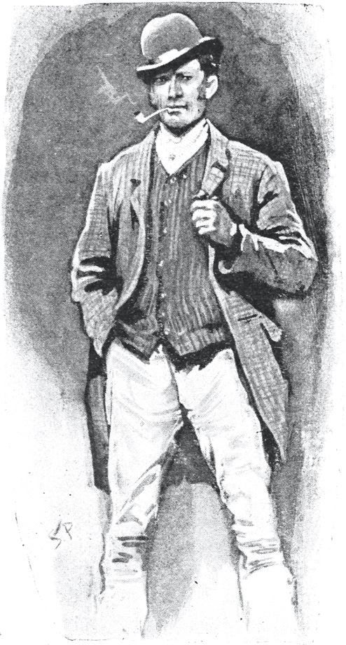
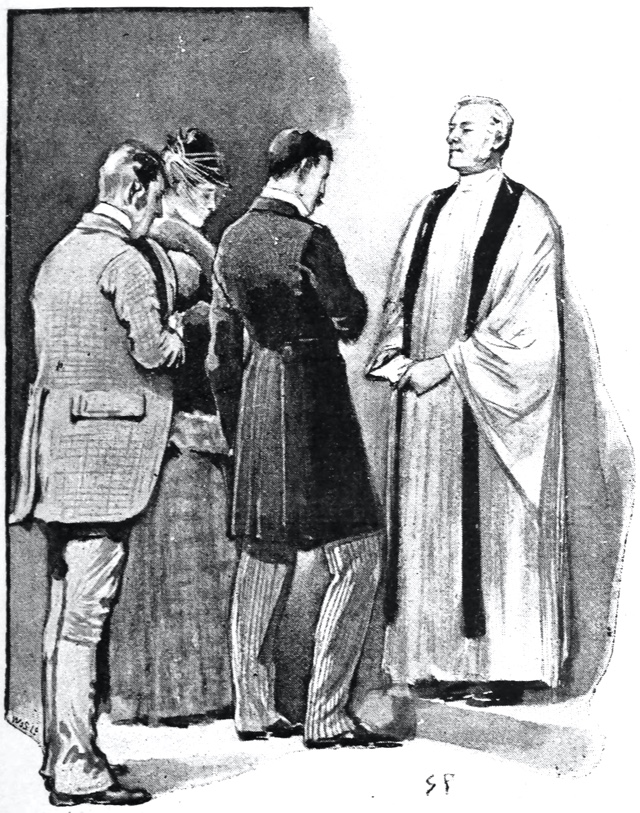
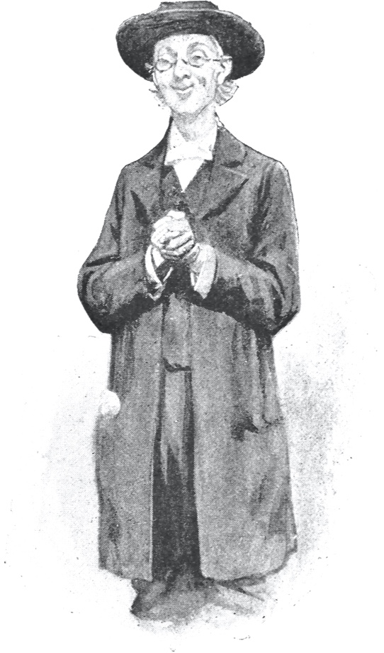
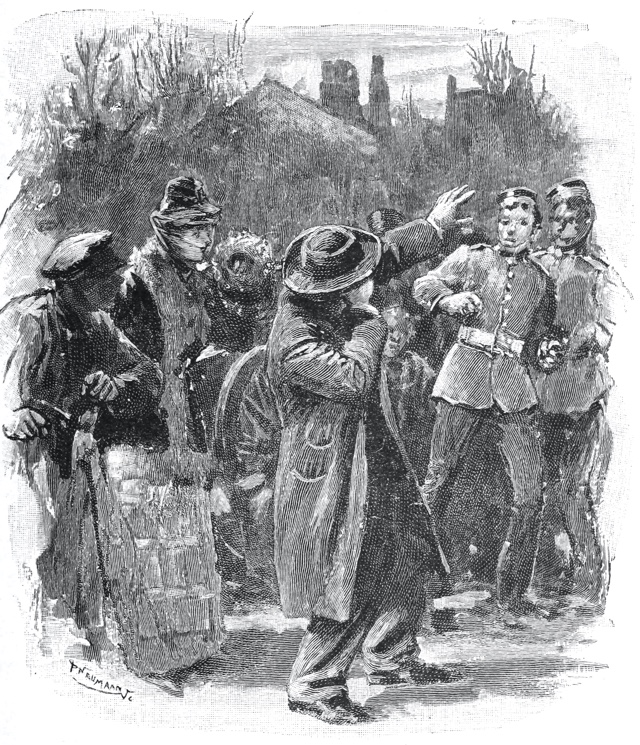

# 𐑩 𐑕𐑒𐑨𐑯𐑛𐑩𐑤 𐑦𐑯 ·𐑚𐑴𐑣𐑰𐑥𐑾

𐑚𐑲 ·𐑸𐑔𐑼 𐑒𐑴𐑯𐑩𐑯 𐑛𐑶𐑤

## 2

𐑨𐑑 𐑔𐑮𐑰 𐑩𐑒𐑤𐑪𐑒 𐑐𐑮𐑦𐑕𐑲𐑕𐑤𐑦 𐑲 𐑢𐑪𐑟 𐑨𐑑 ·𐑚𐑱𐑒𐑼 𐑕𐑑𐑮𐑰𐑑, 𐑚𐑳𐑑 ·𐑣𐑴𐑥𐑟 𐑣𐑨𐑛 𐑯𐑪𐑑 𐑘𐑧𐑑 𐑮𐑦𐑑𐑻𐑯𐑛. 𐑞 𐑤𐑨𐑯𐑛𐑤𐑱𐑛𐑦 𐑦𐑯𐑓𐑹𐑥𐑛 𐑥𐑰 𐑞𐑨𐑑 𐑣𐑰 𐑣𐑨𐑛 𐑤𐑧𐑓𐑑 𐑞 𐑣𐑬𐑕 𐑖𐑹𐑑𐑤𐑦 𐑭𐑓𐑑𐑼 𐑱𐑑 𐑩𐑒𐑤𐑪𐑒 𐑦𐑯 𐑞 𐑥𐑹𐑯𐑦𐑙. 𐑲 𐑕𐑨𐑑 𐑛𐑬𐑯 𐑚𐑦𐑕𐑲𐑛 𐑞 𐑓𐑲𐑼, 𐑣𐑬𐑧𐑝𐑼, 𐑢𐑦𐑞 𐑞 𐑦𐑯𐑑𐑧𐑯𐑖𐑩𐑯 𐑝 𐑩𐑢𐑱𐑑𐑦𐑙 𐑣𐑦𐑥, 𐑣𐑬𐑧𐑝𐑼 𐑤𐑪𐑙 𐑣𐑰 𐑥𐑲𐑑 𐑚𐑰. 𐑲 𐑢𐑪𐑟 𐑷𐑤𐑮𐑧𐑛𐑦 𐑛𐑰𐑐𐑤𐑦 𐑦𐑯𐑑𐑮𐑩𐑕𐑑𐑩𐑛 𐑦𐑯 𐑣𐑦𐑟 𐑦𐑯𐑒𐑢𐑲𐑼𐑦, 𐑓, 𐑞𐑴 𐑦𐑑 𐑢𐑪𐑟 𐑕𐑼𐑬𐑯𐑛𐑩𐑛 𐑚𐑲 𐑯𐑳𐑯 𐑝 𐑞 𐑜𐑮𐑦𐑥 𐑯 𐑕𐑑𐑮𐑱𐑯𐑡 𐑓𐑰𐑗𐑼𐑟 𐑢𐑦𐑗 𐑢𐑻 𐑩𐑕𐑴𐑖𐑦𐑱𐑑𐑩𐑛 𐑢𐑦𐑞 𐑞 𐑑𐑵 𐑒𐑮𐑲𐑥𐑟 𐑢𐑦𐑗 𐑲 𐑣𐑨𐑝 𐑷𐑤𐑮𐑧𐑛𐑦 𐑮𐑦𐑒𐑹𐑛𐑩𐑛, 𐑕𐑑𐑦𐑤, 𐑞 𐑯𐑱𐑗𐑼 𐑝 𐑞 𐑒𐑱𐑕 𐑯 𐑞 𐑦𐑜𐑟𐑷𐑤𐑑𐑩𐑛 𐑕𐑑𐑱𐑖𐑩𐑯 𐑝 𐑣𐑦𐑟 𐑒𐑤𐑲𐑩𐑯𐑑 𐑜𐑱𐑝 𐑦𐑑 𐑩 𐑒𐑨𐑮𐑩𐑒𐑑𐑼 𐑝 𐑦𐑑𐑕 𐑴𐑯. 𐑦𐑯𐑛𐑰𐑛, 𐑩𐑐𐑸𐑑 𐑓𐑮𐑪𐑥 𐑞 𐑯𐑱𐑗𐑼 𐑝 𐑞 𐑦𐑯𐑝𐑧𐑕𐑑𐑦𐑜𐑱𐑖𐑩𐑯 𐑢𐑦𐑗 𐑥𐑲 𐑓𐑮𐑧𐑯𐑛 𐑣𐑨𐑛 𐑪𐑯 𐑣𐑨𐑯𐑛, 𐑞𐑺 𐑢𐑪𐑟 𐑕𐑳𐑥𐑔𐑦𐑙 𐑦𐑯 𐑣𐑦𐑟 𐑥𐑭𐑕𐑑𐑼𐑤𐑦 𐑜𐑮𐑭𐑕𐑐 𐑝 𐑩 𐑕𐑦𐑗𐑵𐑱𐑖𐑩𐑯, 𐑯 𐑣𐑦𐑟 𐑒𐑰𐑯, 𐑦𐑯𐑕𐑲𐑕𐑦𐑝 𐑮𐑰𐑟𐑩𐑯𐑦𐑙, 𐑢𐑦𐑗 𐑥𐑱𐑛 𐑦𐑑 𐑩 𐑐𐑤𐑧𐑠𐑼 𐑑 𐑥𐑰 𐑑 𐑕𐑑𐑳𐑛𐑦 𐑣𐑦𐑟 𐑕𐑦𐑕𐑑𐑩𐑥 𐑝 𐑢𐑻𐑒, 𐑯 𐑑 𐑓𐑪𐑤𐑴 𐑞 𐑒𐑢𐑦𐑒, 𐑕𐑳𐑑𐑩𐑤 𐑥𐑧𐑔𐑩𐑛𐑟 𐑚𐑲 𐑢𐑦𐑗 𐑣𐑰 𐑛𐑦𐑕𐑦𐑯𐑑𐑨𐑙𐑜𐑩𐑤𐑛 𐑞 𐑥𐑴𐑕𐑑 𐑦𐑯𐑦𐑒𐑕𐑑𐑮𐑦𐑒𐑩𐑚𐑩𐑤 𐑥𐑦𐑕𐑑𐑼𐑦𐑟. 𐑕𐑴 𐑩𐑒𐑳𐑕𐑑𐑩𐑥𐑛 𐑢𐑪𐑟 𐑲 𐑑 𐑣𐑦𐑟 𐑦𐑯𐑝𐑺𐑾𐑚𐑩𐑤 𐑕𐑩𐑒𐑕𐑧𐑕 𐑞𐑨𐑑 𐑞 𐑝𐑧𐑮𐑦 𐑐𐑪𐑕𐑩𐑚𐑦𐑤𐑦𐑑𐑦 𐑝 𐑣𐑦𐑟 𐑓𐑱𐑤𐑦𐑙 𐑣𐑨𐑛 𐑕𐑰𐑕𐑑 𐑑 𐑧𐑯𐑑𐑼 𐑦𐑯𐑑𐑵 𐑥𐑲 𐑣𐑧𐑛.

𐑦𐑑 𐑢𐑪𐑟 𐑒𐑤𐑴𐑕 𐑩𐑐𐑪𐑯 𐑓𐑹 𐑚𐑦𐑓𐑹 𐑞 𐑛𐑹 𐑴𐑐𐑩𐑯𐑛, 𐑯 𐑩 𐑛𐑮𐑳𐑙𐑒𐑩𐑯-𐑤𐑫𐑒𐑦𐑙 𐑜𐑮𐑵𐑥, 𐑦𐑤-𐑒𐑧𐑥𐑐𐑑 𐑯 𐑕𐑲𐑛-𐑢𐑦𐑕𐑒𐑼𐑛, 𐑢𐑦𐑞 𐑩𐑯 𐑦𐑯𐑓𐑤𐑱𐑥𐑛 𐑓𐑱𐑕 𐑯 𐑛𐑦𐑕𐑮𐑧𐑐𐑘𐑩𐑑𐑩𐑚𐑩𐑤 𐑒𐑤𐑴𐑞𐑟, 𐑢𐑷𐑒𐑑 𐑦𐑯𐑑𐑵 𐑞 𐑮𐑵𐑥. 𐑩𐑒𐑳𐑕𐑑𐑩𐑥𐑛 𐑨𐑟 𐑲 𐑢𐑪𐑟 𐑑 𐑥𐑲 𐑓𐑮𐑧𐑯𐑛𐑟 𐑩𐑥𐑱𐑟𐑦𐑙 𐑐𐑬𐑼𐑟 𐑦𐑯 𐑞 𐑿𐑕 𐑝 𐑛𐑦𐑕𐑜𐑲𐑟𐑩𐑟, 𐑲 𐑣𐑨𐑛 𐑑 𐑤𐑫𐑒 𐑔𐑮𐑰 𐑑𐑲𐑥𐑟 𐑚𐑦𐑓𐑹 𐑲 𐑢𐑪𐑟 𐑕𐑻𐑑𐑩𐑯 𐑞𐑨𐑑 𐑦𐑑 𐑢𐑪𐑟 𐑦𐑯𐑛𐑰𐑛 𐑣𐑰. 𐑢𐑦𐑞 𐑩 𐑯𐑪𐑛 𐑣𐑰 𐑝𐑨𐑯𐑦𐑖𐑑 𐑦𐑯𐑑𐑵 𐑞 𐑚𐑧𐑛𐑮𐑵𐑥, 𐑢𐑧𐑯𐑕 𐑣𐑰 𐑦𐑥𐑻𐑡𐑛 𐑦𐑯 𐑓𐑲𐑝 𐑥𐑦𐑯𐑦𐑑𐑕 𐑑𐑢𐑰𐑛-𐑕𐑵𐑑𐑩𐑛 𐑯 𐑮𐑦𐑕𐑐𐑧𐑒𐑑𐑩𐑚𐑩𐑤, 𐑨𐑟 𐑝 𐑴𐑤𐑛. 𐑐𐑫𐑑𐑦𐑙 𐑣𐑦𐑟 𐑣𐑨𐑯𐑛𐑟 𐑦𐑯𐑑𐑵 𐑣𐑦𐑟 𐑐𐑪𐑒𐑩𐑑𐑕, 𐑣𐑰 𐑕𐑑𐑮𐑧𐑗𐑑 𐑬𐑑 𐑣𐑦𐑟 𐑤𐑧𐑜𐑟 𐑦𐑯 𐑓𐑮𐑳𐑯𐑑 𐑝 𐑞 𐑓𐑲𐑼 𐑯 𐑤𐑭𐑓𐑑 𐑣𐑸𐑑𐑦𐑤𐑦 𐑓 𐑕𐑳𐑥 𐑥𐑦𐑯𐑦𐑑𐑕.

"𐑢𐑧𐑤, 𐑮𐑾𐑤𐑦!" 𐑣𐑰 𐑒𐑮𐑲𐑛, 𐑯 𐑞𐑧𐑯 𐑣𐑰 𐑗𐑴𐑒𐑑 𐑯 𐑤𐑭𐑓𐑑 𐑩𐑜𐑱𐑯 𐑩𐑯𐑑𐑦𐑤 𐑣𐑰 𐑢𐑪𐑟 𐑩𐑚𐑤𐑲𐑡𐑛 𐑑 𐑤𐑲 𐑚𐑨𐑒, 𐑤𐑦𐑥𐑐 𐑯 𐑣𐑧𐑤𐑐𐑤𐑩𐑕, 𐑦𐑯 𐑞 𐑗𐑺.

"𐑢𐑪𐑑 𐑦𐑟 𐑦𐑑?"

"𐑦𐑑𐑕 𐑒𐑢𐑲𐑑 𐑑𐑵 𐑓𐑳𐑯𐑦. 𐑲 𐑨𐑥 𐑖𐑫𐑼 𐑿 𐑒𐑫𐑛 𐑯𐑧𐑝𐑼 𐑜𐑧𐑕 𐑣𐑬 𐑲 𐑦𐑥𐑐𐑤𐑶𐑛 𐑥𐑲 𐑥𐑹𐑯𐑦𐑙, 𐑹 𐑢𐑪𐑑 𐑲 𐑧𐑯𐑛𐑩𐑛 𐑚𐑲 𐑛𐑵𐑦𐑙."

"𐑲 𐑒𐑭𐑯𐑑 𐑦𐑥𐑨𐑡𐑦𐑯. 𐑲 𐑕𐑩𐑐𐑴𐑟 𐑞𐑨𐑑 𐑿 𐑣𐑨𐑝 𐑚𐑰𐑯 𐑢𐑪𐑗𐑦𐑙 𐑞 𐑣𐑨𐑚𐑦𐑑𐑕, 𐑯 𐑐𐑼𐑣𐑨𐑐𐑕 𐑞 𐑣𐑬𐑕, 𐑝 ·𐑥𐑦𐑕 𐑲𐑮𐑰𐑯 𐑨𐑛𐑤𐑼."

"𐑒𐑢𐑲𐑑 𐑕𐑴; 𐑚𐑳𐑑 𐑞 𐑕𐑰𐑒𐑢𐑩𐑤 𐑢𐑪𐑟 𐑮𐑭𐑞𐑼 𐑳𐑯𐑿𐑠𐑵𐑩𐑤. 𐑲 𐑢𐑦𐑤 𐑑𐑧𐑤 𐑿, 𐑣𐑬𐑧𐑝𐑼. 𐑲 𐑤𐑧𐑓𐑑 𐑞 𐑣𐑬𐑕 𐑩 𐑤𐑦𐑑𐑩𐑤 𐑭𐑓𐑑𐑼 𐑱𐑑 𐑩𐑒𐑤𐑪𐑒 𐑞𐑦𐑕 𐑥𐑹𐑯𐑦𐑙 𐑦𐑯 𐑞 𐑒𐑨𐑮𐑩𐑒𐑑𐑼 𐑝 𐑩 𐑜𐑮𐑵𐑥 𐑬𐑑 𐑝 𐑢𐑻𐑒. 𐑞𐑺 𐑦𐑟 𐑩 𐑢𐑳𐑯𐑛𐑼𐑓𐑩𐑤 𐑕𐑦𐑥𐑐𐑩𐑔𐑦 𐑯 𐑓𐑮𐑰𐑥𐑱𐑕𐑩𐑯𐑮𐑦 𐑩𐑥𐑳𐑙 𐑣𐑹𐑕𐑦 𐑥𐑧𐑯. 𐑚𐑰 𐑢𐑳𐑯 𐑝 𐑞𐑧𐑥, 𐑯 𐑿 𐑢𐑦𐑤 𐑯𐑴 𐑷𐑤 𐑞𐑨𐑑 𐑞𐑺 𐑦𐑟 𐑑 𐑯𐑴. 𐑲 𐑕𐑵𐑯 𐑓𐑬𐑯𐑛 ·𐑚𐑮𐑲𐑩𐑯𐑦 𐑤𐑪𐑡. 𐑦𐑑 𐑦𐑟 𐑩 𐑚𐑰𐑠𐑵 𐑝𐑦𐑤𐑩, 𐑢𐑦𐑞 𐑩 𐑜𐑸𐑛𐑩𐑯 𐑨𐑑 𐑞 𐑚𐑨𐑒, 𐑚𐑳𐑑 𐑚𐑦𐑤𐑑 𐑬𐑑 𐑦𐑯 𐑓𐑮𐑳𐑯𐑑 𐑮𐑲𐑑 𐑳𐑐 𐑑 𐑞 𐑮𐑴𐑛, 𐑑𐑵 𐑕𐑑𐑹𐑦𐑟. ·𐑗𐑳𐑚 𐑤𐑪𐑒 𐑑 𐑞 𐑛𐑹. 𐑤𐑸𐑡 𐑕𐑦𐑑𐑦𐑙-𐑮𐑵𐑥 𐑪𐑯 𐑞 𐑮𐑲𐑑 𐑕𐑲𐑛, 𐑢𐑧𐑤 𐑓𐑻𐑯𐑦𐑖𐑑, 𐑢𐑦𐑞 𐑤𐑪𐑙 𐑢𐑦𐑯𐑛𐑴𐑟 𐑷𐑤𐑥𐑴𐑕𐑑 𐑑 𐑞 𐑓𐑤𐑹, 𐑯 𐑞𐑴𐑟 𐑐𐑮𐑦𐑐𐑪𐑕𐑑𐑼𐑩𐑕 𐑦𐑙𐑜𐑤𐑦𐑖 𐑢𐑦𐑯𐑛𐑴 𐑓𐑭𐑕𐑩𐑯𐑼𐑟 𐑢𐑦𐑗 𐑩 𐑗𐑲𐑤𐑛 𐑒𐑫𐑛 𐑴𐑐𐑩𐑯. 𐑚𐑦𐑣𐑲𐑯𐑛 𐑞𐑺 𐑢𐑪𐑟 𐑯𐑳𐑔𐑦𐑙 𐑮𐑦𐑥𐑸𐑒𐑩𐑚𐑩𐑤, 𐑕𐑱𐑝 𐑞𐑨𐑑 𐑞 𐑐𐑨𐑕𐑦𐑡 𐑢𐑦𐑯𐑛𐑴 𐑒𐑫𐑛 𐑚𐑰 𐑮𐑰𐑗𐑑 𐑓𐑮𐑪𐑥 𐑞 𐑑𐑪𐑐 𐑝 𐑞 𐑒𐑴𐑗-𐑣𐑬𐑕. 𐑲 𐑢𐑷𐑒𐑑 𐑮𐑬𐑯𐑛 𐑦𐑑 𐑯 𐑦𐑜𐑟𐑨𐑥𐑦𐑯𐑛 𐑦𐑑 𐑒𐑤𐑴𐑕𐑤𐑦 𐑓𐑮𐑪𐑥 𐑧𐑝𐑮𐑦 𐑐𐑶𐑯𐑑 𐑝 𐑝𐑿, 𐑚𐑳𐑑 𐑢𐑦𐑞𐑬𐑑 𐑯𐑴𐑑𐑦𐑙 𐑧𐑯𐑦𐑔𐑦𐑙 𐑧𐑤𐑕 𐑝 𐑦𐑯𐑑𐑮𐑩𐑕𐑑.

"𐑲 𐑞𐑧𐑯 𐑤𐑬𐑯𐑡𐑛 𐑛𐑬𐑯 𐑞 𐑕𐑑𐑮𐑰𐑑 𐑯 𐑓𐑬𐑯𐑛, 𐑨𐑟 𐑲 𐑦𐑒𐑕𐑐𐑧𐑒𐑑𐑩𐑛, 𐑞𐑨𐑑 𐑞𐑺 𐑢𐑪𐑟 𐑩 𐑥𐑿𐑟 𐑦𐑯 𐑩 𐑤𐑱𐑯 𐑢𐑦𐑗 𐑮𐑳𐑯𐑟 𐑛𐑬𐑯 𐑚𐑲 𐑢𐑳𐑯 𐑢𐑷𐑤 𐑝 𐑞 𐑜𐑸𐑛𐑩𐑯. 𐑲 𐑤𐑧𐑯𐑑 𐑞 𐑪𐑕𐑤𐑼𐑟 𐑩 𐑣𐑨𐑯𐑛 𐑦𐑯 𐑮𐑳𐑚𐑦𐑙 𐑛𐑬𐑯 𐑞𐑺 𐑣𐑹𐑕𐑩𐑟, 𐑯 𐑮𐑦𐑕𐑰𐑝𐑛 𐑦𐑯 𐑦𐑒𐑕𐑗𐑱𐑯𐑡 𐑑𐑳𐑐𐑩𐑯𐑕, 𐑩 𐑜𐑤𐑭𐑕 𐑝 𐑣𐑭𐑓-𐑯-𐑣𐑭𐑓, 𐑑𐑵 𐑓𐑦𐑤𐑟 𐑝 𐑖𐑨𐑜 𐑑𐑩𐑚𐑨𐑒𐑴, 𐑯 𐑨𐑟 𐑥𐑳𐑗 𐑦𐑯𐑓𐑼𐑥𐑱𐑖𐑩𐑯 𐑨𐑟 𐑲 𐑒𐑫𐑛 𐑛𐑦𐑟𐑲𐑼 𐑩𐑚𐑬𐑑 ·𐑥𐑦𐑕 𐑨𐑛𐑤𐑼, 𐑑 𐑕𐑱 𐑯𐑳𐑔𐑦𐑙 𐑝 𐑣𐑭𐑓 𐑩 𐑛𐑳𐑟𐑩𐑯 𐑳𐑞𐑼 𐑐𐑰𐑐𐑩𐑤 𐑦𐑯 𐑞 𐑯𐑱𐑚𐑼𐑣𐑫𐑛 𐑦𐑯 𐑣𐑵𐑥 𐑲 𐑢𐑪𐑟 𐑯𐑪𐑑 𐑦𐑯 𐑞 𐑤𐑰𐑕𐑑 𐑦𐑯𐑑𐑮𐑩𐑕𐑑𐑩𐑛, 𐑚𐑳𐑑 𐑣𐑵𐑟 𐑚𐑲𐑪𐑜𐑮𐑩𐑓𐑦𐑟 𐑲 𐑢𐑪𐑟 𐑒𐑩𐑥𐑐𐑧𐑤𐑛 𐑑 𐑤𐑦𐑕𐑩𐑯 𐑑."

"𐑯 𐑢𐑪𐑑 𐑝 ·𐑲𐑮𐑰𐑯 𐑨𐑛𐑤𐑼?"𐑲 𐑭𐑕𐑒𐑑.

"𐑴, 𐑖𐑰 𐑣𐑨𐑟 𐑑𐑻𐑯𐑛 𐑷𐑤 𐑞 𐑥𐑧𐑯𐑟 𐑣𐑧𐑛𐑟 𐑛𐑬𐑯 𐑦𐑯 𐑞𐑨𐑑 𐑐𐑸𐑑. 𐑖𐑰 𐑦𐑟 𐑞 𐑛𐑱𐑯𐑑𐑾𐑕𐑑 𐑔𐑦𐑙 𐑳𐑯𐑛𐑼 𐑩 𐑚𐑪𐑯𐑩𐑑 𐑪𐑯 𐑞𐑦𐑕 𐑐𐑤𐑨𐑯𐑩𐑑. 𐑕𐑴 𐑕𐑱 𐑞 ·𐑕𐑻𐑐𐑩𐑯𐑑𐑲𐑯-𐑥𐑿𐑟, 𐑑 𐑩 𐑥𐑨𐑯. 𐑖𐑰 𐑤𐑦𐑝𐑟 𐑒𐑢𐑲𐑩𐑑𐑤𐑦, 𐑕𐑦𐑙𐑟 𐑨𐑑 𐑒𐑪𐑯𐑕𐑼𐑑𐑕, 𐑛𐑮𐑲𐑝𐑟 𐑬𐑑 𐑨𐑑 𐑓𐑲𐑝 𐑧𐑝𐑮𐑦 𐑛𐑱, 𐑯 𐑮𐑦𐑑𐑻𐑯𐑟 𐑨𐑑 𐑕𐑧𐑝𐑩𐑯 𐑖𐑸𐑐 𐑓 𐑛𐑦𐑯𐑼. 𐑕𐑧𐑤𐑛𐑩𐑥 𐑜𐑴𐑟 𐑬𐑑 𐑨𐑑 𐑳𐑞𐑼 𐑑𐑲𐑥𐑟, 𐑦𐑒𐑕𐑧𐑐𐑑 𐑢𐑧𐑯 𐑖𐑰 𐑕𐑦𐑙𐑟. 𐑣𐑨𐑟 𐑴𐑯𐑤𐑦 𐑢𐑳𐑯 𐑥𐑱𐑤 𐑝𐑦𐑟𐑦𐑑𐑼, 𐑚𐑳𐑑 𐑩 𐑜𐑫𐑛 𐑛𐑰𐑤 𐑝 𐑣𐑦𐑥. 𐑣𐑰 𐑦𐑟 𐑛𐑸𐑒, 𐑣𐑨𐑯𐑛𐑕𐑩𐑥, 𐑯 𐑛𐑨𐑖𐑦𐑙, 𐑯𐑧𐑝𐑼 𐑒𐑷𐑤𐑟 𐑤𐑧𐑕 𐑞𐑨𐑯 𐑢𐑳𐑯𐑕 𐑩 𐑛𐑱, 𐑯 𐑪𐑓𐑩𐑯 𐑑𐑢𐑲𐑕. 𐑣𐑰 𐑦𐑟 𐑩 ·𐑥𐑼 𐑜𐑪𐑛𐑓𐑮𐑦 𐑯𐑹𐑑𐑩𐑯, 𐑝 𐑞 ·𐑦𐑯𐑼 𐑑𐑧𐑥𐑐𐑩𐑤. 𐑕𐑰 𐑞 𐑩𐑛𐑝𐑭𐑯𐑑𐑦𐑡𐑩𐑟 𐑝 𐑩 𐑒𐑨𐑚𐑥𐑩𐑯 𐑨𐑟 𐑩 𐑒𐑪𐑯𐑓𐑦𐑛𐑨𐑯𐑑. 𐑞𐑱 𐑣𐑨𐑛 𐑛𐑮𐑦𐑝𐑩𐑯 𐑣𐑦𐑥 𐑣𐑴𐑥 𐑩 𐑛𐑳𐑟𐑩𐑯 𐑑𐑲𐑥𐑟 𐑓𐑮𐑪𐑥 ·𐑕𐑻𐑐𐑩𐑯𐑑𐑲𐑯-𐑥𐑿𐑟, 𐑯 𐑯𐑿 𐑷𐑤 𐑩𐑚𐑬𐑑 𐑣𐑦𐑥. 𐑢𐑧𐑯 𐑲 𐑣𐑨𐑛 𐑤𐑦𐑕𐑩𐑯𐑛 𐑑 𐑷𐑤 𐑞𐑱 𐑣𐑨𐑛 𐑑 𐑑𐑧𐑤, 𐑲 𐑚𐑦𐑜𐑨𐑯 𐑑 𐑢𐑷𐑒 𐑳𐑐 𐑯 𐑛𐑬𐑯 𐑯𐑽 ·𐑚𐑮𐑲𐑩𐑯𐑦 𐑤𐑪𐑡 𐑢𐑳𐑯𐑕 𐑥𐑹, 𐑯 𐑑 𐑔𐑦𐑙𐑒 𐑴𐑝𐑼 𐑥𐑲 𐑐𐑤𐑨𐑯 𐑝 𐑒𐑨𐑥𐑐𐑱𐑯.

"𐑞𐑦𐑕 ·𐑜𐑪𐑛𐑓𐑮𐑦 𐑯𐑹𐑑𐑩𐑯 𐑢𐑪𐑟 𐑧𐑝𐑦𐑛𐑩𐑯𐑑𐑤𐑦 𐑩𐑯 𐑦𐑥𐑐𐑹𐑑𐑩𐑯𐑑 𐑓𐑨𐑒𐑑𐑼 𐑦𐑯 𐑞 𐑥𐑨𐑑𐑼. 𐑣𐑰 𐑢𐑪𐑟 𐑩 𐑤𐑷𐑘𐑼. 𐑞𐑨𐑑 𐑕𐑬𐑯𐑛𐑩𐑛 𐑪𐑥𐑦𐑯𐑩𐑕. 𐑢𐑪𐑑 𐑢𐑪𐑟 𐑞 𐑮𐑦𐑤𐑱𐑖𐑩𐑯 𐑚𐑦𐑑𐑢𐑰𐑯 𐑞𐑧𐑥, 𐑯 𐑢𐑪𐑑 𐑞 𐑪𐑚𐑡𐑧𐑒𐑑 𐑝 𐑣𐑦𐑟 𐑮𐑦𐑐𐑰𐑑𐑩𐑛 𐑝𐑦𐑟𐑦𐑑𐑕? 𐑢𐑪𐑟 𐑖𐑰 𐑣𐑦𐑟 𐑒𐑤𐑲𐑩𐑯𐑑, 𐑣𐑦𐑟 𐑓𐑮𐑧𐑯𐑛, 𐑹 𐑣𐑦𐑟 𐑥𐑦𐑕𐑑𐑮𐑩𐑕? 𐑦𐑓 𐑞 𐑓𐑹𐑥𐑼, 𐑖𐑰 𐑣𐑨𐑛 𐑐𐑮𐑪𐑚𐑩𐑚𐑤𐑦 𐑑𐑮𐑨𐑯𐑕𐑓𐑻𐑛 𐑞 𐑓𐑴𐑑𐑩𐑜𐑮𐑨𐑓 𐑑 𐑣𐑦𐑟 𐑒𐑰𐑐𐑦𐑙. 𐑦𐑓 𐑞 𐑤𐑨𐑑𐑼, 𐑦𐑑 𐑢𐑪𐑟 𐑤𐑧𐑕 𐑤𐑲𐑒𐑤𐑦. 𐑪𐑯 𐑞 𐑦𐑖𐑵 𐑝 𐑞𐑦𐑕 𐑒𐑢𐑧𐑕𐑗𐑩𐑯 𐑛𐑦𐑐𐑧𐑯𐑛𐑩𐑛 𐑢𐑧𐑞𐑼 𐑲 𐑖𐑫𐑛 𐑒𐑩𐑯𐑑𐑦𐑯𐑿 𐑥𐑲 𐑢𐑻𐑒 𐑨𐑑 ·𐑚𐑮𐑲𐑩𐑯𐑦 𐑤𐑪𐑡, 𐑹 𐑑𐑻𐑯 𐑥𐑲 𐑩𐑑𐑧𐑯𐑖𐑩𐑯 𐑑 𐑞 𐑡𐑧𐑯𐑑𐑩𐑤𐑥𐑩𐑯𐑟 𐑗𐑱𐑥𐑚𐑼𐑟 𐑦𐑯 𐑞 ·𐑑𐑧𐑥𐑐𐑩𐑤. 𐑦𐑑 𐑢𐑪𐑟 𐑩 𐑛𐑧𐑤𐑦𐑒𐑩𐑑 𐑐𐑶𐑯𐑑, 𐑯 𐑦𐑑 𐑢𐑲𐑛𐑩𐑯𐑛 𐑞 𐑓𐑰𐑤𐑛 𐑝 𐑥𐑲 𐑦𐑯𐑒𐑢𐑲𐑼𐑦. 𐑲 𐑓𐑽 𐑞𐑨𐑑 𐑲 𐑚𐑹 𐑿 𐑢𐑦𐑞 𐑞𐑰𐑟 𐑛𐑰𐑑𐑱𐑤𐑟, 𐑚𐑳𐑑 𐑲 𐑣𐑨𐑝 𐑑 𐑤𐑧𐑑 𐑿 𐑕𐑰 𐑥𐑲 𐑤𐑦𐑑𐑩𐑤 𐑛𐑦𐑓𐑦𐑒𐑩𐑤𐑑𐑦𐑟, 𐑦𐑓 𐑿 𐑸 𐑑 𐑳𐑯𐑛𐑼𐑕𐑑𐑨𐑯𐑛 𐑞 𐑕𐑦𐑗𐑵𐑱𐑖𐑩𐑯."

"𐑲 𐑨𐑥 𐑓𐑪𐑤𐑴𐑦𐑙 𐑿 𐑒𐑤𐑴𐑕𐑤𐑦," 𐑲 𐑭𐑯𐑕𐑼𐑛.

"𐑲 𐑢𐑪𐑟 𐑕𐑑𐑦𐑤 𐑚𐑨𐑤𐑩𐑯𐑕𐑦𐑙 𐑞 𐑥𐑨𐑑𐑼 𐑦𐑯 𐑥𐑲 𐑥𐑲𐑯𐑛 𐑢𐑧𐑯 𐑩 𐑣𐑨𐑯𐑕𐑩𐑥 𐑒𐑨𐑚 𐑛𐑮𐑴𐑝 𐑳𐑐 𐑑 ·𐑚𐑮𐑲𐑩𐑯𐑦 𐑤𐑪𐑡, 𐑯 𐑩 𐑡𐑧𐑯𐑑𐑩𐑤𐑥𐑩𐑯 𐑕𐑐𐑮𐑨𐑙 𐑬𐑑. 𐑣𐑰 𐑢𐑪𐑟 𐑩 𐑮𐑦𐑥𐑸𐑒𐑩𐑚𐑤𐑦 𐑣𐑨𐑯𐑛𐑕𐑩𐑥 𐑥𐑨𐑯, 𐑛𐑸𐑒, 𐑨𐑒𐑢𐑦𐑤𐑲𐑯, 𐑯 𐑥𐑩𐑕𐑑𐑭𐑖𐑑—𐑧𐑝𐑦𐑛𐑩𐑯𐑑𐑤𐑦 𐑞 𐑥𐑨𐑯 𐑝 𐑣𐑵𐑥 𐑲 𐑣𐑨𐑛 𐑣𐑻𐑛. 𐑣𐑰 𐑩𐑐𐑽𐑛 𐑑 𐑚𐑰 𐑦𐑯 𐑩 𐑜𐑮𐑱𐑑 𐑣𐑳𐑮𐑦, 𐑖𐑬𐑑𐑩𐑛 𐑑 𐑞 𐑒𐑨𐑚𐑥𐑩𐑯 𐑑 𐑢𐑱𐑑, 𐑯 𐑚𐑮𐑳𐑖𐑑 𐑐𐑭𐑕𐑑 𐑞 𐑥𐑱𐑛 𐑣𐑵 𐑴𐑐𐑩𐑯𐑛 𐑞 𐑛𐑹 𐑢𐑦𐑞 𐑞 𐑺 𐑝 𐑩 𐑥𐑨𐑯 𐑣𐑵 𐑢𐑪𐑟 𐑔𐑳𐑮𐑩𐑤𐑦 𐑨𐑑 𐑣𐑴𐑥.

"𐑣𐑰 𐑢𐑪𐑟 𐑦𐑯 𐑞 𐑣𐑬𐑕 𐑩𐑚𐑬𐑑 𐑣𐑭𐑓 𐑩𐑯 𐑬𐑼, 𐑯 𐑲 𐑒𐑫𐑛 𐑒𐑨𐑗 𐑜𐑤𐑦𐑥𐑐𐑕𐑩𐑟 𐑝 𐑣𐑦𐑥 𐑦𐑯 𐑞 𐑢𐑦𐑯𐑛𐑴𐑟 𐑝 𐑞 𐑕𐑦𐑑𐑦𐑙-𐑮𐑵𐑥, 𐑐𐑱𐑕𐑦𐑙 𐑳𐑐 𐑯 𐑛𐑬𐑯, 𐑑𐑷𐑒𐑦𐑙 𐑦𐑒𐑕𐑲𐑑𐑩𐑛𐑤𐑦, 𐑯 𐑢𐑱𐑝𐑦𐑙 𐑣𐑦𐑟 𐑸𐑥𐑟. 𐑝 𐑣𐑻 𐑲 𐑒𐑫𐑛 𐑕𐑰 𐑯𐑳𐑔𐑦𐑙. 𐑐𐑮𐑧𐑟𐑩𐑯𐑑𐑤𐑦 𐑣𐑰 𐑦𐑥𐑻𐑡𐑛, 𐑤𐑫𐑒𐑦𐑙 𐑰𐑝𐑩𐑯 𐑥𐑹 𐑓𐑤𐑳𐑮𐑦𐑛 𐑞𐑨𐑯 𐑚𐑦𐑓𐑹. 𐑨𐑟 𐑣𐑰 𐑕𐑑𐑧𐑐𐑑 𐑳𐑐 𐑑 𐑞 𐑒𐑨𐑚, 𐑣𐑰 𐑐𐑫𐑤𐑛 𐑩 𐑜𐑴𐑤𐑛 𐑢𐑪𐑗 𐑓𐑮𐑪𐑥 𐑣𐑦𐑟 𐑐𐑪𐑒𐑩𐑑 𐑯 𐑤𐑫𐑒𐑑 𐑨𐑑 𐑦𐑑 𐑻𐑯𐑩𐑕𐑑𐑤𐑦, '𐑛𐑮𐑲𐑝 𐑤𐑲𐑒 𐑞 𐑛𐑧𐑝𐑩𐑤,' 𐑣𐑰 𐑖𐑬𐑑𐑩𐑛, '𐑓𐑻𐑕𐑑 𐑑 ·𐑜𐑮𐑴𐑕 𐑯 𐑣𐑨𐑙𐑒𐑦𐑟 𐑦𐑯 ·𐑮𐑰𐑡𐑩𐑯𐑑 𐑕𐑑𐑮𐑰𐑑, 𐑯 𐑞𐑧𐑯 𐑑 𐑞 𐑗𐑻𐑗 𐑝 ·𐑕𐑱𐑯𐑑 𐑥𐑪𐑯𐑦𐑒𐑩 𐑦𐑯 𐑞 ·𐑧𐑡𐑢𐑺 𐑮𐑴𐑛. 𐑣𐑭𐑓 𐑩 𐑜𐑦𐑯𐑦 𐑦𐑓 𐑿 𐑛𐑵 𐑦𐑑 𐑦𐑯 𐑑𐑢𐑧𐑯𐑑𐑦 𐑥𐑦𐑯𐑦𐑑𐑕!'

"𐑩𐑢𐑱 𐑞𐑱 𐑢𐑧𐑯𐑑, 𐑯 𐑲 𐑢𐑪𐑟 𐑡𐑳𐑕𐑑 𐑢𐑳𐑯𐑛𐑼𐑦𐑙 𐑢𐑧𐑞𐑼 𐑲 𐑖𐑫𐑛 𐑯𐑪𐑑 𐑛𐑵 𐑢𐑧𐑤 𐑑 𐑓𐑪𐑤𐑴 𐑞𐑧𐑥 𐑢𐑧𐑯 𐑳𐑐 𐑞 𐑤𐑱𐑯 𐑒𐑱𐑥 𐑩 𐑯𐑰𐑑 𐑤𐑦𐑑𐑩𐑤 𐑤𐑨𐑯𐑛𐑷, 𐑞 𐑒𐑴𐑗𐑥𐑩𐑯 𐑢𐑦𐑞 𐑣𐑦𐑟 𐑒𐑴𐑑 𐑴𐑯𐑤𐑦 𐑣𐑭𐑓-𐑚𐑳𐑑𐑩𐑯𐑛, 𐑯 𐑣𐑦𐑟 𐑑𐑲 𐑳𐑯𐑛𐑼 𐑣𐑦𐑟 𐑽, 𐑢𐑲𐑤 𐑷𐑤 𐑞 𐑑𐑨𐑜𐑟 𐑝 𐑣𐑦𐑟 𐑣𐑸𐑯𐑩𐑕 𐑢𐑻 𐑕𐑑𐑦𐑒𐑦𐑙 𐑬𐑑 𐑝 𐑞 𐑚𐑳𐑒𐑩𐑤𐑟. 𐑦𐑑 𐑣𐑨𐑛𐑩𐑯𐑑 𐑐𐑫𐑤𐑛 𐑳𐑐 𐑚𐑦𐑓𐑹 𐑖𐑰 𐑖𐑪𐑑 𐑬𐑑 𐑝 𐑞 𐑣𐑷𐑤 𐑛𐑹 𐑯 𐑦𐑯𐑑𐑵 𐑦𐑑. 𐑲 𐑴𐑯𐑤𐑦 𐑒𐑷𐑑 𐑩 𐑜𐑤𐑦𐑥𐑐𐑕 𐑝 𐑣𐑻 𐑨𐑑 𐑞 𐑥𐑴𐑥𐑩𐑯𐑑, 𐑚𐑳𐑑 𐑖𐑰 𐑢𐑪𐑟 𐑩 𐑤𐑳𐑝𐑤𐑦 𐑢𐑫𐑥𐑩𐑯, 𐑢𐑦𐑞 𐑩 𐑓𐑱𐑕 𐑞𐑨𐑑 𐑩 𐑥𐑨𐑯 𐑥𐑲𐑑 𐑛𐑲 𐑓.

"'𐑞 𐑗𐑻𐑗 𐑝 ·𐑕𐑱𐑯𐑑 𐑥𐑪𐑯𐑦𐑒𐑩, ·𐑡𐑪𐑯,' 𐑖𐑰 𐑒𐑮𐑲𐑛, '𐑯 𐑣𐑭𐑓 𐑩 𐑕𐑪𐑝𐑮𐑩𐑯 𐑦𐑓 𐑿 𐑮𐑰𐑗 𐑦𐑑 𐑦𐑯 𐑑𐑢𐑧𐑯𐑑𐑦 𐑥𐑦𐑯𐑦𐑑𐑕. '

"𐑞𐑦𐑕 𐑢𐑪𐑟 𐑒𐑢𐑲𐑑 𐑑𐑵 𐑜𐑫𐑛 𐑑 𐑤𐑵𐑟, ·𐑢𐑪𐑑𐑕𐑩𐑯. 𐑲 𐑢𐑪𐑟 𐑡𐑳𐑕𐑑 𐑚𐑨𐑤𐑩𐑯𐑕𐑦𐑙 𐑢𐑧𐑞𐑼 𐑲 𐑖𐑫𐑛 𐑮𐑳𐑯 𐑓 𐑦𐑑, 𐑹 𐑢𐑧𐑞𐑼 𐑲 𐑖𐑫𐑛 𐑐𐑻𐑗 𐑚𐑦𐑣𐑲𐑯𐑛 𐑣𐑻 𐑤𐑨𐑯𐑛𐑷 𐑢𐑧𐑯 𐑩 𐑒𐑨𐑚 𐑒𐑱𐑥 𐑔𐑮𐑵 𐑞 𐑕𐑑𐑮𐑰𐑑. 𐑞 𐑛𐑮𐑲𐑝𐑼 𐑤𐑫𐑒𐑑 𐑑𐑢𐑲𐑕 𐑨𐑑 𐑕𐑳𐑗 𐑩 𐑖𐑨𐑚𐑦 𐑓𐑺, 𐑚𐑳𐑑 𐑲 𐑡𐑳𐑥𐑐𐑑 𐑦𐑯 𐑚𐑦𐑓𐑹 𐑣𐑰 𐑒𐑫𐑛 𐑩𐑚𐑡𐑧𐑒𐑑. '𐑞 𐑗𐑻𐑗 𐑝 ·𐑕𐑱𐑯𐑑 𐑥𐑪𐑯𐑦𐑒𐑩,' 𐑕𐑧𐑛 𐑲, '𐑯 𐑣𐑭𐑓 𐑩 𐑕𐑪𐑝𐑮𐑩𐑯 𐑦𐑓 𐑿 𐑮𐑰𐑗 𐑦𐑑 𐑦𐑯 𐑑𐑢𐑧𐑯𐑑𐑦 𐑥𐑦𐑯𐑦𐑑𐑕.' 𐑦𐑑 𐑢𐑪𐑟 𐑑𐑢𐑧𐑯𐑑𐑦-𐑓𐑲𐑝 𐑥𐑦𐑯𐑦𐑑𐑕 𐑑 𐑑𐑢𐑧𐑤𐑝, 𐑯 𐑝 𐑒𐑹𐑕 𐑦𐑑 𐑢𐑪𐑟 𐑒𐑤𐑽 𐑦𐑯𐑳𐑓 𐑢𐑪𐑑 𐑢𐑪𐑟 𐑦𐑯 𐑞 𐑢𐑦𐑯𐑛.

"𐑥𐑲 𐑒𐑨𐑚𐑦 𐑛𐑮𐑴𐑝 𐑓𐑭𐑕𐑑. 𐑲 𐑛𐑴𐑯𐑑 𐑔𐑦𐑙𐑒 𐑲 𐑧𐑝𐑼 𐑛𐑮𐑴𐑝 𐑓𐑭𐑕𐑑𐑼, 𐑚𐑳𐑑 𐑞 𐑳𐑞𐑼𐑟 𐑢𐑻 𐑞𐑺 𐑚𐑦𐑓𐑹 𐑳𐑕. 𐑞 𐑒𐑨𐑚 𐑯 𐑞 𐑤𐑨𐑯𐑛𐑷 𐑢𐑦𐑞 𐑞𐑺 𐑕𐑑𐑰𐑥𐑦𐑙 𐑣𐑹𐑕𐑩𐑟 𐑢𐑻 𐑦𐑯 𐑓𐑮𐑳𐑯𐑑 𐑝 𐑞 𐑛𐑹 𐑢𐑧𐑯 𐑲 𐑼𐑲𐑝𐑛. 𐑲 𐑐𐑱𐑛 𐑞 𐑥𐑨𐑯 𐑯 𐑣𐑳𐑮𐑦𐑛 𐑦𐑯𐑑𐑵 𐑞 𐑗𐑻𐑗. 𐑞𐑺 𐑢𐑪𐑟 𐑯𐑪𐑑 𐑩 𐑕𐑴𐑤 𐑞𐑺 𐑕𐑱𐑝 𐑞 𐑑𐑵 𐑣𐑵𐑥 𐑲 𐑣𐑨𐑛 𐑓𐑪𐑤𐑴𐑛 𐑯 𐑩 𐑕𐑻𐑐𐑤𐑦𐑕𐑑 𐑒𐑤𐑻𐑡𐑦𐑥𐑩𐑯, 𐑣𐑵 𐑕𐑰𐑥𐑛 𐑑 𐑚𐑰 𐑦𐑒𐑕𐑐𐑪𐑕𐑗𐑩𐑤𐑱𐑑𐑦𐑙 𐑢𐑦𐑞 𐑞𐑧𐑥. 𐑞𐑱 𐑢𐑻 𐑷𐑤 𐑔𐑮𐑰 𐑕𐑑𐑨𐑯𐑛𐑦𐑙 𐑦𐑯 𐑩 𐑯𐑪𐑑 𐑦𐑯 𐑓𐑮𐑳𐑯𐑑 𐑝 𐑞 𐑷𐑤𐑑𐑼. 𐑲 𐑤𐑬𐑯𐑡𐑛 𐑳𐑐 𐑞 𐑕𐑲𐑛 𐑲𐑤 𐑤𐑲𐑒 𐑧𐑯𐑦 𐑳𐑞𐑼 𐑲𐑛𐑤𐑼 𐑣𐑵 𐑣𐑨𐑟 𐑛𐑮𐑪𐑐𐑑 𐑦𐑯𐑑𐑵 𐑩 𐑗𐑻𐑗. 𐑕𐑳𐑛𐑩𐑯𐑤𐑦, 𐑑 𐑥𐑲 𐑕𐑼𐑐𐑮𐑲𐑟, 𐑞 𐑔𐑮𐑰 𐑨𐑑 𐑞 𐑷𐑤𐑑𐑼 𐑓𐑱𐑕𐑑 𐑮𐑬𐑯𐑛 𐑑 𐑥𐑰, 𐑯 ·𐑜𐑪𐑛𐑓𐑮𐑦 𐑯𐑹𐑑𐑩𐑯 𐑒𐑱𐑥 𐑮𐑳𐑯𐑦𐑙 𐑨𐑟 𐑣𐑸𐑛 𐑨𐑟 𐑣𐑰 𐑒𐑫𐑛 𐑑𐑩𐑢𐑹𐑛𐑟 𐑥𐑰.

"'𐑔𐑨𐑙𐑒 ·𐑜𐑪𐑛,' 𐑣𐑰 𐑒𐑮𐑲𐑛. '𐑿𐑤 𐑛𐑵. 𐑒𐑳𐑥! 𐑒𐑳𐑥!'

"'𐑢𐑪𐑑 𐑞𐑧𐑯?' 𐑲 𐑭𐑕𐑒𐑑.

"'𐑒𐑳𐑥, 𐑥𐑨𐑯, 𐑒𐑳𐑥, 𐑴𐑯𐑤𐑦 𐑔𐑮𐑰 𐑥𐑦𐑯𐑦𐑑𐑕, 𐑹 𐑦𐑑 𐑢𐑴𐑯𐑑 𐑚𐑰 𐑤𐑰𐑜𐑩𐑤.'

"𐑲 𐑢𐑪𐑟 𐑣𐑭𐑓-𐑛𐑮𐑨𐑜𐑛 𐑳𐑐 𐑑 𐑞 𐑷𐑤𐑑𐑼, 𐑯 𐑚𐑦𐑓𐑹 𐑲 𐑯𐑿 𐑢𐑺 𐑲 𐑢𐑪𐑟 𐑲 𐑓𐑬𐑯𐑛 𐑥𐑲𐑕𐑧𐑤𐑓 𐑥𐑳𐑥𐑚𐑤𐑦𐑙 𐑮𐑦𐑕𐑐𐑪𐑯𐑕𐑩𐑟 𐑢𐑦𐑗 𐑢𐑻 𐑢𐑦𐑕𐑐𐑼𐑛 𐑦𐑯 𐑥𐑲 𐑽, 𐑯 𐑝𐑬𐑗𐑦𐑙 𐑓 𐑔𐑦𐑙𐑟 𐑝 𐑢𐑦𐑗 𐑲 𐑯𐑿 𐑯𐑳𐑔𐑦𐑙, 𐑯 𐑡𐑧𐑯𐑼𐑩𐑤𐑦 𐑩𐑕𐑦𐑕𐑑𐑦𐑙 𐑦𐑯 𐑞 𐑕𐑦𐑒𐑘𐑫𐑼 𐑑𐑲𐑦𐑙 𐑳𐑐 𐑝 ·𐑲𐑮𐑰𐑯 𐑨𐑛𐑤𐑼, 𐑕𐑐𐑦𐑯𐑕𐑑𐑼, 𐑑 ·𐑜𐑪𐑛𐑓𐑮𐑦 𐑯𐑹𐑑𐑩𐑯, 𐑚𐑨𐑗𐑩𐑤𐑼. 𐑦𐑑 𐑢𐑪𐑟 𐑷𐑤 𐑛𐑳𐑯 𐑦𐑯 𐑩𐑯 𐑦𐑯𐑕𐑑𐑩𐑯𐑑, 𐑯 𐑞𐑺 𐑢𐑪𐑟 𐑞 𐑡𐑧𐑯𐑑𐑩𐑤𐑥𐑩𐑯 𐑔𐑨𐑙𐑒𐑦𐑙 𐑥𐑰 𐑪𐑯 𐑞 𐑢𐑳𐑯 𐑕𐑲𐑛 𐑯 𐑞 𐑤𐑱𐑛𐑦 𐑪𐑯 𐑞 𐑳𐑞𐑼, 𐑢𐑲𐑤 𐑞 𐑒𐑤𐑻𐑡𐑦𐑥𐑩𐑯 𐑚𐑰𐑥𐑛 𐑪𐑯 𐑥𐑰 𐑦𐑯 𐑓𐑮𐑳𐑯𐑑. 𐑦𐑑 𐑢𐑪𐑟 𐑞 𐑥𐑴𐑕𐑑 𐑐𐑮𐑦𐑐𐑪𐑕𐑑𐑼𐑩𐑕 𐑐𐑩𐑟𐑦𐑖𐑩𐑯 𐑦𐑯 𐑢𐑦𐑗 𐑲 𐑧𐑝𐑼 𐑓𐑬𐑯𐑛 𐑥𐑲𐑕𐑧𐑤𐑓 𐑦𐑯 𐑥𐑲 𐑤𐑲𐑓, 𐑯 𐑦𐑑 𐑢𐑪𐑟 𐑞 𐑔𐑷𐑑 𐑝 𐑦𐑑 𐑞𐑨𐑑 𐑕𐑑𐑸𐑑𐑩𐑛 𐑥𐑰 𐑤𐑭𐑓𐑦𐑙 𐑡𐑳𐑕𐑑 𐑯𐑬. 𐑦𐑑 𐑕𐑰𐑥𐑟 𐑞𐑨𐑑 𐑞𐑺 𐑣𐑨𐑛 𐑚𐑰𐑯 𐑕𐑳𐑥 𐑦𐑯𐑓𐑹𐑥𐑨𐑤𐑦𐑑𐑦 𐑩𐑚𐑬𐑑 𐑞𐑺 𐑤𐑲𐑕𐑩𐑯𐑕, 𐑞𐑨𐑑 𐑞 𐑒𐑤𐑻𐑡𐑦𐑥𐑩𐑯 𐑨𐑚𐑕𐑩𐑤𐑵𐑑𐑤𐑦 𐑮𐑦𐑓𐑿𐑟𐑛 𐑑 𐑥𐑨𐑮𐑦 𐑞𐑧𐑥 𐑢𐑦𐑞𐑬𐑑 𐑩 𐑢𐑦𐑑𐑯𐑩𐑕 𐑝 𐑕𐑳𐑥 𐑕𐑹𐑑, 𐑯 𐑞𐑨𐑑 𐑥𐑲 𐑤𐑳𐑒𐑦 𐑩𐑐𐑽𐑩𐑯𐑕 𐑕𐑱𐑝𐑛 𐑞 𐑚𐑮𐑲𐑛𐑜𐑮𐑵𐑥 𐑓𐑮𐑪𐑥 𐑣𐑨𐑝𐑦𐑙 𐑑 𐑕𐑨𐑤𐑦 𐑬𐑑 𐑦𐑯𐑑𐑵 𐑞 𐑕𐑑𐑮𐑰𐑑𐑕 𐑦𐑯 𐑕𐑻𐑗 𐑝 𐑩 𐑚𐑧𐑕𐑑 𐑥𐑨𐑯. 𐑞 𐑚𐑮𐑲𐑛 𐑜𐑱𐑝 𐑥𐑰 𐑩 𐑕𐑪𐑝𐑮𐑩𐑯, 𐑯 𐑲 𐑥𐑰𐑯 𐑑 𐑢𐑺 𐑦𐑑 𐑪𐑯 𐑥𐑲 𐑢𐑪𐑗 𐑗𐑱𐑯 𐑦𐑯 𐑥𐑧𐑥𐑼𐑦 𐑝 𐑞 𐑩𐑒𐑱𐑠𐑩𐑯."

"𐑞𐑦𐑕 𐑦𐑟 𐑩 𐑝𐑧𐑮𐑦 𐑳𐑯𐑦𐑒𐑕𐑐𐑧𐑒𐑑𐑩𐑛 𐑑𐑻𐑯 𐑝 𐑩𐑓𐑺𐑟," 𐑕𐑧𐑛 𐑲; "𐑯 𐑢𐑪𐑑 𐑞𐑧𐑯?"

"𐑢𐑧𐑤, 𐑲 𐑓𐑬𐑯𐑛 𐑥𐑲 𐑐𐑤𐑨𐑯𐑟 𐑝𐑧𐑮𐑦 𐑕𐑽𐑾𐑕𐑤𐑦 𐑥𐑧𐑯𐑩𐑕𐑑. 𐑦𐑑 𐑤𐑫𐑒𐑑 𐑨𐑟 𐑦𐑓 𐑞 𐑐𐑺 𐑥𐑲𐑑 𐑑𐑱𐑒 𐑩𐑯 𐑦𐑥𐑰𐑛𐑾𐑑 𐑛𐑦𐑐𐑸𐑗𐑼, 𐑯 𐑕𐑴 𐑯𐑦𐑕𐑧𐑕𐑦𐑑𐑱𐑑 𐑝𐑧𐑮𐑦 𐑐𐑮𐑪𐑥𐑐𐑑 𐑯 𐑧𐑯𐑼𐑡𐑧𐑑𐑦𐑒 𐑥𐑧𐑠𐑼𐑟 𐑪𐑯 𐑥𐑲 𐑐𐑸𐑑. 𐑨𐑑 𐑞 𐑗𐑻𐑗 𐑛𐑹, 𐑣𐑬𐑧𐑝𐑼, 𐑞𐑱 𐑕𐑧𐑐𐑼𐑱𐑑𐑩𐑛, 𐑣𐑰 𐑛𐑮𐑲𐑝𐑦𐑙 𐑚𐑨𐑒 𐑑 𐑞 ·𐑑𐑧𐑥𐑐𐑩𐑤, 𐑯 𐑖𐑰 𐑑 𐑣𐑻 𐑴𐑯 𐑣𐑬𐑕. '𐑲 𐑖𐑨𐑤 𐑛𐑮𐑲𐑝 𐑬𐑑 𐑦𐑯 𐑞 𐑐𐑸𐑒 𐑨𐑑 𐑓𐑲𐑝 𐑨𐑟 𐑿𐑠𐑵𐑩𐑤,' 𐑖𐑰 𐑕𐑧𐑛 𐑨𐑟 𐑖𐑰 𐑤𐑧𐑓𐑑 𐑣𐑦𐑥. 𐑲 𐑣𐑻𐑛 𐑯𐑴 𐑥𐑹. 𐑞𐑱 𐑛𐑮𐑴𐑝 𐑩𐑢𐑱 𐑦𐑯 𐑛𐑦𐑓𐑼𐑩𐑯𐑑 𐑛𐑦𐑮𐑧𐑒𐑖𐑩𐑯𐑟, 𐑯 𐑲 𐑢𐑧𐑯𐑑 𐑪𐑓 𐑑 𐑥𐑱𐑒 𐑥𐑲 𐑴𐑯 𐑼𐑱𐑯𐑡𐑥𐑩𐑯𐑑𐑕."

"𐑢𐑦𐑗 𐑸?"

"𐑕𐑳𐑥 𐑒𐑴𐑤𐑛 𐑚𐑰𐑓 𐑯 𐑩 𐑜𐑤𐑭𐑕 𐑝 𐑚𐑽," 𐑣𐑰 𐑭𐑯𐑕𐑼𐑛, 𐑮𐑦𐑙𐑦𐑙 𐑞 𐑚𐑧𐑤. "𐑲 𐑣𐑨𐑝 𐑚𐑰𐑯 𐑑𐑵 𐑚𐑦𐑟𐑦 𐑑 𐑔𐑦𐑙𐑒 𐑝 𐑓𐑵𐑛, 𐑯 𐑲 𐑨𐑥 𐑤𐑲𐑒𐑤𐑦 𐑑 𐑚𐑰 𐑚𐑦𐑟𐑽 𐑕𐑑𐑦𐑤 𐑞𐑦𐑕 𐑰𐑝𐑯𐑦𐑙. 𐑚𐑲 𐑞 𐑢𐑱, 𐑛𐑪𐑒𐑑𐑼, 𐑲 𐑖𐑨𐑤 𐑢𐑪𐑯𐑑 𐑘𐑹 𐑒𐑴-𐑪𐑐𐑼𐑱𐑖𐑩𐑯."

"𐑲 𐑖𐑨𐑤 𐑚𐑰 𐑛𐑦𐑤𐑲𐑑𐑩𐑛."

"𐑿 𐑛𐑴𐑯𐑑 𐑥𐑲𐑯𐑛 𐑚𐑮𐑱𐑒𐑦𐑙 𐑞 𐑤𐑷?"

"𐑯𐑪𐑑 𐑦𐑯 𐑞 𐑤𐑰𐑕𐑑."

"𐑯𐑹 𐑮𐑳𐑯𐑦𐑙 𐑩 𐑗𐑭𐑯𐑕 𐑝 𐑼𐑧𐑕𐑑?"

"𐑯𐑪𐑑 𐑦𐑯 𐑩 𐑜𐑫𐑛 𐑒𐑷𐑟."

"𐑴, 𐑞 𐑒𐑷𐑟 𐑦𐑟 𐑧𐑒𐑕𐑩𐑤𐑩𐑯𐑑!"

"𐑞𐑧𐑯 𐑲 𐑨𐑥 𐑘𐑹 𐑥𐑨𐑯."

"𐑲 𐑢𐑪𐑟 𐑖𐑫𐑼 𐑞𐑨𐑑 𐑲 𐑥𐑲𐑑 𐑮𐑦𐑤𐑲 𐑪𐑯 𐑿."

"𐑚𐑳𐑑 𐑢𐑪𐑑 𐑦𐑟 𐑦𐑑 𐑿 𐑢𐑦𐑖?"

"𐑢𐑧𐑯 ·𐑥𐑕𐑟 𐑑𐑻𐑯𐑼 𐑣𐑨𐑟 𐑚𐑮𐑷𐑑 𐑦𐑯 𐑞 𐑑𐑮𐑱 𐑲 𐑢𐑦𐑤 𐑥𐑱𐑒 𐑦𐑑 𐑒𐑤𐑽 𐑑 𐑿. 𐑯𐑬," 𐑣𐑰 𐑕𐑧𐑛 𐑨𐑟 𐑣𐑰 𐑑𐑻𐑯𐑛 𐑣𐑳𐑙𐑜𐑮𐑦𐑤𐑦 𐑪𐑯 𐑞 𐑕𐑦𐑥𐑐𐑩𐑤 𐑓𐑺 𐑞𐑨𐑑 𐑬𐑼 𐑤𐑨𐑯𐑛𐑤𐑱𐑛𐑦 𐑣𐑨𐑛 𐑐𐑮𐑩𐑝𐑲𐑛𐑩𐑛, "𐑲 𐑥𐑳𐑕𐑑 𐑛𐑦𐑕𐑒𐑳𐑕 𐑦𐑑 𐑢𐑲𐑤 𐑲 𐑰𐑑, 𐑓 𐑲 𐑣𐑨𐑝 𐑯𐑪𐑑 𐑥𐑳𐑗 𐑑𐑲𐑥. 𐑦𐑑 𐑦𐑟 𐑯𐑽𐑤𐑦 𐑓𐑲𐑝 𐑯𐑬. 𐑦𐑯 𐑑𐑵 𐑬𐑼𐑟 𐑢𐑰 𐑥𐑳𐑕𐑑 𐑚𐑰 𐑪𐑯 𐑞 𐑕𐑰𐑯 𐑝 𐑨𐑒𐑖𐑩𐑯. ·𐑥𐑦𐑕 𐑲𐑮𐑰𐑯, 𐑹 𐑥𐑩𐑛𐑭𐑥, 𐑮𐑭𐑞𐑼, 𐑮𐑦𐑑𐑻𐑯𐑟 𐑓𐑮𐑪𐑥 𐑣𐑻 𐑛𐑮𐑲𐑝 𐑨𐑑 𐑕𐑧𐑝𐑩𐑯. 𐑢𐑰 𐑥𐑳𐑕𐑑 𐑚𐑰 𐑨𐑑 ·𐑚𐑮𐑲𐑩𐑯𐑦 𐑤𐑪𐑡 𐑑 𐑥𐑰𐑑 𐑣𐑻."

"𐑯 𐑢𐑪𐑑 𐑞𐑧𐑯?"

"𐑿 𐑥𐑳𐑕𐑑 𐑤𐑰𐑝 𐑞𐑨𐑑 𐑑 𐑥𐑰. 𐑲 𐑣𐑨𐑝 𐑷𐑤𐑮𐑧𐑛𐑦 𐑼𐑱𐑯𐑡𐑛 𐑢𐑪𐑑 𐑦𐑟 𐑑 𐑩𐑒𐑻. 𐑞𐑺 𐑦𐑟 𐑴𐑯𐑤𐑦 𐑢𐑳𐑯 𐑐𐑶𐑯𐑑 𐑪𐑯 𐑢𐑦𐑗 𐑲 𐑥𐑳𐑕𐑑 𐑦𐑯𐑕𐑦𐑕𐑑. 𐑿 𐑥𐑳𐑕𐑑 𐑯𐑪𐑑 𐑦𐑯𐑑𐑼𐑓𐑽, 𐑒𐑳𐑥 𐑢𐑪𐑑 𐑥𐑱. 𐑿 𐑳𐑯𐑛𐑼𐑕𐑑𐑨𐑯𐑛?"

"𐑲 𐑨𐑥 𐑑 𐑚𐑰 𐑯𐑿𐑑𐑮𐑩𐑤?"

"𐑑 𐑛𐑵 𐑯𐑳𐑔𐑦𐑙 𐑢𐑪𐑑𐑧𐑝𐑼. 𐑞𐑺 𐑢𐑦𐑤 𐑐𐑮𐑪𐑚𐑩𐑚𐑤𐑦 𐑚𐑰 𐑕𐑳𐑥 𐑕𐑥𐑷𐑤 𐑳𐑯𐑐𐑤𐑧𐑟𐑩𐑯𐑑𐑯𐑩𐑕. 𐑛𐑵 𐑯𐑪𐑑 𐑡𐑶𐑯 𐑦𐑯 𐑦𐑑. 𐑦𐑑 𐑢𐑦𐑤 𐑧𐑯𐑛 𐑦𐑯 𐑥𐑲 𐑚𐑰𐑦𐑙 𐑒𐑩𐑯𐑝𐑱𐑛 𐑦𐑯𐑑𐑵 𐑞 𐑣𐑬𐑕. 𐑓𐑹 𐑹 𐑓𐑲𐑝 𐑥𐑦𐑯𐑦𐑑𐑕 𐑭𐑓𐑑𐑼𐑢𐑼𐑛𐑟 𐑞 𐑕𐑦𐑑𐑦𐑙-𐑮𐑵𐑥 𐑢𐑦𐑯𐑛𐑴 𐑢𐑦𐑤 𐑴𐑐𐑩𐑯. 𐑿 𐑸 𐑑 𐑕𐑑𐑱𐑖𐑩𐑯 𐑘𐑹𐑕𐑧𐑤𐑓 𐑒𐑤𐑴𐑕 𐑑 𐑞𐑨𐑑 𐑴𐑐𐑩𐑯 𐑢𐑦𐑯𐑛𐑴."

"𐑘𐑧𐑕."

"𐑿 𐑸 𐑑 𐑢𐑪𐑗 𐑥𐑰, 𐑓 𐑲 𐑢𐑦𐑤 𐑚𐑰 𐑝𐑦𐑟𐑩𐑚𐑩𐑤 𐑑 𐑿."

"𐑘𐑧𐑕."

"𐑯 𐑢𐑧𐑯 𐑲 𐑮𐑱𐑟 𐑥𐑲 𐑣𐑨𐑯𐑛—𐑕𐑴 𐑿 𐑢𐑦𐑤 𐑔𐑮𐑴 𐑦𐑯𐑑𐑵 𐑞 𐑮𐑵𐑥 𐑢𐑪𐑑 𐑲 𐑜𐑦𐑝 𐑿 𐑑 𐑔𐑮𐑴, 𐑯 𐑢𐑦𐑤, 𐑨𐑑 𐑞 𐑕𐑱𐑥 𐑑𐑲𐑥, 𐑮𐑱𐑟 𐑞 𐑒𐑮𐑲 𐑝 𐑓𐑲𐑼. 𐑿 𐑒𐑢𐑲𐑑 𐑓𐑪𐑤𐑴 𐑥𐑰?"

"𐑦𐑯𐑑𐑲𐑼𐑤𐑦."

"𐑦𐑑 𐑦𐑟 𐑯𐑳𐑔𐑦𐑙 𐑝𐑧𐑮𐑦 𐑓𐑹𐑥𐑦𐑛𐑩𐑚𐑩𐑤," 𐑣𐑰 𐑕𐑧𐑛, 𐑑𐑱𐑒𐑦𐑙 𐑩 𐑤𐑪𐑙 𐑕𐑦𐑜𐑸-𐑖𐑱𐑐𐑑 𐑮𐑴𐑤 𐑓𐑮𐑪𐑥 𐑣𐑦𐑟 𐑐𐑪𐑒𐑩𐑑. "𐑦𐑑 𐑦𐑟 𐑩𐑯 𐑹𐑛𐑦𐑯𐑼𐑦 𐑐𐑤𐑳𐑥𐑼𐑟 𐑕𐑥𐑴𐑒-𐑮𐑪𐑒𐑩𐑑, 𐑓𐑦𐑑𐑩𐑛 𐑢𐑦𐑞 𐑩 𐑒𐑨𐑐 𐑨𐑑 𐑲𐑞𐑼 𐑧𐑯𐑛 𐑑 𐑥𐑱𐑒 𐑦𐑑 𐑕𐑧𐑤𐑓-𐑤𐑲𐑑𐑦𐑙. 𐑘𐑹 𐑑𐑭𐑕𐑒 𐑦𐑟 𐑒𐑩𐑯𐑓𐑲𐑯𐑛 𐑑 𐑞𐑨𐑑. 𐑢𐑧𐑯 𐑿 𐑮𐑱𐑟 𐑘𐑹 𐑒𐑮𐑲 𐑝 𐑓𐑲𐑼, 𐑦𐑑 𐑢𐑦𐑤 𐑚𐑰 𐑑𐑱𐑒𐑩𐑯 𐑳𐑐 𐑚𐑲 𐑒𐑢𐑲𐑑 𐑩 𐑯𐑳𐑥𐑚𐑼 𐑝 𐑐𐑰𐑐𐑩𐑤. 𐑿 𐑥𐑱 𐑞𐑧𐑯 𐑢𐑷𐑒 𐑑 𐑞 𐑧𐑯𐑛 𐑝 𐑞 𐑕𐑑𐑮𐑰𐑑, 𐑯 𐑲 𐑢𐑦𐑤 𐑮𐑰𐑡𐑶𐑯 𐑿 𐑦𐑯 𐑑𐑧𐑯 𐑥𐑦𐑯𐑦𐑑𐑕. 𐑲 𐑣𐑴𐑐 𐑞𐑨𐑑 𐑲 𐑣𐑨𐑝 𐑥𐑱𐑛 𐑥𐑲𐑕𐑧𐑤𐑓 𐑒𐑤𐑽?"

"𐑲 𐑨𐑥 𐑑 𐑮𐑦𐑥𐑱𐑯 𐑯𐑿𐑑𐑮𐑩𐑤, 𐑑 𐑜𐑧𐑑 𐑯𐑽 𐑞 𐑢𐑦𐑯𐑛𐑴, 𐑑 𐑢𐑪𐑗 𐑿, 𐑯 𐑨𐑑 𐑞 𐑕𐑦𐑜𐑯𐑩𐑤 𐑑 𐑔𐑮𐑴 𐑦𐑯 𐑞𐑦𐑕 𐑪𐑚𐑡𐑧𐑒𐑑, 𐑞𐑧𐑯 𐑑 𐑮𐑱𐑟 𐑞 𐑒𐑮𐑲 𐑝 𐑓𐑲𐑼, 𐑯 𐑑 𐑢𐑱𐑑 𐑿 𐑨𐑑 𐑞 𐑒𐑹𐑯𐑼 𐑝 𐑞 𐑕𐑑𐑮𐑰𐑑."

"𐑐𐑮𐑦𐑕𐑲𐑕𐑤𐑦."

"𐑞𐑧𐑯 𐑿 𐑥𐑱 𐑦𐑯𐑑𐑲𐑼𐑤𐑦 𐑮𐑦𐑤𐑲 𐑪𐑯 𐑥𐑰."

"𐑞𐑨𐑑 𐑦𐑟 𐑧𐑒𐑕𐑩𐑤𐑩𐑯𐑑. 𐑲 𐑔𐑦𐑙𐑒, 𐑐𐑼𐑣𐑨𐑐𐑕, 𐑦𐑑 𐑦𐑟 𐑷𐑤𐑥𐑴𐑕𐑑 𐑑𐑲𐑥 𐑞𐑨𐑑 𐑲 𐑐𐑮𐑦𐑐𐑺 𐑓 𐑞 𐑯𐑿 𐑮𐑴𐑤 𐑲 𐑣𐑨𐑝 𐑑 𐑐𐑤𐑱."

𐑣𐑰 𐑛𐑦𐑕𐑩𐑐𐑽𐑛 𐑦𐑯𐑑𐑵 𐑣𐑦𐑟 𐑚𐑧𐑛𐑮𐑵𐑥 𐑯 𐑮𐑦𐑑𐑻𐑯𐑛 𐑦𐑯 𐑩 𐑓𐑿 𐑥𐑦𐑯𐑦𐑑𐑕 𐑦𐑯 𐑞 𐑒𐑨𐑮𐑩𐑒𐑑𐑼 𐑝 𐑩𐑯 𐑱𐑥𐑾𐑚𐑩𐑤 𐑯 𐑕𐑦𐑥𐑐𐑩𐑤-𐑥𐑲𐑯𐑛𐑩𐑛 𐑯𐑪𐑯𐑒𐑩𐑯𐑓𐑹𐑥𐑦𐑕𐑑 𐑒𐑤𐑻𐑡𐑦𐑥𐑩𐑯. 𐑣𐑦𐑟 𐑚𐑮𐑷𐑛 𐑚𐑤𐑨𐑒 𐑣𐑨𐑑, 𐑣𐑦𐑟 𐑚𐑨𐑜𐑦 𐑑𐑮𐑬𐑟𐑼𐑟, 𐑣𐑦𐑟 𐑢𐑲𐑑 𐑑𐑲, 𐑣𐑦𐑟 𐑕𐑦𐑥𐑐𐑩𐑔𐑧𐑑𐑦𐑒 𐑕𐑥𐑲𐑤, 𐑯 𐑡𐑧𐑯𐑼𐑩𐑤 𐑤𐑫𐑒 𐑝 𐑐𐑽𐑦𐑙 𐑯 𐑚𐑦𐑯𐑧𐑝𐑩𐑤𐑩𐑯𐑑 𐑒𐑘𐑫𐑼𐑦𐑪𐑕𐑦𐑑𐑦 𐑢𐑻 𐑕𐑳𐑗 𐑨𐑟 ·𐑥𐑼 𐑡𐑪𐑯 𐑣𐑺 𐑩𐑤𐑴𐑯 𐑒𐑫𐑛 𐑣𐑨𐑝 𐑰𐑒𐑢𐑩𐑤𐑛. 𐑦𐑑 𐑢𐑪𐑟 𐑯𐑪𐑑 𐑥𐑽𐑤𐑦 𐑞𐑨𐑑 ·𐑣𐑴𐑥𐑟 𐑗𐑱𐑯𐑡𐑛 𐑣𐑦𐑟 𐑒𐑪𐑕𐑑𐑿𐑥. 𐑣𐑦𐑟 𐑦𐑒𐑕𐑐𐑮𐑧𐑖𐑩𐑯, 𐑣𐑦𐑟 𐑥𐑨𐑯𐑼, 𐑣𐑦𐑟 𐑝𐑧𐑮𐑦 𐑕𐑴𐑤 𐑕𐑰𐑥𐑛 𐑑 𐑝𐑺𐑦 𐑢𐑦𐑞 𐑧𐑝𐑮𐑦 𐑓𐑮𐑧𐑖 𐑐𐑸𐑑 𐑞𐑨𐑑 𐑣𐑰 𐑩𐑕𐑿𐑥𐑛. 𐑞 𐑕𐑑𐑱𐑡 𐑤𐑪𐑕𐑑 𐑩 𐑓𐑲𐑯 𐑨𐑒𐑑𐑼, 𐑰𐑝𐑩𐑯 𐑨𐑟 𐑕𐑲𐑩𐑯𐑕 𐑤𐑪𐑕𐑑 𐑩𐑯 𐑩𐑒𐑿𐑑 𐑮𐑰𐑟𐑩𐑯𐑼, 𐑢𐑧𐑯 𐑣𐑰 𐑚𐑦𐑒𐑱𐑥 𐑩 𐑕𐑐𐑧𐑖𐑩𐑤𐑦𐑕𐑑 𐑦𐑯 𐑒𐑮𐑲𐑥.

𐑦𐑑 𐑢𐑪𐑟 𐑩 𐑒𐑢𐑹𐑑𐑼 𐑐𐑭𐑕𐑑 𐑕𐑦𐑒𐑕 𐑢𐑧𐑯 𐑢𐑰 𐑤𐑧𐑓𐑑 ·𐑚𐑱𐑒𐑼 𐑕𐑑𐑮𐑰𐑑, 𐑯 𐑦𐑑 𐑕𐑑𐑦𐑤 𐑢𐑪𐑯𐑑𐑩𐑛 𐑑𐑧𐑯 𐑥𐑦𐑯𐑦𐑑𐑕 𐑑 𐑞 𐑬𐑼 𐑢𐑧𐑯 𐑢𐑰 𐑓𐑬𐑯𐑛 𐑬𐑼𐑕𐑧𐑤𐑝𐑟 𐑦𐑯 ·𐑕𐑻𐑐𐑩𐑯𐑑𐑲𐑯 𐑨𐑝𐑩𐑯𐑿. 𐑦𐑑 𐑢𐑪𐑟 𐑷𐑤𐑮𐑧𐑛𐑦 𐑛𐑳𐑕𐑒, 𐑯 𐑞 𐑤𐑨𐑥𐑐𐑕 𐑢𐑻 𐑡𐑳𐑕𐑑 𐑚𐑰𐑦𐑙 𐑤𐑲𐑑𐑩𐑛 𐑨𐑟 𐑢𐑰 𐑐𐑱𐑕𐑑 𐑳𐑐 𐑯 𐑛𐑬𐑯 𐑦𐑯 𐑓𐑮𐑳𐑯𐑑 𐑝 ·𐑚𐑮𐑲𐑩𐑯𐑦 𐑤𐑪𐑡, 𐑢𐑱𐑑𐑦𐑙 𐑓 𐑞 𐑒𐑳𐑥𐑦𐑙 𐑝 𐑦𐑑𐑕 𐑪𐑒𐑘𐑩𐑐𐑩𐑯𐑑. 𐑞 𐑣𐑬𐑕 𐑢𐑪𐑟 𐑡𐑳𐑕𐑑 𐑕𐑳𐑗 𐑨𐑟 𐑲 𐑣𐑨𐑛 𐑐𐑦𐑒𐑗𐑼𐑛 𐑦𐑑 𐑓𐑮𐑪𐑥 ·𐑖𐑻𐑤𐑪𐑒 𐑣𐑴𐑥𐑟 𐑕𐑩𐑒𐑕𐑦𐑙𐑒𐑑 𐑛𐑦𐑕𐑒𐑮𐑦𐑐𐑖𐑩𐑯, 𐑚𐑳𐑑 𐑞 𐑤𐑴𐑒𐑨𐑤𐑦𐑑𐑦 𐑩𐑐𐑽𐑛 𐑑 𐑚𐑰 𐑤𐑧𐑕 𐑐𐑮𐑲𐑝𐑩𐑑 𐑞𐑨𐑯 𐑲 𐑦𐑒𐑕𐑐𐑧𐑒𐑑𐑩𐑛. 𐑪𐑯 𐑞 𐑒𐑪𐑯𐑑𐑮𐑼𐑦, 𐑓 𐑩 𐑕𐑥𐑷𐑤 𐑕𐑑𐑮𐑰𐑑 𐑦𐑯 𐑩 𐑒𐑢𐑲𐑩𐑑 𐑯𐑱𐑚𐑼𐑣𐑫𐑛, 𐑦𐑑 𐑢𐑪𐑟 𐑮𐑦𐑥𐑸𐑒𐑩𐑚𐑤𐑦 𐑨𐑯𐑦𐑥𐑱𐑑𐑩𐑛. 𐑞𐑺 𐑢𐑪𐑟 𐑩 𐑜𐑮𐑵𐑐 𐑝 𐑖𐑨𐑚𐑦𐑤𐑦 𐑛𐑮𐑧𐑕𐑑 𐑥𐑧𐑯 𐑕𐑥𐑴𐑒𐑦𐑙 𐑯 𐑤𐑭𐑓𐑦𐑙 𐑦𐑯 𐑩 𐑒𐑹𐑯𐑼, 𐑩 𐑕𐑦𐑟𐑼𐑟-𐑜𐑮𐑲𐑯𐑛𐑼 𐑢𐑦𐑞 𐑣𐑦𐑟 𐑢𐑰𐑤, 𐑑𐑵 𐑜𐑸𐑛𐑟𐑥𐑧𐑯 𐑣𐑵 𐑢𐑻 𐑓𐑤𐑻𐑑𐑦𐑙 𐑢𐑦𐑞 𐑩 𐑯𐑻𐑕-𐑜𐑻𐑤, 𐑯 𐑕𐑧𐑝𐑼𐑩𐑤 𐑢𐑧𐑤-𐑛𐑮𐑧𐑕𐑑 𐑘𐑳𐑙 𐑥𐑧𐑯 𐑣𐑵 𐑢𐑻 𐑤𐑬𐑯𐑡𐑦𐑙 𐑳𐑐 𐑯 𐑛𐑬𐑯 𐑢𐑦𐑞 𐑕𐑦𐑜𐑸𐑟 𐑦𐑯 𐑞𐑺 𐑥𐑬𐑞𐑟.

"𐑿 𐑕𐑰," 𐑮𐑦𐑥𐑸𐑒𐑑 ·𐑣𐑴𐑥𐑟, 𐑨𐑟 𐑢𐑰 𐑐𐑱𐑕𐑑 𐑑 𐑯 𐑓𐑮𐑴 𐑦𐑯 𐑓𐑮𐑳𐑯𐑑 𐑝 𐑞 𐑣𐑬𐑕, "𐑞𐑦𐑕 𐑥𐑨𐑮𐑦𐑡 𐑮𐑭𐑞𐑼 𐑕𐑦𐑥𐑐𐑤𐑦𐑓𐑲𐑟 𐑥𐑨𐑑𐑼𐑟. 𐑞 𐑓𐑴𐑑𐑩𐑜𐑮𐑨𐑓 𐑚𐑦𐑒𐑳𐑥𐑟 𐑩 𐑛𐑳𐑚𐑩𐑤-𐑧𐑡𐑛 𐑢𐑧𐑐𐑩𐑯 𐑯𐑬. 𐑞 𐑗𐑭𐑯𐑕𐑩𐑟 𐑸 𐑞𐑨𐑑 𐑖𐑰 𐑢𐑫𐑛 𐑚𐑰 𐑨𐑟 𐑩𐑝𐑻𐑕 𐑑 𐑦𐑑𐑕 𐑚𐑰𐑦𐑙 𐑕𐑰𐑯 𐑚𐑲 ·𐑥𐑼 𐑜𐑪𐑛𐑓𐑮𐑦 𐑯𐑹𐑑𐑩𐑯, 𐑨𐑟 𐑬𐑼 𐑒𐑤𐑲𐑩𐑯𐑑 𐑦𐑟 𐑑 𐑦𐑑𐑕 𐑒𐑳𐑥𐑦𐑙 𐑑 𐑞 𐑲𐑟 𐑝 𐑣𐑦𐑟 𐑐𐑮𐑦𐑯𐑕𐑧𐑕. 𐑯𐑬 𐑞 𐑒𐑢𐑧𐑕𐑗𐑩𐑯 𐑦𐑟, 𐑢𐑺 𐑸 𐑢𐑰 𐑑 𐑓𐑲𐑯𐑛 𐑞 𐑓𐑴𐑑𐑩𐑜𐑮𐑨𐑓?"

"𐑢𐑺, 𐑦𐑯𐑛𐑰𐑛?"

"𐑦𐑑 𐑦𐑟 𐑥𐑴𐑕𐑑 𐑳𐑯𐑤𐑲𐑒𐑤𐑦 𐑞𐑨𐑑 𐑖𐑰 𐑒𐑨𐑮𐑦𐑟 𐑦𐑑 𐑩𐑚𐑬𐑑 𐑢𐑦𐑞 𐑣𐑻. 𐑦𐑑 𐑦𐑟 𐑒𐑨𐑚𐑦𐑯𐑩𐑑 𐑕𐑲𐑟. 𐑑𐑵 𐑤𐑸𐑡 𐑓 𐑰𐑟𐑦 𐑒𐑩𐑯𐑕𐑰𐑤𐑥𐑩𐑯𐑑 𐑩𐑚𐑬𐑑 𐑩 𐑢𐑫𐑥𐑩𐑯𐑟 𐑛𐑮𐑧𐑕. 𐑖𐑰 𐑯𐑴𐑟 𐑞𐑨𐑑 𐑞 𐑒𐑦𐑙 𐑦𐑟 𐑒𐑱𐑐𐑩𐑚𐑩𐑤 𐑝 𐑣𐑨𐑝𐑦𐑙 𐑣𐑻 𐑢𐑱𐑤𐑱𐑛 𐑯 𐑕𐑻𐑗𐑑. 𐑑𐑵 𐑩𐑑𐑧𐑥𐑐𐑑𐑕 𐑝 𐑞 𐑕𐑹𐑑 𐑣𐑨𐑝 𐑷𐑤𐑮𐑧𐑛𐑦 𐑚𐑰𐑯 𐑥𐑱𐑛. 𐑢𐑰 𐑥𐑱 𐑑𐑱𐑒 𐑦𐑑, 𐑞𐑧𐑯, 𐑞𐑨𐑑 𐑖𐑰 𐑛𐑳𐑟 𐑯𐑪𐑑 𐑒𐑨𐑮𐑦 𐑦𐑑 𐑩𐑚𐑬𐑑 𐑢𐑦𐑞 𐑣𐑻."

"𐑢𐑺, 𐑞𐑧𐑯?"

"𐑣𐑻 𐑚𐑨𐑙𐑒𐑼 𐑹 𐑣𐑻 𐑤𐑷𐑘𐑼. 𐑞𐑺 𐑦𐑟 𐑞𐑨𐑑 𐑛𐑳𐑚𐑩𐑤 𐑐𐑪𐑕𐑩𐑚𐑦𐑤𐑦𐑑𐑦. 𐑚𐑳𐑑 𐑲 𐑨𐑥 𐑦𐑯𐑒𐑤𐑲𐑯𐑛 𐑑 𐑔𐑦𐑙𐑒 𐑯𐑲𐑞𐑼. 𐑢𐑦𐑥𐑦𐑯 𐑸 𐑯𐑨𐑗𐑼𐑩𐑤𐑦 𐑕𐑰𐑒𐑮𐑩𐑑𐑦𐑝, 𐑯 𐑞𐑱 𐑤𐑲𐑒 𐑑 𐑛𐑵 𐑞𐑺 𐑴𐑯 𐑕𐑦𐑒𐑮𐑰𐑑𐑦𐑙. 𐑢𐑲 𐑖𐑫𐑛 𐑖𐑰 𐑣𐑨𐑯𐑛 𐑦𐑑 𐑴𐑝𐑼 𐑑 𐑧𐑯𐑦𐑢𐑳𐑯 𐑧𐑤𐑕? 𐑖𐑰 𐑒𐑫𐑛 𐑑𐑮𐑳𐑕𐑑 𐑣𐑻 𐑴𐑯 𐑜𐑸𐑛𐑾𐑯𐑖𐑦𐑐, 𐑚𐑳𐑑 𐑖𐑰 𐑒𐑫𐑛 𐑯𐑪𐑑 𐑑𐑧𐑤 𐑢𐑪𐑑 𐑦𐑯𐑛𐑦𐑮𐑧𐑒𐑑 𐑹 𐑐𐑩𐑤𐑦𐑑𐑦𐑒𐑩𐑤 𐑦𐑯𐑓𐑤𐑵𐑩𐑯𐑕 𐑥𐑲𐑑 𐑚𐑰 𐑚𐑮𐑷𐑑 𐑑 𐑚𐑺 𐑩𐑐𐑪𐑯 𐑩 𐑚𐑦𐑟𐑯𐑩𐑕 𐑥𐑨𐑯. 𐑚𐑦𐑕𐑲𐑛𐑟, 𐑮𐑦𐑥𐑧𐑥𐑚𐑼 𐑞𐑨𐑑 𐑖𐑰 𐑣𐑨𐑛 𐑮𐑦𐑟𐑪𐑤𐑝𐑛 𐑑 𐑿𐑟 𐑦𐑑 𐑢𐑦𐑞𐑦𐑯 𐑩 𐑓𐑿 𐑛𐑱𐑟. 𐑦𐑑 𐑥𐑳𐑕𐑑 𐑚𐑰 𐑢𐑺 𐑖𐑰 𐑒𐑨𐑯 𐑤𐑱 𐑣𐑻 𐑣𐑨𐑯𐑛𐑟 𐑩𐑐𐑪𐑯 𐑦𐑑. 𐑦𐑑 𐑥𐑳𐑕𐑑 𐑚𐑰 𐑦𐑯 𐑣𐑻 𐑴𐑯 𐑣𐑬𐑕."

"𐑚𐑳𐑑 𐑦𐑑 𐑣𐑨𐑟 𐑑𐑢𐑲𐑕 𐑚𐑰𐑯 𐑚𐑻𐑜𐑩𐑤𐑛."

"𐑐𐑖𐑷! 𐑞𐑱 𐑛𐑦𐑛 𐑯𐑪𐑑 𐑯𐑴 𐑣𐑬 𐑑 𐑤𐑫𐑒."

"𐑚𐑳𐑑 𐑣𐑬 𐑢𐑦𐑤 𐑿 𐑤𐑫𐑒?"

"𐑲 𐑢𐑦𐑤 𐑯𐑪𐑑 𐑤𐑫𐑒."

"𐑢𐑪𐑑 𐑞𐑧𐑯?"

"𐑲 𐑢𐑦𐑤 𐑜𐑧𐑑 𐑣𐑻 𐑑 𐑖𐑴 𐑥𐑰."

"𐑚𐑳𐑑 𐑖𐑰 𐑢𐑦𐑤 𐑮𐑦𐑓𐑿𐑟."

"𐑖𐑰 𐑢𐑦𐑤 𐑯𐑪𐑑 𐑚𐑰 𐑱𐑚𐑩𐑤 𐑑. 𐑚𐑳𐑑 𐑲 𐑣𐑽 𐑞 𐑮𐑳𐑥𐑚𐑩𐑤 𐑝 𐑢𐑰𐑤𐑟. 𐑦𐑑 𐑦𐑟 𐑣𐑻 𐑒𐑨𐑮𐑦𐑡. 𐑯𐑬 𐑒𐑨𐑮𐑦 𐑬𐑑 𐑥𐑲 𐑹𐑛𐑼𐑟 𐑑 𐑞 𐑤𐑧𐑑𐑼."

𐑨𐑟 𐑣𐑰 𐑕𐑐𐑴𐑒 𐑞 𐑜𐑤𐑰𐑥 𐑝 𐑞 𐑕𐑲𐑛𐑤𐑲𐑑𐑕 𐑝 𐑩 𐑒𐑨𐑮𐑦𐑡 𐑒𐑱𐑥 𐑮𐑬𐑯𐑛 𐑞 𐑒𐑻𐑝 𐑝 𐑞 𐑨𐑝𐑩𐑯𐑿. 𐑦𐑑 𐑢𐑪𐑟 𐑩 𐑕𐑥𐑸𐑑 𐑤𐑦𐑑𐑩𐑤 𐑤𐑨𐑯𐑛𐑷 𐑢𐑦𐑗 𐑮𐑨𐑑𐑩𐑤𐑛 𐑳𐑐 𐑑 𐑞 𐑛𐑹 𐑝 ·𐑚𐑮𐑲𐑩𐑯𐑦 𐑤𐑪𐑡. 𐑨𐑟 𐑦𐑑 𐑐𐑫𐑤𐑛 𐑳𐑐, 𐑢𐑳𐑯 𐑝 𐑞 𐑤𐑴𐑓𐑦𐑙 𐑥𐑧𐑯 𐑨𐑑 𐑞 𐑒𐑹𐑯𐑼 𐑛𐑨𐑖𐑑 𐑓𐑹𐑢𐑼𐑛 𐑑 𐑴𐑐𐑩𐑯 𐑞 𐑛𐑹 𐑦𐑯 𐑞 𐑣𐑴𐑐 𐑝 𐑻𐑯𐑦𐑙 𐑩 𐑒𐑪𐑐𐑼, 𐑚𐑳𐑑 𐑢𐑪𐑟 𐑧𐑤𐑚𐑴𐑛 𐑩𐑢𐑱 𐑚𐑲 𐑩𐑯𐑳𐑞𐑼 𐑤𐑴𐑓𐑼, 𐑣𐑵 𐑣𐑨𐑛 𐑮𐑳𐑖𐑑 𐑳𐑐 𐑢𐑦𐑞 𐑞 𐑕𐑱𐑥 𐑦𐑯𐑑𐑧𐑯𐑖𐑩𐑯. 𐑩 𐑓𐑽𐑕 𐑒𐑢𐑪𐑮𐑩𐑤 𐑚𐑮𐑴𐑒 𐑬𐑑, 𐑢𐑦𐑗 𐑢𐑪𐑟 𐑦𐑯𐑒𐑮𐑰𐑕𐑑 𐑚𐑲 𐑞 𐑑𐑵 𐑜𐑸𐑛𐑟𐑥𐑧𐑯, 𐑣𐑵 𐑑𐑫𐑒 𐑕𐑲𐑛𐑟 𐑢𐑦𐑞 𐑢𐑳𐑯 𐑝 𐑞 𐑤𐑬𐑯𐑡𐑼𐑟, 𐑯 𐑚𐑲 𐑞 𐑕𐑦𐑟𐑼𐑟-𐑜𐑮𐑲𐑯𐑛𐑼, 𐑣𐑵 𐑢𐑪𐑟 𐑰𐑒𐑢𐑩𐑤𐑦 𐑣𐑪𐑑 𐑩𐑐𐑪𐑯 𐑞 𐑳𐑞𐑼 𐑕𐑲𐑛. 𐑩 𐑚𐑤𐑴 𐑢𐑪𐑟 𐑕𐑑𐑮𐑳𐑒, 𐑯 𐑦𐑯 𐑩𐑯 𐑦𐑯𐑕𐑑𐑩𐑯𐑑 𐑞 𐑤𐑱𐑛𐑦, 𐑣𐑵 𐑣𐑨𐑛 𐑕𐑑𐑧𐑐𐑑 𐑓𐑮𐑪𐑥 𐑣𐑻 𐑒𐑨𐑮𐑦𐑡, 𐑢𐑪𐑟 𐑞 𐑕𐑧𐑯𐑑𐑼 𐑝 𐑩 𐑤𐑦𐑑𐑩𐑤 𐑯𐑪𐑑 𐑝 𐑓𐑤𐑳𐑖𐑑 𐑯 𐑕𐑑𐑮𐑳𐑜𐑤𐑦𐑙 𐑥𐑧𐑯, 𐑣𐑵 𐑕𐑑𐑮𐑳𐑒 𐑕𐑨𐑝𐑦𐑡𐑤𐑦 𐑨𐑑 𐑰𐑗 𐑳𐑞𐑼 𐑢𐑦𐑞 𐑞𐑺 𐑓𐑦𐑕𐑑𐑕 𐑯 𐑕𐑑𐑦𐑒𐑕. ·𐑣𐑴𐑥𐑟 𐑛𐑨𐑖𐑑 𐑦𐑯𐑑𐑵 𐑞 𐑒𐑮𐑬𐑛 𐑑 𐑐𐑮𐑩𐑑𐑧𐑒𐑑 𐑞 𐑤𐑱𐑛𐑦; 𐑚𐑳𐑑, 𐑡𐑳𐑕𐑑 𐑨𐑟 𐑣𐑰 𐑮𐑰𐑗𐑑 𐑣𐑻, 𐑣𐑰 𐑜𐑱𐑝 𐑩 𐑒𐑮𐑲 𐑯 𐑛𐑮𐑪𐑐𐑑 𐑑 𐑞 𐑜𐑮𐑬𐑯𐑛, 𐑢𐑦𐑞 𐑞 𐑚𐑤𐑳𐑛 𐑮𐑳𐑯𐑦𐑙 𐑓𐑮𐑰𐑤𐑦 𐑛𐑬𐑯 𐑣𐑦𐑟 𐑓𐑱𐑕. 𐑨𐑑 𐑣𐑦𐑟 𐑓𐑷𐑤 𐑞 𐑜𐑸𐑛𐑟𐑥𐑧𐑯 𐑑𐑫𐑒 𐑑 𐑞𐑺 𐑣𐑰𐑤𐑟 𐑦𐑯 𐑢𐑳𐑯 𐑛𐑦𐑮𐑧𐑒𐑖𐑩𐑯 𐑯 𐑞 𐑤𐑬𐑯𐑡𐑼𐑟 𐑦𐑯 𐑞 𐑳𐑞𐑼, 𐑢𐑲𐑤 𐑩 𐑯𐑳𐑥𐑚𐑼 𐑝 𐑚𐑧𐑑𐑼 𐑛𐑮𐑧𐑕𐑑 𐑐𐑰𐑐𐑩𐑤, 𐑣𐑵 𐑣𐑨𐑛 𐑢𐑪𐑗𐑑 𐑞 𐑕𐑒𐑳𐑓𐑩𐑤 𐑢𐑦𐑞𐑬𐑑 𐑑𐑱𐑒𐑦𐑙 𐑐𐑸𐑑 𐑦𐑯 𐑦𐑑, 𐑒𐑮𐑬𐑛𐑩𐑛 𐑦𐑯 𐑑 𐑣𐑧𐑤𐑐 𐑞 𐑤𐑱𐑛𐑦 𐑯 𐑑 𐑩𐑑𐑧𐑯𐑛 𐑑 𐑞 𐑦𐑯𐑡𐑼𐑛 𐑥𐑨𐑯. ·𐑲𐑮𐑰𐑯 𐑨𐑛𐑤𐑼, 𐑨𐑟 𐑲 𐑢𐑦𐑤 𐑕𐑑𐑦𐑤 𐑒𐑷𐑤 𐑣𐑻, 𐑣𐑨𐑛 𐑣𐑳𐑮𐑦𐑛 𐑳𐑐 𐑞 𐑕𐑑𐑧𐑐𐑕; 𐑚𐑳𐑑 𐑖𐑰 𐑕𐑑𐑫𐑛 𐑨𐑑 𐑞 𐑑𐑪𐑐 𐑢𐑦𐑞 𐑣𐑻 𐑕𐑵𐑐𐑻𐑚 𐑓𐑦𐑜𐑼 𐑬𐑑𐑤𐑲𐑯𐑛 𐑩𐑜𐑱𐑯𐑕𐑑 𐑞 𐑤𐑲𐑑𐑕 𐑝 𐑞 𐑣𐑷𐑤, 𐑤𐑫𐑒𐑦𐑙 𐑚𐑨𐑒 𐑦𐑯𐑑𐑵 𐑞 𐑕𐑑𐑮𐑰𐑑.

"𐑦𐑟 𐑞 𐑐𐑫𐑼 𐑡𐑧𐑯𐑑𐑩𐑤𐑥𐑩𐑯 𐑥𐑳𐑗 𐑣𐑻𐑑?" 𐑖𐑰 𐑭𐑕𐑒𐑑.

"𐑣𐑰 𐑦𐑟 𐑛𐑧𐑛," 𐑒𐑮𐑲𐑛 𐑕𐑧𐑝𐑼𐑩𐑤 𐑝𐑶𐑕𐑩𐑟.

"𐑯𐑴, 𐑯𐑴, 𐑞𐑺𐑟 𐑤𐑲𐑓 𐑦𐑯 𐑣𐑦𐑥!" 𐑖𐑬𐑑𐑩𐑛 𐑩𐑯𐑳𐑞𐑼. "𐑚𐑳𐑑 𐑣𐑰𐑤 𐑚𐑰 𐑜𐑪𐑯 𐑚𐑦𐑓𐑹 𐑿 𐑒𐑨𐑯 𐑜𐑧𐑑 𐑣𐑦𐑥 𐑑 𐑣𐑪𐑕𐑐𐑦𐑑𐑩𐑤."

"𐑣𐑰𐑟 𐑩 𐑚𐑮𐑱𐑝 𐑓𐑧𐑤𐑴," 𐑕𐑧𐑛 𐑩 𐑢𐑫𐑥𐑩𐑯. "𐑞𐑱 𐑢𐑫𐑛 𐑣𐑨𐑝 𐑣𐑨𐑛 𐑞 𐑤𐑱𐑛𐑦𐑟 𐑐𐑻𐑕 𐑯 𐑢𐑪𐑗 𐑦𐑓 𐑦𐑑 𐑣𐑨𐑛𐑩𐑯𐑑 𐑚𐑰𐑯 𐑓 𐑣𐑦𐑥. 𐑞𐑱 𐑢𐑻 𐑩 𐑜𐑨𐑙, 𐑯 𐑩 𐑮𐑳𐑓 𐑢𐑳𐑯, 𐑑𐑵. 𐑭, 𐑣𐑰𐑟 𐑚𐑮𐑰𐑞𐑦𐑙 𐑯𐑬."

"𐑣𐑰 𐑒𐑭𐑯𐑑 𐑤𐑲 𐑦𐑯 𐑞 𐑕𐑑𐑮𐑰𐑑. 𐑥𐑱 𐑢𐑰 𐑚𐑮𐑦𐑙 𐑣𐑦𐑥 𐑦𐑯, 𐑥𐑭𐑥?"

"𐑖𐑫𐑼𐑤𐑦. 𐑚𐑮𐑦𐑙 𐑣𐑦𐑥 𐑦𐑯𐑑𐑵 𐑞 𐑕𐑦𐑑𐑦𐑙-𐑮𐑵𐑥. 𐑞𐑺 𐑦𐑟 𐑩 𐑒𐑳𐑥𐑓𐑼𐑑𐑩𐑚𐑩𐑤 𐑕𐑴𐑓𐑩. 𐑞𐑦𐑕 𐑢𐑱, 𐑐𐑤𐑰𐑟!"

𐑕𐑤𐑴𐑤𐑦 𐑯 𐑕𐑪𐑤𐑩𐑥𐑤𐑦 𐑣𐑰 𐑢𐑪𐑟 𐑚𐑹𐑯 𐑦𐑯𐑑𐑵 ·𐑚𐑮𐑲𐑩𐑯𐑦 𐑤𐑪𐑡 𐑯 𐑤𐑱𐑛 𐑬𐑑 𐑦𐑯 𐑞 𐑐𐑮𐑦𐑯𐑕𐑩𐑐𐑩𐑤 𐑮𐑵𐑥, 𐑢𐑲𐑤 𐑲 𐑕𐑑𐑦𐑤 𐑩𐑚𐑟𐑻𐑝𐑛 𐑞 𐑐𐑮𐑩𐑕𐑰𐑛𐑦𐑙𐑟 𐑓𐑮𐑪𐑥 𐑥𐑲 𐑐𐑴𐑕𐑑 𐑚𐑲 𐑞 𐑢𐑦𐑯𐑛𐑴. 𐑞 𐑤𐑨𐑥𐑐𐑕 𐑣𐑨𐑛 𐑚𐑰𐑯 𐑤𐑦𐑑, 𐑚𐑳𐑑 𐑞 𐑚𐑤𐑲𐑯𐑛𐑟 𐑣𐑨𐑛 𐑯𐑪𐑑 𐑚𐑰𐑯 𐑛𐑮𐑷𐑯, 𐑕𐑴 𐑞𐑨𐑑 𐑲 𐑒𐑫𐑛 𐑕𐑰 ·𐑣𐑴𐑥𐑟 𐑨𐑟 𐑣𐑰 𐑤𐑱 𐑩𐑐𐑪𐑯 𐑞 𐑒𐑬𐑗. 𐑲 𐑛𐑵 𐑯𐑪𐑑 𐑯𐑴 𐑢𐑧𐑞𐑼 𐑣𐑰 𐑢𐑪𐑟 𐑕𐑰𐑟𐑛 𐑢𐑦𐑞 𐑒𐑩𐑥𐑐𐑳𐑙𐑒𐑖𐑩𐑯 𐑨𐑑 𐑞𐑨𐑑 𐑥𐑴𐑥𐑩𐑯𐑑 𐑓 𐑞 𐑐𐑸𐑑 𐑣𐑰 𐑢𐑪𐑟 𐑐𐑤𐑱𐑦𐑙, 𐑚𐑳𐑑 𐑲 𐑯𐑴 𐑞𐑨𐑑 𐑲 𐑯𐑧𐑝𐑼 𐑓𐑧𐑤𐑑 𐑥𐑹 𐑣𐑸𐑑𐑦𐑤𐑦 𐑩𐑖𐑱𐑥𐑛 𐑝 𐑥𐑲𐑕𐑧𐑤𐑓 𐑦𐑯 𐑥𐑲 𐑤𐑲𐑓 𐑞𐑨𐑯 𐑢𐑧𐑯 𐑲 𐑕𐑷 𐑞 𐑚𐑿𐑑𐑦𐑓𐑩𐑤 𐑒𐑮𐑰𐑗𐑼 𐑩𐑜𐑱𐑯𐑕𐑑 𐑣𐑵𐑥 𐑲 𐑢𐑪𐑟 𐑒𐑩𐑯𐑕𐑐𐑲𐑼𐑦𐑙, 𐑹 𐑞 𐑜𐑮𐑱𐑕 𐑯 𐑒𐑲𐑯𐑛𐑤𐑦𐑯𐑩𐑕 𐑢𐑦𐑞 𐑢𐑦𐑗 𐑖𐑰 𐑢𐑱𐑑𐑩𐑛 𐑩𐑐𐑪𐑯 𐑞 𐑦𐑯𐑡𐑼𐑛 𐑥𐑨𐑯. 𐑯 𐑘𐑧𐑑 𐑦𐑑 𐑢𐑫𐑛 𐑚𐑰 𐑞 𐑚𐑤𐑨𐑒𐑩𐑕𐑑 𐑑𐑮𐑧𐑗𐑼𐑦 𐑑 ·𐑣𐑴𐑥𐑟 𐑑 𐑛𐑮𐑷 𐑚𐑨𐑒 𐑯𐑬 𐑓𐑮𐑪𐑥 𐑞 𐑐𐑸𐑑 𐑢𐑦𐑗 𐑣𐑰 𐑣𐑨𐑛 𐑦𐑯𐑑𐑮𐑳𐑕𐑑𐑩𐑛 𐑑 𐑥𐑰. 𐑲 𐑣𐑸𐑛𐑩𐑯𐑛 𐑥𐑲 𐑣𐑸𐑑, 𐑯 𐑑𐑫𐑒 𐑞 𐑕𐑥𐑴𐑒-𐑮𐑪𐑒𐑩𐑑 𐑓𐑮𐑪𐑥 𐑳𐑯𐑛𐑼 𐑥𐑲 𐑳𐑤𐑕𐑑𐑼. 𐑭𐑓𐑑𐑼 𐑷𐑤, 𐑲 𐑔𐑷𐑑, 𐑢𐑰 𐑸 𐑯𐑪𐑑 𐑦𐑯𐑡𐑼𐑦𐑙 𐑣𐑻. 𐑢𐑰 𐑸 𐑚𐑳𐑑 𐑐𐑮𐑦𐑝𐑧𐑯𐑑𐑦𐑙 𐑣𐑻 𐑓𐑮𐑪𐑥 𐑦𐑯𐑡𐑼𐑦𐑙 𐑩𐑯𐑳𐑞𐑼.

·𐑣𐑴𐑥𐑟 𐑣𐑨𐑛 𐑕𐑨𐑑 𐑳𐑐 𐑩𐑐𐑪𐑯 𐑞 𐑒𐑬𐑗, 𐑯 𐑲 𐑕𐑷 𐑣𐑦𐑥 𐑥𐑴𐑖𐑩𐑯 𐑤𐑲𐑒 𐑩 𐑥𐑨𐑯 𐑣𐑵 𐑦𐑟 𐑦𐑯 𐑯𐑰𐑛 𐑝 𐑺. 𐑩 𐑥𐑱𐑛 𐑮𐑳𐑖𐑑 𐑩𐑒𐑮𐑪𐑕 𐑯 𐑔𐑮𐑵 𐑴𐑐𐑩𐑯 𐑞 𐑢𐑦𐑯𐑛𐑴. 𐑨𐑑 𐑞 𐑕𐑱𐑥 𐑦𐑯𐑕𐑑𐑩𐑯𐑑 𐑲 𐑕𐑷 𐑣𐑦𐑥 𐑮𐑱𐑟 𐑣𐑦𐑟 𐑣𐑨𐑯𐑛 𐑯 𐑨𐑑 𐑞 𐑕𐑦𐑜𐑯𐑩𐑤 𐑲 𐑑𐑪𐑕𐑑 𐑥𐑲 𐑮𐑪𐑒𐑩𐑑 𐑦𐑯𐑑𐑵 𐑞 𐑮𐑵𐑥 𐑢𐑦𐑞 𐑩 𐑒𐑮𐑲 𐑝 "𐑓𐑲𐑼!" 𐑞 𐑢𐑻𐑛 𐑢𐑪𐑟 𐑯𐑴 𐑕𐑵𐑯𐑼 𐑬𐑑 𐑝 𐑥𐑲 𐑥𐑬𐑔 𐑞𐑨𐑯 𐑞 𐑣𐑴𐑤 𐑒𐑮𐑬𐑛 𐑝 𐑕𐑐𐑧𐑒𐑑𐑱𐑑𐑼𐑟, 𐑢𐑧𐑤 𐑛𐑮𐑧𐑕𐑑 𐑯 𐑦𐑤—𐑡𐑧𐑯𐑑𐑩𐑤𐑥𐑧𐑯, 𐑪𐑕𐑤𐑼𐑟, 𐑯 𐑕𐑻𐑝𐑩𐑯𐑑 𐑥𐑱𐑛𐑟—𐑡𐑶𐑯𐑛 𐑦𐑯 𐑩 𐑡𐑧𐑯𐑼𐑩𐑤 𐑖𐑮𐑰𐑒 𐑝 "𐑓𐑲𐑼!" 𐑔𐑦𐑒 𐑒𐑤𐑬𐑛𐑟 𐑝 𐑕𐑥𐑴𐑒 𐑒𐑻𐑤𐑛 𐑔𐑮𐑵 𐑞 𐑮𐑵𐑥 𐑯 𐑬𐑑 𐑨𐑑 𐑞 𐑴𐑐𐑩𐑯 𐑢𐑦𐑯𐑛𐑴. 𐑲 𐑒𐑷𐑑 𐑩 𐑜𐑤𐑦𐑥𐑐𐑕 𐑝 𐑮𐑳𐑖𐑦𐑙 𐑓𐑦𐑜𐑼𐑟, 𐑯 𐑩 𐑥𐑴𐑥𐑩𐑯𐑑 𐑤𐑱𐑑𐑼 𐑞 𐑝𐑶𐑕 𐑝 ·𐑣𐑴𐑥𐑟 𐑓𐑮𐑪𐑥 𐑢𐑦𐑞𐑦𐑯 𐑩𐑖𐑫𐑼𐑦𐑙 𐑞𐑧𐑥 𐑞𐑨𐑑 𐑦𐑑 𐑢𐑪𐑟 𐑩 𐑓𐑷𐑤𐑕 𐑩𐑤𐑸𐑥. 𐑕𐑤𐑦𐑐𐑦𐑙 𐑔𐑮𐑵 𐑞 𐑖𐑬𐑑𐑦𐑙 𐑒𐑮𐑬𐑛 𐑲 𐑥𐑱𐑛 𐑥𐑲 𐑢𐑱 𐑑 𐑞 𐑒𐑹𐑯𐑼 𐑝 𐑞 𐑕𐑑𐑮𐑰𐑑, 𐑯 𐑦𐑯 𐑑𐑧𐑯 𐑥𐑦𐑯𐑦𐑑𐑕 𐑢𐑪𐑟 𐑮𐑦𐑡𐑶𐑕𐑑 𐑑 𐑓𐑲𐑯𐑛 𐑥𐑲 𐑓𐑮𐑧𐑯𐑛𐑟 𐑸𐑥 𐑦𐑯 𐑥𐑲𐑯, 𐑯 𐑑 𐑜𐑧𐑑 𐑩𐑢𐑱 𐑓𐑮𐑪𐑥 𐑞 𐑕𐑰𐑯 𐑝 𐑳𐑐𐑮𐑹. 𐑣𐑰 𐑢𐑷𐑒𐑑 𐑕𐑢𐑦𐑓𐑑𐑤𐑦 𐑯 𐑦𐑯 𐑕𐑲𐑤𐑩𐑯𐑕 𐑓 𐑕𐑳𐑥 𐑓𐑿 𐑥𐑦𐑯𐑦𐑑𐑕 𐑩𐑯𐑑𐑦𐑤 𐑢𐑰 𐑣𐑨𐑛 𐑑𐑻𐑯𐑛 𐑛𐑬𐑯 𐑢𐑳𐑯 𐑝 𐑞 𐑒𐑢𐑲𐑩𐑑 𐑕𐑑𐑮𐑰𐑑𐑕 𐑢𐑦𐑗 𐑤𐑧𐑛 𐑑𐑩𐑢𐑹𐑛𐑟 𐑞 ·𐑧𐑡𐑢𐑺 𐑮𐑴𐑛.

"𐑿 𐑛𐑦𐑛 𐑦𐑑 𐑝𐑧𐑮𐑦 𐑯𐑲𐑕𐑤𐑦, 𐑛𐑪𐑒𐑑𐑼," 𐑣𐑰 𐑮𐑦𐑥𐑸𐑒𐑑. "𐑯𐑳𐑔𐑦𐑙 𐑒𐑫𐑛 𐑣𐑨𐑝 𐑚𐑰𐑯 𐑚𐑧𐑑𐑼. 𐑦𐑑 𐑦𐑟 𐑷𐑤 𐑮𐑲𐑑."

"𐑿 𐑣𐑨𐑝 𐑞 𐑓𐑴𐑑𐑩𐑜𐑮𐑨𐑓?"

"𐑲 𐑯𐑴 𐑢𐑺 𐑦𐑑 𐑦𐑟."

"𐑯 𐑣𐑬 𐑛𐑦𐑛 𐑿 𐑓𐑲𐑯𐑛 𐑬𐑑?"

"𐑖𐑰 𐑖𐑴𐑛 𐑥𐑰, 𐑨𐑟 𐑲 𐑑𐑴𐑤𐑛 𐑿 𐑖𐑰 𐑢𐑫𐑛."

"𐑲 𐑨𐑥 𐑕𐑑𐑦𐑤 𐑦𐑯 𐑞 𐑛𐑸𐑒."

"𐑲 𐑛𐑵 𐑯𐑪𐑑 𐑢𐑦𐑖 𐑑 𐑥𐑱𐑒 𐑩 𐑥𐑦𐑕𐑑𐑼𐑦," 𐑕𐑧𐑛 𐑣𐑰, 𐑤𐑭𐑓𐑦𐑙. "𐑞 𐑥𐑨𐑑𐑼 𐑢𐑪𐑟 𐑐𐑻𐑓𐑦𐑒𐑑𐑤𐑦 𐑕𐑦𐑥𐑐𐑩𐑤. 𐑿, 𐑝 𐑒𐑹𐑕, 𐑕𐑷 𐑞𐑨𐑑 𐑧𐑝𐑮𐑦𐑢𐑳𐑯 𐑦𐑯 𐑞 𐑕𐑑𐑮𐑰𐑑 𐑢𐑪𐑟 𐑩𐑯 𐑩𐑒𐑳𐑥𐑐𐑤𐑦𐑕. 𐑞𐑱 𐑢𐑻 𐑷𐑤 𐑦𐑯𐑜𐑱𐑡𐑛 𐑓 𐑞 𐑰𐑝𐑯𐑦𐑙."

"𐑲 𐑜𐑧𐑕𐑑 𐑨𐑟 𐑥𐑳𐑗."

"𐑞𐑧𐑯, 𐑢𐑧𐑯 𐑞 𐑮𐑬 𐑚𐑮𐑴𐑒 𐑬𐑑, 𐑲 𐑣𐑨𐑛 𐑩 𐑤𐑦𐑑𐑩𐑤 𐑥𐑶𐑕𐑑 𐑮𐑧𐑛 𐑐𐑱𐑯𐑑 𐑦𐑯 𐑞 𐑐𐑭𐑥 𐑝 𐑥𐑲 𐑣𐑨𐑯𐑛. 𐑲 𐑮𐑳𐑖𐑑 𐑓𐑹𐑢𐑼𐑛, 𐑓𐑧𐑤 𐑛𐑬𐑯, 𐑒𐑤𐑨𐑐𐑑 𐑥𐑲 𐑣𐑨𐑯𐑛 𐑑 𐑥𐑲 𐑓𐑱𐑕, 𐑯 𐑚𐑦𐑒𐑱𐑥 𐑩 𐑐𐑦𐑑𐑾𐑕 𐑕𐑐𐑧𐑒𐑑𐑩𐑒𐑩𐑤. 𐑦𐑑 𐑦𐑟 𐑩𐑯 𐑴𐑤𐑛 𐑑𐑮𐑦𐑒."

"𐑞𐑨𐑑 𐑷𐑤𐑕𐑴 𐑲 𐑒𐑫𐑛 𐑓𐑨𐑞𐑩𐑥."

"𐑞𐑧𐑯 𐑞𐑱 𐑒𐑨𐑮𐑦𐑛 𐑥𐑰 𐑦𐑯. 𐑖𐑰 𐑢𐑪𐑟 𐑚𐑬𐑯𐑛 𐑑 𐑣𐑨𐑝 𐑥𐑰 𐑦𐑯. 𐑢𐑪𐑑 𐑧𐑤𐑕 𐑒𐑫𐑛 𐑖𐑰 𐑛𐑵? 𐑯 𐑦𐑯𐑑𐑵 𐑣𐑻 𐑕𐑦𐑑𐑦𐑙-𐑮𐑵𐑥, 𐑢𐑦𐑗 𐑢𐑪𐑟 𐑞 𐑝𐑧𐑮𐑦 𐑮𐑵𐑥 𐑢𐑦𐑗 𐑲 𐑕𐑩𐑕𐑐𐑧𐑒𐑑𐑩𐑛. 𐑦𐑑 𐑤𐑱 𐑚𐑦𐑑𐑢𐑰𐑯 𐑞𐑨𐑑 𐑯 𐑣𐑻 𐑚𐑧𐑛𐑮𐑵𐑥, 𐑯 𐑲 𐑢𐑪𐑟 𐑛𐑦𐑑𐑻𐑥𐑦𐑯𐑛 𐑑 𐑕𐑰 𐑢𐑦𐑗. 𐑞𐑱 𐑤𐑱𐑛 𐑥𐑰 𐑪𐑯 𐑩 𐑒𐑬𐑗, 𐑲 𐑥𐑴𐑖𐑩𐑯𐑛 𐑓 𐑺, 𐑞𐑱 𐑢𐑻 𐑒𐑩𐑥𐑐𐑧𐑤𐑛 𐑑 𐑴𐑐𐑩𐑯 𐑞 𐑢𐑦𐑯𐑛𐑴, 𐑯 𐑿 𐑣𐑨𐑛 𐑘𐑹 𐑗𐑭𐑯𐑕."

"𐑣𐑬 𐑛𐑦𐑛 𐑞𐑨𐑑 𐑣𐑧𐑤𐑐 𐑿?"

"𐑦𐑑 𐑢𐑪𐑟 𐑷𐑤-𐑦𐑥𐑐𐑹𐑑𐑩𐑯𐑑. 𐑢𐑧𐑯 𐑩 𐑢𐑫𐑥𐑩𐑯 𐑔𐑦𐑙𐑒𐑕 𐑞𐑨𐑑 𐑣𐑻 𐑣𐑬𐑕 𐑦𐑟 𐑪𐑯 𐑓𐑲𐑼, 𐑣𐑻 𐑦𐑯𐑕𐑑𐑦𐑙𐑒𐑑 𐑦𐑟 𐑨𐑑 𐑢𐑳𐑯𐑕 𐑑 𐑮𐑳𐑖 𐑑 𐑞 𐑔𐑦𐑙 𐑢𐑦𐑗 𐑖𐑰 𐑝𐑨𐑤𐑿𐑟 𐑥𐑴𐑕𐑑. 𐑦𐑑 𐑦𐑟 𐑩 𐑐𐑻𐑓𐑦𐑒𐑑𐑤𐑦 𐑴𐑝𐑼𐑐𐑬𐑼𐑦𐑙 𐑦𐑥𐑐𐑳𐑤𐑕, 𐑯 𐑲 𐑣𐑨𐑝 𐑥𐑹 𐑞𐑨𐑯 𐑢𐑳𐑯𐑕 𐑑𐑱𐑒𐑩𐑯 𐑩𐑛𐑝𐑭𐑯𐑑𐑦𐑡 𐑝 𐑦𐑑. 𐑦𐑯 𐑞 𐑒𐑱𐑕 𐑝 𐑞 ·𐑛𐑸𐑤𐑦𐑙𐑑𐑩𐑯 𐑕𐑳𐑚𐑕𐑑𐑦𐑑𐑿𐑖𐑩𐑯 𐑕𐑒𐑨𐑯𐑛𐑩𐑤 𐑦𐑑 𐑢𐑪𐑟 𐑝 𐑿𐑕 𐑑 𐑥𐑰, 𐑯 𐑷𐑤𐑕𐑴 𐑦𐑯 𐑞 ·𐑸𐑯𐑟𐑢𐑼𐑔 𐑒𐑭𐑕𐑩𐑤 𐑚𐑦𐑟𐑯𐑩𐑕. 𐑩 𐑥𐑨𐑮𐑦𐑛 𐑢𐑫𐑥𐑩𐑯 𐑜𐑮𐑨𐑚𐑟 𐑨𐑑 𐑣𐑻 𐑚𐑱𐑚𐑦; 𐑩𐑯 𐑳𐑯𐑥𐑨𐑮𐑦𐑛 𐑢𐑳𐑯 𐑮𐑰𐑗𐑩𐑟 𐑓 𐑣𐑻 𐑡𐑵𐑩𐑤-𐑚𐑪𐑒𐑕. 𐑯𐑬 𐑦𐑑 𐑢𐑪𐑟 𐑒𐑤𐑽 𐑑 𐑥𐑰 𐑞𐑨𐑑 𐑬𐑼 𐑤𐑱𐑛𐑦 𐑝 𐑑𐑩𐑛𐑱 𐑣𐑨𐑛 𐑯𐑳𐑔𐑦𐑙 𐑦𐑯 𐑞 𐑣𐑬𐑕 𐑥𐑹 𐑐𐑮𐑧𐑖𐑩𐑕 𐑑 𐑣𐑻 𐑞𐑨𐑯 𐑢𐑪𐑑 𐑢𐑰 𐑸 𐑦𐑯 𐑒𐑢𐑧𐑕𐑑 𐑝. 𐑖𐑰 𐑢𐑫𐑛 𐑮𐑳𐑖 𐑑 𐑕𐑦𐑒𐑘𐑫𐑼 𐑦𐑑. 𐑞 𐑩𐑤𐑸𐑥 𐑝 𐑓𐑲𐑼 𐑢𐑪𐑟 𐑨𐑛𐑥𐑼𐑩𐑚𐑤𐑦 𐑛𐑳𐑯. 𐑞 𐑕𐑥𐑴𐑒 𐑯 𐑖𐑬𐑑𐑦𐑙 𐑢𐑻 𐑦𐑯𐑳𐑓 𐑑 𐑖𐑱𐑒 𐑯𐑻𐑝𐑟 𐑝 𐑕𐑑𐑰𐑤. 𐑖𐑰 𐑮𐑦𐑕𐑐𐑪𐑯𐑛𐑩𐑛 𐑚𐑿𐑑𐑦𐑓𐑩𐑤𐑦. 𐑞 𐑓𐑴𐑑𐑩𐑜𐑮𐑨𐑓 𐑦𐑟 𐑦𐑯 𐑩 𐑮𐑰𐑕𐑧𐑕 𐑚𐑦𐑣𐑲𐑯𐑛 𐑩 𐑕𐑤𐑲𐑛𐑦𐑙 𐑐𐑨𐑯𐑩𐑤 𐑡𐑳𐑕𐑑 𐑩𐑚𐑳𐑝 𐑞 𐑮𐑲𐑑 𐑚𐑧𐑤-𐑐𐑫𐑤. 𐑖𐑰 𐑢𐑪𐑟 𐑞𐑺 𐑦𐑯 𐑩𐑯 𐑦𐑯𐑕𐑑𐑩𐑯𐑑, 𐑯 𐑲 𐑒𐑷𐑑 𐑩 𐑜𐑤𐑦𐑥𐑐𐑕 𐑝 𐑦𐑑 𐑨𐑟 𐑖𐑰 𐑣𐑭𐑓 𐑛𐑮𐑵 𐑦𐑑 𐑬𐑑. 𐑢𐑧𐑯 𐑲 𐑒𐑮𐑲𐑛 𐑬𐑑 𐑞𐑨𐑑 𐑦𐑑 𐑢𐑪𐑟 𐑩 𐑓𐑷𐑤𐑕 𐑩𐑤𐑸𐑥, 𐑖𐑰 𐑮𐑦𐑐𐑤𐑱𐑕𐑑 𐑦𐑑, 𐑜𐑤𐑭𐑯𐑕𐑑 𐑨𐑑 𐑞 𐑮𐑪𐑒𐑩𐑑, 𐑮𐑳𐑖𐑑 𐑓𐑮𐑪𐑥 𐑞 𐑮𐑵𐑥, 𐑯 𐑲 𐑣𐑨𐑝 𐑯𐑪𐑑 𐑕𐑰𐑯 𐑣𐑻 𐑕𐑦𐑯𐑕. 𐑲 𐑮𐑴𐑟, 𐑯, 𐑥𐑱𐑒𐑦𐑙 𐑥𐑲 𐑦𐑒𐑕𐑒𐑿𐑕𐑩𐑟, 𐑦𐑕𐑒𐑱𐑐𐑑 𐑓𐑮𐑪𐑥 𐑞 𐑣𐑬𐑕. 𐑲 𐑣𐑧𐑟𐑦𐑑𐑱𐑑𐑩𐑛 𐑢𐑧𐑞𐑼 𐑑 𐑩𐑑𐑧𐑥𐑐𐑑 𐑑 𐑕𐑦𐑒𐑘𐑫𐑼 𐑞 𐑓𐑴𐑑𐑩𐑜𐑮𐑨𐑓 𐑨𐑑 𐑢𐑳𐑯𐑕; 𐑚𐑳𐑑 𐑞 𐑒𐑴𐑗𐑥𐑩𐑯 𐑣𐑨𐑛 𐑒𐑳𐑥 𐑦𐑯, 𐑯 𐑨𐑟 𐑣𐑰 𐑢𐑪𐑟 𐑢𐑪𐑗𐑦𐑙 𐑥𐑰 𐑯𐑨𐑮𐑴𐑤𐑦, 𐑦𐑑 𐑕𐑰𐑥𐑛 𐑕𐑱𐑓𐑼 𐑑 𐑢𐑱𐑑. 𐑩 𐑤𐑦𐑑𐑩𐑤 𐑴𐑝𐑼-𐑐𐑮𐑦𐑕𐑦𐑐𐑦𐑑𐑩𐑯𐑕 𐑥𐑱 𐑮𐑵𐑦𐑯 𐑷𐑤."

"𐑯 𐑯𐑬?" 𐑲 𐑭𐑕𐑒𐑑.

"𐑬𐑼 𐑒𐑢𐑧𐑕𐑑 𐑦𐑟 𐑐𐑮𐑨𐑒𐑑𐑦𐑒𐑤𐑦 𐑓𐑦𐑯𐑦𐑖𐑑. 𐑲 𐑖𐑨𐑤 𐑒𐑷𐑤 𐑢𐑦𐑞 𐑞 𐑒𐑦𐑙 𐑑𐑩𐑥𐑪𐑮𐑴, 𐑯 𐑢𐑦𐑞 𐑿, 𐑦𐑓 𐑿 𐑒𐑺 𐑑 𐑒𐑳𐑥 𐑢𐑦𐑞 𐑳𐑕. 𐑢𐑰 𐑢𐑦𐑤 𐑚𐑰 𐑖𐑴𐑯 𐑦𐑯𐑑𐑵 𐑞 𐑕𐑦𐑑𐑦𐑙-𐑮𐑵𐑥 𐑑 𐑢𐑱𐑑 𐑓 𐑞 𐑤𐑱𐑛𐑦, 𐑚𐑳𐑑 𐑦𐑑 𐑦𐑟 𐑐𐑮𐑪𐑚𐑩𐑚𐑩𐑤 𐑞𐑨𐑑 𐑢𐑧𐑯 𐑖𐑰 𐑒𐑳𐑥𐑟 𐑖𐑰 𐑥𐑱 𐑓𐑲𐑯𐑛 𐑯𐑲𐑞𐑼 𐑳𐑕 𐑯𐑹 𐑞 𐑓𐑴𐑑𐑩𐑜𐑮𐑨𐑓. 𐑦𐑑 𐑥𐑲𐑑 𐑚𐑰 𐑩 𐑕𐑨𐑑𐑦𐑕𐑓𐑨𐑒𐑖𐑩𐑯 𐑑 𐑣𐑦𐑟 𐑥𐑨𐑡𐑩𐑕𐑑𐑦 𐑑 𐑮𐑦𐑜𐑱𐑯 𐑦𐑑 𐑢𐑦𐑞 𐑣𐑦𐑟 𐑴𐑯 𐑣𐑨𐑯𐑛𐑟."

"𐑯 𐑢𐑧𐑯 𐑢𐑦𐑤 𐑿 𐑒𐑷𐑤?"

"𐑨𐑑 𐑱𐑑 𐑦𐑯 𐑞 𐑥𐑹𐑯𐑦𐑙. 𐑖𐑰 𐑢𐑦𐑤 𐑯𐑪𐑑 𐑚𐑰 𐑳𐑐, 𐑕𐑴 𐑞𐑨𐑑 𐑢𐑰 𐑖𐑨𐑤 𐑣𐑨𐑝 𐑩 𐑒𐑤𐑽 𐑓𐑰𐑤𐑛. 𐑚𐑦𐑕𐑲𐑛𐑟, 𐑢𐑰 𐑥𐑳𐑕𐑑 𐑚𐑰 𐑐𐑮𐑪𐑥𐑐𐑑, 𐑓 𐑞𐑦𐑕 𐑥𐑨𐑮𐑦𐑡 𐑥𐑱 𐑥𐑰𐑯 𐑩 𐑒𐑩𐑥𐑐𐑤𐑰𐑑 𐑗𐑱𐑯𐑡 𐑦𐑯 𐑣𐑻 𐑤𐑲𐑓 𐑯 𐑣𐑨𐑚𐑦𐑑𐑕. 𐑲 𐑥𐑳𐑕𐑑 𐑢𐑲𐑼 𐑑 𐑞 𐑒𐑦𐑙 𐑢𐑦𐑞𐑬𐑑 𐑛𐑦𐑤𐑱."

𐑢𐑰 𐑣𐑨𐑛 𐑮𐑰𐑗𐑑 ·𐑚𐑱𐑒𐑼 𐑕𐑑𐑮𐑰𐑑 𐑯 𐑣𐑨𐑛 𐑕𐑑𐑪𐑐𐑑 𐑨𐑑 𐑞 𐑛𐑹. 𐑣𐑰 𐑢𐑪𐑟 𐑕𐑻𐑗𐑦𐑙 𐑣𐑦𐑟 𐑐𐑪𐑒𐑩𐑑𐑕 𐑓 𐑞 𐑒𐑰 𐑢𐑧𐑯 𐑕𐑳𐑥𐑢𐑳𐑯 𐑐𐑭𐑕𐑦𐑙 𐑕𐑧𐑛:

"𐑜𐑫𐑛-𐑯𐑲𐑑, ·𐑥𐑼 𐑖𐑻𐑤𐑪𐑒 𐑣𐑴𐑥𐑟."

𐑞𐑺 𐑢𐑻 𐑕𐑧𐑝𐑼𐑩𐑤 𐑐𐑰𐑐𐑩𐑤 𐑪𐑯 𐑞 𐑐𐑱𐑝𐑥𐑩𐑯𐑑 𐑨𐑑 𐑞 𐑑𐑲𐑥, 𐑚𐑳𐑑 𐑞 𐑜𐑮𐑰𐑑𐑦𐑙 𐑩𐑐𐑽𐑛 𐑑 𐑒𐑳𐑥 𐑓𐑮𐑪𐑥 𐑩 𐑕𐑤𐑦𐑥 𐑿𐑔 𐑦𐑯 𐑩𐑯 𐑳𐑤𐑕𐑑𐑼 𐑣𐑵 𐑣𐑨𐑛 𐑣𐑳𐑮𐑦𐑛 𐑚𐑲.

"𐑲𐑝 𐑣𐑻𐑛 𐑞𐑨𐑑 𐑝𐑶𐑕 𐑚𐑦𐑓𐑹," 𐑕𐑧𐑛 ·𐑣𐑴𐑥𐑟, 𐑕𐑑𐑺𐑦𐑙 𐑛𐑬𐑯 𐑞 𐑛𐑦𐑥𐑤𐑦 𐑤𐑦𐑑 𐑕𐑑𐑮𐑰𐑑. "𐑯𐑬, 𐑲 𐑢𐑳𐑯𐑛𐑼 𐑣𐑵 𐑞 𐑛𐑿𐑕 𐑞𐑨𐑑 𐑒𐑫𐑛 𐑣𐑨𐑝 𐑚𐑰𐑯."
