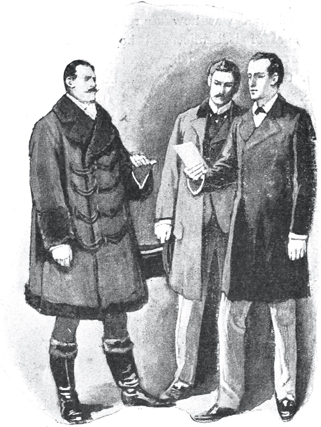

# 𐑩 𐑕𐑒𐑨𐑯𐑛𐑩𐑤 𐑦𐑯 ·𐑚𐑴𐑣𐑰𐑥𐑾

𐑚𐑲 ·𐑸𐑔𐑼 𐑒𐑴𐑯𐑩𐑯 𐑛𐑶𐑤

## 3

𐑲 𐑕𐑤𐑧𐑐𐑑 𐑨𐑑 ·𐑚𐑱𐑒𐑼 𐑕𐑑𐑮𐑰𐑑 𐑞𐑨𐑑 𐑯𐑲𐑑, 𐑯 𐑢𐑰 𐑢𐑻 𐑦𐑯𐑜𐑱𐑡𐑛 𐑩𐑐𐑪𐑯 𐑬𐑼 𐑑𐑴𐑕𐑑 𐑯 𐑒𐑪𐑓𐑦 𐑦𐑯 𐑞 𐑥𐑹𐑯𐑦𐑙 𐑢𐑧𐑯 𐑞 𐑒𐑦𐑙 𐑝 ·𐑚𐑴𐑣𐑰𐑥𐑾 𐑮𐑳𐑖𐑑 𐑦𐑯𐑑𐑵 𐑞 𐑮𐑵𐑥.

"𐑿 𐑣𐑨𐑝 𐑮𐑾𐑤𐑦 𐑜𐑪𐑑 𐑦𐑑!" 𐑣𐑰 𐑒𐑮𐑲𐑛, 𐑜𐑮𐑭𐑕𐑐𐑦𐑙 ·𐑖𐑻𐑤𐑪𐑒 𐑣𐑴𐑥𐑟 𐑚𐑲 𐑲𐑞𐑼 𐑖𐑴𐑤𐑛𐑼 𐑯 𐑤𐑫𐑒𐑦𐑙 𐑰𐑜𐑼𐑤𐑦 𐑦𐑯𐑑𐑵 𐑣𐑦𐑟 𐑓𐑱𐑕.

"𐑯𐑪𐑑 𐑘𐑧𐑑."

"𐑚𐑳𐑑 𐑿 𐑣𐑨𐑝 𐑣𐑴𐑐𐑕?"

"𐑲 𐑣𐑨𐑝 𐑣𐑴𐑐𐑕."

"𐑞𐑧𐑯, 𐑒𐑳𐑥. 𐑲 𐑨𐑥 𐑷𐑤 𐑦𐑥𐑐𐑱𐑖𐑩𐑯𐑕 𐑑 𐑚𐑰 𐑜𐑪𐑯."

"𐑢𐑰 𐑥𐑳𐑕𐑑 𐑣𐑨𐑝 𐑩 𐑒𐑨𐑚."

"𐑯𐑴, 𐑥𐑲 𐑚𐑮𐑵𐑩𐑥 𐑦𐑟 𐑢𐑱𐑑𐑦𐑙."

"𐑞𐑧𐑯 𐑞𐑨𐑑 𐑢𐑦𐑤 𐑕𐑦𐑥𐑐𐑤𐑦𐑓𐑲 𐑥𐑨𐑑𐑼𐑟."𐑢𐑰 𐑛𐑦𐑕𐑧𐑯𐑛𐑩𐑛 𐑯 𐑕𐑑𐑸𐑑𐑩𐑛 𐑪𐑓 𐑢𐑳𐑯𐑕 𐑥𐑹 𐑓 ·𐑚𐑮𐑲𐑩𐑯𐑦 𐑤𐑪𐑡.

"·𐑲𐑮𐑰𐑯 𐑨𐑛𐑤𐑼 𐑦𐑟 𐑥𐑨𐑮𐑦𐑛," 𐑮𐑦𐑥𐑸𐑒𐑑 ·𐑣𐑴𐑥𐑟.

"𐑥𐑨𐑮𐑦𐑛! 𐑢𐑧𐑯?"

"𐑘𐑧𐑕𐑑𐑩𐑛𐑱."

"𐑚𐑳𐑑 𐑑 𐑣𐑵𐑥?"

"𐑑 𐑩𐑯 𐑦𐑙𐑜𐑤𐑦𐑖 𐑤𐑷𐑘𐑼 𐑯𐑱𐑥𐑛 ·𐑯𐑹𐑑𐑩𐑯."

"𐑚𐑳𐑑 𐑖𐑰 𐑒𐑫𐑛 𐑯𐑪𐑑 𐑤𐑳𐑝 𐑣𐑦𐑥."

"𐑲 𐑨𐑥 𐑦𐑯 𐑣𐑴𐑐𐑕 𐑞𐑨𐑑 𐑖𐑰 𐑛𐑳𐑟."

"𐑯 𐑢𐑲 𐑦𐑯 𐑣𐑴𐑐𐑕?"

"𐑚𐑦𐑒𐑪𐑟 𐑦𐑑 𐑢𐑫𐑛 𐑕𐑐𐑺 𐑘𐑹 𐑥𐑨𐑡𐑩𐑕𐑑𐑦 𐑷𐑤 𐑓𐑽 𐑝 𐑓𐑿𐑗𐑼 𐑩𐑯𐑶𐑩𐑯𐑕. 𐑦𐑓 𐑞 𐑤𐑱𐑛𐑦 𐑤𐑳𐑝𐑟 𐑣𐑻 𐑣𐑳𐑟𐑚𐑩𐑯𐑛, 𐑖𐑰 𐑛𐑳𐑟 𐑯𐑪𐑑 𐑤𐑳𐑝 𐑘𐑹 𐑥𐑨𐑡𐑩𐑕𐑑𐑦. 𐑦𐑓 𐑖𐑰 𐑛𐑳𐑟 𐑯𐑪𐑑 𐑤𐑳𐑝 𐑘𐑹 𐑥𐑨𐑡𐑩𐑕𐑑𐑦, 𐑞𐑺 𐑦𐑟 𐑯𐑴 𐑮𐑰𐑟𐑩𐑯 𐑢𐑲 𐑖𐑰 𐑖𐑫𐑛 𐑦𐑯𐑑𐑼𐑓𐑽 𐑢𐑦𐑞 𐑘𐑹 𐑥𐑨𐑡𐑩𐑕𐑑𐑦𐑟 𐑐𐑤𐑨𐑯."

"𐑦𐑑 𐑦𐑟 𐑑𐑮𐑵. 𐑯 𐑘𐑧𐑑—! 𐑢𐑧𐑤! 𐑲 𐑢𐑦𐑖 𐑖𐑰 𐑣𐑨𐑛 𐑚𐑰𐑯 𐑝 𐑥𐑲 𐑴𐑯 𐑕𐑑𐑱𐑖𐑩𐑯! 𐑢𐑪𐑑 𐑩 𐑒𐑢𐑰𐑯 𐑖𐑰 𐑢𐑫𐑛 𐑣𐑨𐑝 𐑥𐑱𐑛!" 𐑣𐑰 𐑮𐑦𐑤𐑨𐑐𐑕𐑑 𐑦𐑯𐑑𐑵 𐑩 𐑥𐑵𐑛𐑦 𐑕𐑲𐑤𐑩𐑯𐑕, 𐑢𐑦𐑗 𐑢𐑪𐑟 𐑯𐑪𐑑 𐑚𐑮𐑴𐑒𐑩𐑯 𐑩𐑯𐑑𐑦𐑤 𐑢𐑰 𐑛𐑮𐑵 𐑳𐑐 𐑦𐑯 ·𐑕𐑻𐑐𐑩𐑯𐑑𐑲𐑯 𐑨𐑝𐑩𐑯𐑿.

𐑞 𐑛𐑹 𐑝 ·𐑚𐑮𐑲𐑩𐑯𐑦 𐑤𐑪𐑡 𐑢𐑪𐑟 𐑴𐑐𐑩𐑯, 𐑯 𐑩𐑯 𐑧𐑤𐑛𐑼𐑤𐑦 𐑢𐑫𐑥𐑩𐑯 𐑕𐑑𐑫𐑛 𐑩𐑐𐑪𐑯 𐑞 𐑕𐑑𐑧𐑐𐑕. 𐑖𐑰 𐑢𐑪𐑗𐑑 𐑳𐑕 𐑢𐑦𐑞 𐑩 𐑕𐑸𐑛𐑪𐑯𐑦𐑒 𐑲 𐑨𐑟 𐑢𐑰 𐑕𐑑𐑧𐑐𐑑 𐑓𐑮𐑪𐑥 𐑞 𐑚𐑮𐑵𐑩𐑥.

"·𐑥𐑼 𐑖𐑻𐑤𐑪𐑒 𐑣𐑴𐑥𐑟, 𐑲 𐑚𐑦𐑤𐑰𐑝?" 𐑕𐑧𐑛 𐑖𐑰.

"𐑲 𐑨𐑥 ·𐑥𐑼 𐑣𐑴𐑥𐑟," 𐑭𐑯𐑕𐑼𐑛 𐑥𐑲 𐑒𐑩𐑥𐑐𐑨𐑯𐑾𐑯, 𐑤𐑫𐑒𐑦𐑙 𐑨𐑑 𐑣𐑻 𐑢𐑦𐑞 𐑩 𐑒𐑢𐑧𐑕𐑗𐑩𐑯𐑦𐑙 𐑯 𐑮𐑭𐑞𐑼 𐑕𐑑𐑸𐑑𐑩𐑤𐑛 𐑜𐑱𐑟.

"𐑦𐑯𐑛𐑰𐑛! 𐑥𐑲 𐑥𐑦𐑕𐑑𐑮𐑩𐑕 𐑑𐑴𐑤𐑛 𐑥𐑰 𐑞𐑨𐑑 𐑿 𐑢𐑻 𐑤𐑲𐑒𐑤𐑦 𐑑 𐑒𐑷𐑤. 𐑖𐑰 𐑤𐑧𐑓𐑑 𐑞𐑦𐑕 𐑥𐑹𐑯𐑦𐑙 𐑢𐑦𐑞 𐑣𐑻 𐑣𐑳𐑟𐑚𐑩𐑯𐑛 𐑚𐑲 𐑞 5:15 𐑑𐑮𐑱𐑯 𐑓𐑮𐑪𐑥 ·𐑗𐑨𐑮𐑦𐑙 𐑒𐑮𐑪𐑕 𐑓 𐑞 𐑒𐑪𐑯𐑑𐑦𐑯𐑩𐑯𐑑."

"𐑢𐑪𐑑!" ·𐑖𐑻𐑤𐑪𐑒 𐑣𐑴𐑥𐑟 𐑕𐑑𐑨𐑜𐑼𐑛 𐑚𐑨𐑒, 𐑢𐑲𐑑 𐑢𐑦𐑞 𐑖𐑨𐑜𐑮𐑦𐑯 𐑯 𐑕𐑼𐑐𐑮𐑲𐑟. "𐑛𐑵 𐑿 𐑥𐑰𐑯 𐑞𐑨𐑑 𐑖𐑰 𐑣𐑨𐑟 𐑤𐑧𐑓𐑑 ·𐑦𐑙𐑜𐑤𐑩𐑯𐑛?"

"𐑯𐑧𐑝𐑼 𐑑 𐑮𐑦𐑑𐑻𐑯."

"𐑯 𐑞 𐑐𐑱𐑐𐑼𐑟?" 𐑭𐑕𐑒𐑑 𐑞 𐑒𐑦𐑙 𐑣𐑹𐑕𐑤𐑦. "𐑷𐑤 𐑦𐑟 𐑤𐑪𐑕𐑑."

"𐑢𐑰 𐑖𐑨𐑤 𐑕𐑰." 𐑣𐑰 𐑐𐑫𐑖𐑑 𐑐𐑭𐑕𐑑 𐑞 𐑕𐑻𐑝𐑩𐑯𐑑 𐑯 𐑮𐑳𐑖𐑑 𐑦𐑯𐑑𐑵 𐑞 𐑛𐑮𐑷𐑦𐑙-𐑮𐑵𐑥, 𐑓𐑪𐑤𐑴𐑛 𐑚𐑲 𐑞 𐑒𐑦𐑙 𐑯 𐑥𐑲𐑕𐑧𐑤𐑓. 𐑞 𐑓𐑻𐑯𐑦𐑗𐑼 𐑢𐑪𐑟 𐑕𐑒𐑨𐑑𐑼𐑛 𐑩𐑚𐑬𐑑 𐑦𐑯 𐑧𐑝𐑮𐑦 𐑛𐑦𐑮𐑧𐑒𐑖𐑩𐑯, 𐑢𐑦𐑞 𐑛𐑦𐑕𐑥𐑨𐑯𐑑𐑩𐑤𐑛 𐑖𐑧𐑤𐑝𐑟 𐑯 𐑴𐑐𐑩𐑯 𐑛𐑮𐑹𐑟, 𐑨𐑟 𐑦𐑓 𐑞 𐑤𐑱𐑛𐑦 𐑣𐑨𐑛 𐑣𐑳𐑮𐑦𐑛𐑤𐑦 𐑮𐑨𐑯𐑕𐑨𐑒𐑑 𐑞𐑧𐑥 𐑚𐑦𐑓𐑹 𐑣𐑻 𐑓𐑤𐑲𐑑. ·𐑣𐑴𐑥𐑟 𐑮𐑳𐑖𐑑 𐑨𐑑 𐑞 𐑚𐑧𐑤-𐑐𐑫𐑤, 𐑑𐑹 𐑚𐑨𐑒 𐑩 𐑕𐑥𐑷𐑤 𐑕𐑤𐑲𐑛𐑦𐑙 𐑖𐑳𐑑𐑼, 𐑯, 𐑐𐑤𐑳𐑯𐑡𐑦𐑙 𐑦𐑯 𐑣𐑦𐑟 𐑣𐑨𐑯𐑛, 𐑐𐑫𐑤𐑛 𐑬𐑑 𐑩 𐑓𐑴𐑑𐑩𐑜𐑮𐑨𐑓 𐑯 𐑩 𐑤𐑧𐑑𐑼. 𐑞 𐑓𐑴𐑑𐑩𐑜𐑮𐑨𐑓 𐑢𐑪𐑟 𐑝 ·𐑲𐑮𐑰𐑯 𐑨𐑛𐑤𐑼 𐑣𐑻𐑕𐑧𐑤𐑓 𐑦𐑯 𐑰𐑝𐑯𐑦𐑙 𐑛𐑮𐑧𐑕, 𐑞 𐑤𐑧𐑑𐑼 𐑢𐑪𐑟 𐑕𐑵𐑐𐑼𐑕𐑒𐑮𐑲𐑚𐑛 𐑑 "·𐑖𐑻𐑤𐑪𐑒 𐑣𐑴𐑥𐑟, 𐑦𐑕𐑒. 𐑑 𐑚𐑰 𐑤𐑧𐑓𐑑 𐑑𐑦𐑤 𐑒𐑷𐑤𐑛 𐑓." 𐑥𐑲 𐑓𐑮𐑧𐑯𐑛 𐑑𐑹 𐑦𐑑 𐑴𐑐𐑩𐑯, 𐑯 𐑢𐑰 𐑷𐑤 𐑔𐑮𐑰 𐑮𐑧𐑛 𐑦𐑑 𐑑𐑩𐑜𐑧𐑞𐑼. 𐑦𐑑 𐑢𐑪𐑟 𐑛𐑱𐑑𐑩𐑛 𐑨𐑑 𐑥𐑦𐑛𐑯𐑲𐑑 𐑝 𐑞 𐑐𐑮𐑦𐑕𐑰𐑛𐑦𐑙 𐑯𐑲𐑑 𐑯 𐑮𐑨𐑯 𐑦𐑯 𐑞𐑦𐑕 𐑢𐑱:

"𐑥𐑲 𐑛𐑽 ·𐑥𐑼. 𐑖𐑻𐑤𐑪𐑒 𐑣𐑴𐑥𐑟,—𐑿 𐑮𐑾𐑤𐑦 𐑛𐑦𐑛 𐑦𐑑 𐑝𐑧𐑮𐑦 𐑢𐑧𐑤. 𐑿 𐑑𐑫𐑒 𐑥𐑰 𐑦𐑯 𐑒𐑩𐑥𐑐𐑤𐑰𐑑𐑤𐑦. 𐑩𐑯𐑑𐑦𐑤 𐑭𐑓𐑑𐑼 𐑞 𐑩𐑤𐑸𐑥 𐑝 𐑓𐑲𐑼, 𐑲 𐑣𐑨𐑛 𐑯𐑪𐑑 𐑩 𐑕𐑩𐑕𐑐𐑦𐑖𐑩𐑯. 𐑚𐑳𐑑 𐑞𐑧𐑯, 𐑢𐑧𐑯 𐑲 𐑓𐑬𐑯𐑛 𐑣𐑬 𐑲 𐑣𐑨𐑛 𐑚𐑦𐑑𐑮𐑱𐑛 𐑥𐑲𐑕𐑧𐑤𐑓, 𐑲 𐑚𐑦𐑜𐑨𐑯 𐑑 𐑔𐑦𐑙𐑒. 𐑲 𐑣𐑨𐑛 𐑚𐑰𐑯 𐑢𐑹𐑯𐑛 𐑩𐑜𐑱𐑯𐑕𐑑 𐑿 𐑥𐑳𐑯𐑔𐑕 𐑩𐑜𐑴. 𐑲 𐑣𐑨𐑛 𐑚𐑰𐑯 𐑑𐑴𐑤𐑛 𐑞𐑨𐑑, 𐑦𐑓 𐑞 𐑒𐑦𐑙 𐑦𐑥𐑐𐑤𐑶𐑛 𐑩𐑯 𐑱𐑡𐑩𐑯𐑑, 𐑦𐑑 𐑢𐑫𐑛 𐑕𐑻𐑑𐑩𐑯𐑤𐑦 𐑚𐑰 𐑿. 𐑯 𐑘𐑹 𐑩𐑛𐑮𐑧𐑕 𐑣𐑨𐑛 𐑚𐑰𐑯 𐑜𐑦𐑝𐑩𐑯 𐑥𐑰. 𐑘𐑧𐑑, 𐑢𐑦𐑞 𐑷𐑤 𐑞𐑦𐑕, 𐑿 𐑥𐑱𐑛 𐑥𐑰 𐑮𐑦𐑝𐑰𐑤 𐑢𐑪𐑑 𐑿 𐑢𐑪𐑯𐑑𐑩𐑛 𐑑 𐑯𐑴. 𐑰𐑝𐑩𐑯 𐑭𐑓𐑑𐑼 𐑲 𐑚𐑦𐑒𐑱𐑥 𐑕𐑩𐑕𐑐𐑦𐑖𐑩𐑕, 𐑲 𐑓𐑬𐑯𐑛 𐑦𐑑 𐑣𐑸𐑛 𐑑 𐑔𐑦𐑙𐑒 𐑰𐑝𐑩𐑤 𐑝 𐑕𐑳𐑗 𐑩 𐑛𐑽, 𐑒𐑲𐑯𐑛 𐑴𐑤𐑛 𐑒𐑤𐑻𐑡𐑦𐑥𐑩𐑯. 𐑚𐑳𐑑, 𐑿 𐑯𐑴, 𐑲 𐑣𐑨𐑝 𐑚𐑰𐑯 𐑑𐑮𐑱𐑯𐑛 𐑨𐑟 𐑩𐑯 𐑨𐑒𐑑𐑮𐑩𐑕 𐑥𐑲𐑕𐑧𐑤𐑓. 𐑥𐑱𐑤 𐑒𐑪𐑕𐑑𐑿𐑥 𐑦𐑟 𐑯𐑳𐑔𐑦𐑙 𐑯𐑿 𐑑 𐑥𐑰. 𐑲 𐑪𐑓𐑩𐑯 𐑑𐑱𐑒 𐑩𐑛𐑝𐑭𐑯𐑑𐑦𐑡 𐑝 𐑞 𐑓𐑮𐑰𐑛𐑩𐑥 𐑢𐑦𐑗 𐑦𐑑 𐑜𐑦𐑝𐑟. 𐑲 𐑕𐑧𐑯𐑑 ·𐑡𐑪𐑯, 𐑞 𐑒𐑴𐑗𐑥𐑩𐑯, 𐑑 𐑢𐑪𐑗 𐑿, 𐑮𐑨𐑯 𐑳𐑐𐑕𐑑𐑺𐑟, 𐑜𐑪𐑑 𐑦𐑯𐑑𐑵 𐑥𐑲 𐑢𐑷𐑒𐑦𐑙 𐑒𐑤𐑴𐑞𐑟, 𐑨𐑟 𐑲 𐑒𐑷𐑤 𐑞𐑧𐑥, 𐑯 𐑒𐑱𐑥 𐑛𐑬𐑯 𐑡𐑳𐑕𐑑 𐑨𐑟 𐑿 𐑛𐑦𐑐𐑸𐑑𐑩𐑛.

"𐑢𐑧𐑤, 𐑲 𐑓𐑪𐑤𐑴𐑛 𐑿 𐑑 𐑘𐑹 𐑛𐑹, 𐑯 𐑕𐑴 𐑥𐑱𐑛 𐑖𐑫𐑼 𐑞𐑨𐑑 𐑲 𐑢𐑪𐑟 𐑮𐑾𐑤𐑦 𐑩𐑯 𐑪𐑚𐑡𐑧𐑒𐑑 𐑝 𐑦𐑯𐑑𐑮𐑩𐑕𐑑 𐑑 𐑞 𐑕𐑧𐑤𐑩𐑚𐑮𐑱𐑑𐑩𐑛 ·𐑥𐑼 𐑖𐑻𐑤𐑪𐑒 𐑣𐑴𐑥𐑟. 𐑞𐑧𐑯 𐑲, 𐑮𐑭𐑞𐑼 𐑦𐑥𐑐𐑮𐑵𐑛𐑩𐑯𐑑𐑤𐑦, 𐑢𐑦𐑖𐑑 𐑿 𐑜𐑫𐑛-𐑯𐑲𐑑, 𐑯 𐑕𐑑𐑸𐑑𐑩𐑛 𐑓 𐑞 ·𐑑𐑧𐑥𐑐𐑩𐑤 𐑑 𐑕𐑰 𐑥𐑲 𐑣𐑳𐑟𐑚𐑩𐑯𐑛.

"𐑢𐑰 𐑚𐑴𐑔 𐑔𐑷𐑑 𐑞 𐑚𐑧𐑕𐑑 𐑮𐑦𐑟𐑹𐑕 𐑢𐑪𐑟 𐑓𐑤𐑲𐑑, 𐑢𐑧𐑯 𐑐𐑼𐑕𐑿𐑛 𐑚𐑲 𐑕𐑴 𐑓𐑹𐑥𐑦𐑛𐑩𐑚𐑩𐑤 𐑩𐑯 𐑨𐑯𐑑𐑨𐑜𐑩𐑯𐑦𐑕𐑑; 𐑕𐑴 𐑿 𐑢𐑦𐑤 𐑓𐑲𐑯𐑛 𐑞 𐑯𐑧𐑕𐑑 𐑧𐑥𐑐𐑑𐑦 𐑢𐑧𐑯 𐑿 𐑒𐑷𐑤 𐑑𐑩𐑥𐑪𐑮𐑴. 𐑨𐑟 𐑑 𐑞 𐑓𐑴𐑑𐑩𐑜𐑮𐑨𐑓, 𐑘𐑹 𐑒𐑤𐑲𐑩𐑯𐑑 𐑥𐑱 𐑮𐑧𐑕𐑑 𐑦𐑯 𐑐𐑰𐑕. 𐑲 𐑤𐑳𐑝 𐑯 𐑨𐑥 𐑤𐑳𐑝𐑛 𐑚𐑲 𐑩 𐑚𐑧𐑑𐑼 𐑥𐑨𐑯 𐑞𐑨𐑯 𐑣𐑰. 𐑞 𐑒𐑦𐑙 𐑥𐑱 𐑛𐑵 𐑢𐑪𐑑 𐑣𐑰 𐑢𐑦𐑤 𐑢𐑦𐑞𐑬𐑑 𐑣𐑦𐑯𐑛𐑮𐑩𐑯𐑕 𐑓𐑮𐑪𐑥 𐑢𐑳𐑯 𐑣𐑵𐑥 𐑣𐑰 𐑣𐑨𐑟 𐑒𐑮𐑵𐑩𐑤𐑦 𐑮𐑪𐑙𐑛. 𐑲 𐑒𐑰𐑐 𐑦𐑑 𐑴𐑯𐑤𐑦 𐑑 𐑕𐑱𐑓𐑜𐑸𐑛 𐑥𐑲𐑕𐑧𐑤𐑓, 𐑯 𐑑 𐑐𐑮𐑦𐑟𐑻𐑝 𐑩 𐑢𐑧𐑐𐑩𐑯 𐑢𐑦𐑗 𐑢𐑦𐑤 𐑷𐑤𐑢𐑱𐑟 𐑕𐑦𐑒𐑘𐑫𐑼 𐑥𐑰 𐑓𐑮𐑪𐑥 𐑧𐑯𐑦 𐑕𐑑𐑧𐑐𐑕 𐑢𐑦𐑗 𐑣𐑰 𐑥𐑲𐑑 𐑑𐑱𐑒 𐑦𐑯 𐑞 𐑓𐑿𐑗𐑼. 𐑲 𐑤𐑰𐑝 𐑩 𐑓𐑴𐑑𐑩𐑜𐑮𐑨𐑓 𐑢𐑦𐑗 𐑣𐑰 𐑥𐑲𐑑 𐑒𐑺 𐑑 𐑐𐑩𐑟𐑧𐑕; 𐑯 𐑲 𐑮𐑦𐑥𐑱𐑯, 𐑛𐑽 ·𐑥𐑼 𐑖𐑻𐑤𐑪𐑒 𐑣𐑴𐑥𐑟,

"𐑝𐑧𐑮𐑦 𐑑𐑮𐑵𐑤𐑦 𐑘𐑹𐑟,

"·𐑲𐑮𐑰𐑯 𐑯𐑹𐑑𐑩𐑯, 𐑯𐑱 ·𐑨𐑛𐑤𐑼."

"𐑢𐑪𐑑 𐑩 𐑢𐑫𐑥𐑩𐑯—𐑴, 𐑢𐑪𐑑 𐑩 𐑢𐑫𐑥𐑩𐑯!" 𐑒𐑮𐑲𐑛 𐑞 𐑒𐑦𐑙 𐑝 ·𐑚𐑴𐑣𐑰𐑥𐑾, 𐑢𐑧𐑯 𐑢𐑰 𐑣𐑨𐑛 𐑷𐑤 𐑔𐑮𐑰 𐑮𐑰𐑛 𐑞𐑦𐑕 𐑦𐑐𐑦𐑕𐑩𐑤. "𐑛𐑦𐑛 𐑲 𐑯𐑪𐑑 𐑑𐑧𐑤 𐑿 𐑣𐑬 𐑒𐑢𐑦𐑒 𐑯 𐑮𐑧𐑟𐑩𐑤𐑵𐑑 𐑖𐑰 𐑢𐑪𐑟? 𐑢𐑫𐑛 𐑖𐑰 𐑯𐑪𐑑 𐑣𐑨𐑝 𐑥𐑱𐑛 𐑩𐑯 𐑨𐑛𐑥𐑼𐑩𐑚𐑩𐑤 𐑒𐑢𐑰𐑯 ? 𐑦𐑟 𐑦𐑑 𐑯𐑪𐑑 𐑩 𐑐𐑦𐑑𐑦 𐑞𐑨𐑑 𐑖𐑰 𐑢𐑪𐑟 𐑯𐑪𐑑 𐑪𐑯 𐑥𐑲 𐑤𐑧𐑝𐑩𐑤?"

"𐑓𐑮𐑪𐑥 𐑢𐑪𐑑 𐑲 𐑣𐑨𐑝 𐑕𐑰𐑯 𐑝 𐑞 𐑤𐑱𐑛𐑦, 𐑖𐑰 𐑕𐑰𐑥𐑟, 𐑦𐑯𐑛𐑰𐑛, 𐑑 𐑚𐑰 𐑪𐑯 𐑩 𐑝𐑧𐑮𐑦 𐑛𐑦𐑓𐑼𐑩𐑯𐑑 𐑤𐑧𐑝𐑩𐑤 𐑑 𐑘𐑹 𐑥𐑨𐑡𐑩𐑕𐑑𐑦," 𐑕𐑧𐑛 ·𐑣𐑴𐑥𐑟 𐑒𐑴𐑤𐑛𐑤𐑦. "𐑲 𐑨𐑥 𐑕𐑪𐑮𐑦 𐑞𐑨𐑑 𐑲 𐑣𐑨𐑝 𐑯𐑪𐑑 𐑚𐑰𐑯 𐑱𐑚𐑩𐑤 𐑑 𐑚𐑮𐑦𐑙 𐑘𐑹 𐑥𐑨𐑡𐑩𐑕𐑑𐑦𐑟 𐑚𐑦𐑟𐑯𐑩𐑕 𐑑 𐑩 𐑥𐑹 𐑕𐑩𐑒𐑕𐑧𐑕𐑓𐑩𐑤 𐑒𐑩𐑯𐑒𐑤𐑵𐑠𐑩𐑯."

"𐑪𐑯 𐑞 𐑒𐑪𐑯𐑑𐑮𐑼𐑦, 𐑥𐑲 𐑛𐑽 𐑕𐑻," 𐑒𐑮𐑲𐑛 𐑞 𐑒𐑦𐑙; "𐑯𐑳𐑔𐑦𐑙 𐑒𐑫𐑛 𐑚𐑰 𐑥𐑹 𐑕𐑩𐑒𐑕𐑧𐑕𐑓𐑩𐑤. 𐑲 𐑯𐑴 𐑞𐑨𐑑 𐑣𐑻 𐑢𐑻𐑛 𐑦𐑟 𐑦𐑯𐑝𐑲𐑩𐑤𐑩𐑑. 𐑞 𐑓𐑴𐑑𐑩𐑜𐑮𐑨𐑓 𐑦𐑟 𐑯𐑬 𐑨𐑟 𐑕𐑱𐑓 𐑨𐑟 𐑦𐑓 𐑦𐑑 𐑢𐑻 𐑦𐑯 𐑞 𐑓𐑲𐑼."

"𐑲 𐑨𐑥 𐑜𐑤𐑨𐑛 𐑑 𐑣𐑽 𐑘𐑹 𐑥𐑨𐑡𐑩𐑕𐑑𐑦 𐑕𐑱 𐑕𐑴."

"𐑲 𐑨𐑥 𐑦𐑥𐑧𐑯𐑕𐑤𐑦 𐑦𐑯𐑛𐑧𐑑𐑩𐑛 𐑑 𐑿. 𐑐𐑮𐑱 𐑑𐑧𐑤 𐑥𐑰 𐑦𐑯 𐑢𐑪𐑑 𐑢𐑱 𐑲 𐑒𐑨𐑯 𐑮𐑦𐑢𐑹𐑛 𐑿. 𐑞𐑦𐑕 𐑮𐑦𐑙—" 𐑣𐑰 𐑕𐑤𐑦𐑐𐑑 𐑩𐑯 𐑧𐑥𐑼𐑩𐑤𐑛 𐑕𐑯𐑱𐑒 𐑮𐑦𐑙 𐑓𐑮𐑪𐑥 𐑣𐑦𐑟 𐑓𐑦𐑙𐑜𐑼 𐑯 𐑣𐑧𐑤𐑛 𐑦𐑑 𐑬𐑑 𐑩𐑐𐑪𐑯 𐑞 𐑐𐑭𐑥 𐑝 𐑣𐑦𐑟 𐑣𐑨𐑯𐑛.

"𐑘𐑹 𐑥𐑨𐑡𐑩𐑕𐑑𐑦 𐑣𐑨𐑟 𐑕𐑳𐑥𐑔𐑦𐑙 𐑢𐑦𐑗 𐑲 𐑖𐑫𐑛 𐑝𐑨𐑤𐑿 𐑰𐑝𐑩𐑯 𐑥𐑹 𐑣𐑲𐑤𐑦," 𐑕𐑧𐑛 ·𐑣𐑴𐑥𐑟. 

"𐑿 𐑣𐑨𐑝 𐑚𐑳𐑑 𐑑 𐑯𐑱𐑥 𐑦𐑑."

"𐑞𐑦𐑕 𐑓𐑴𐑑𐑩𐑜𐑮𐑨𐑓!"

𐑞 𐑒𐑦𐑙 𐑕𐑑𐑺𐑛 𐑨𐑑 𐑣𐑦𐑥 𐑦𐑯 𐑩𐑥𐑱𐑟𐑥𐑩𐑯𐑑.

"·𐑲𐑮𐑰𐑯𐑟 𐑓𐑴𐑑𐑩𐑜𐑮𐑨𐑓!" 𐑣𐑰 𐑒𐑮𐑲𐑛. "𐑕𐑻𐑑𐑩𐑯𐑤𐑦, 𐑦𐑓 𐑿 𐑢𐑦𐑖 𐑦𐑑."

"𐑲 𐑔𐑨𐑙𐑒 𐑘𐑹 𐑥𐑨𐑡𐑩𐑕𐑑𐑦. 𐑞𐑧𐑯 𐑞𐑺 𐑦𐑟 𐑯𐑴 𐑥𐑹 𐑑 𐑚𐑰 𐑛𐑳𐑯 𐑦𐑯 𐑞 𐑥𐑨𐑑𐑼. 𐑲 𐑣𐑨𐑝 𐑞 𐑪𐑯𐑼 𐑑 𐑢𐑦𐑖 𐑿 𐑩 𐑝𐑧𐑮𐑦 𐑜𐑫𐑛 𐑥𐑹𐑯𐑦𐑙." 𐑣𐑰 𐑚𐑬𐑛, 𐑯, 𐑑𐑻𐑯𐑦𐑙 𐑩𐑢𐑱 𐑢𐑦𐑞𐑬𐑑 𐑩𐑚𐑟𐑻𐑝𐑦𐑙 𐑞 𐑣𐑨𐑯𐑛 𐑢𐑦𐑗 𐑞 𐑒𐑦𐑙 𐑣𐑨𐑛 𐑕𐑑𐑮𐑧𐑗𐑑 𐑬𐑑 𐑑 𐑣𐑦𐑥, 𐑣𐑰 𐑕𐑧𐑑 𐑪𐑓 𐑦𐑯 𐑥𐑲 𐑒𐑳𐑥𐑐𐑩𐑯𐑦 𐑓 𐑣𐑦𐑟 𐑗𐑱𐑥𐑚𐑼𐑟.

𐑯 𐑞𐑨𐑑 𐑢𐑪𐑟 𐑣𐑬 𐑩 𐑜𐑮𐑱𐑑 𐑕𐑒𐑨𐑯𐑛𐑩𐑤 𐑔𐑮𐑧𐑑𐑩𐑯𐑛 𐑑 𐑩𐑓𐑧𐑒𐑑 𐑞 𐑒𐑦𐑙𐑛𐑩𐑥 𐑝 ·𐑚𐑴𐑣𐑰𐑥𐑾, 𐑯 𐑣𐑬 𐑞 𐑚𐑧𐑕𐑑 𐑐𐑤𐑨𐑯𐑟 𐑝 ·𐑥𐑼 𐑖𐑻𐑤𐑪𐑒 𐑣𐑴𐑥𐑟 𐑢𐑻 𐑚𐑰𐑑𐑩𐑯 𐑚𐑲 𐑩 𐑢𐑫𐑥𐑩𐑯𐑟 𐑢𐑦𐑑. 𐑣𐑰 𐑿𐑕𐑑 𐑑 𐑥𐑱𐑒 𐑥𐑧𐑮𐑦 𐑴𐑝𐑼 𐑞 𐑒𐑤𐑧𐑝𐑼𐑯𐑩𐑕 𐑝 𐑢𐑦𐑥𐑦𐑯, 𐑚𐑳𐑑 𐑲 𐑣𐑨𐑝 𐑯𐑪𐑑 𐑣𐑻𐑛 𐑣𐑦𐑥 𐑛𐑵 𐑦𐑑 𐑝 𐑤𐑱𐑑. 𐑯 𐑢𐑧𐑯 𐑣𐑰 𐑕𐑐𐑰𐑒𐑕 𐑝 ·𐑲𐑮𐑰𐑯 𐑨𐑛𐑤𐑼, 𐑹 𐑢𐑧𐑯 𐑣𐑰 𐑮𐑦𐑓𐑻𐑟 𐑑 𐑣𐑻 𐑓𐑴𐑑𐑩𐑜𐑮𐑨𐑓, 𐑦𐑑 𐑦𐑟 𐑷𐑤𐑢𐑱𐑟 𐑳𐑯𐑛𐑼 𐑞 𐑪𐑯𐑼𐑩𐑚𐑩𐑤 𐑑𐑲𐑑𐑩𐑤 𐑝 𐑞 𐑢𐑫𐑥𐑩𐑯.
